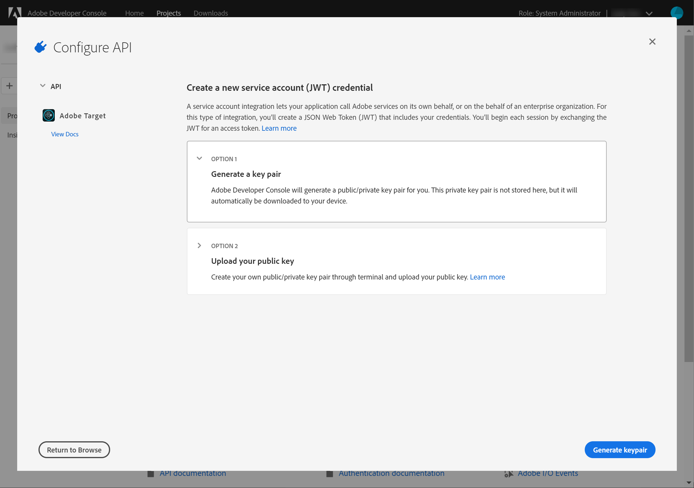
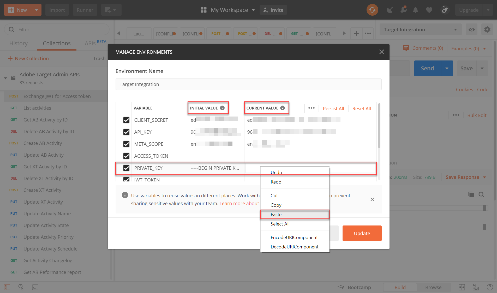
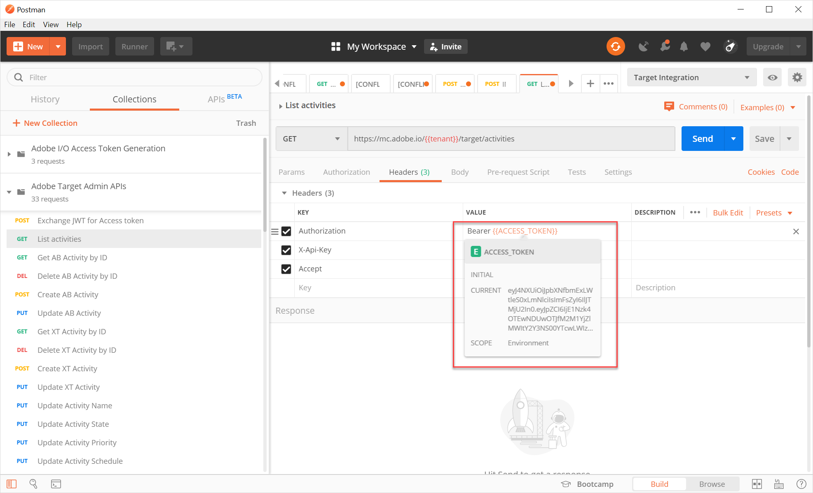
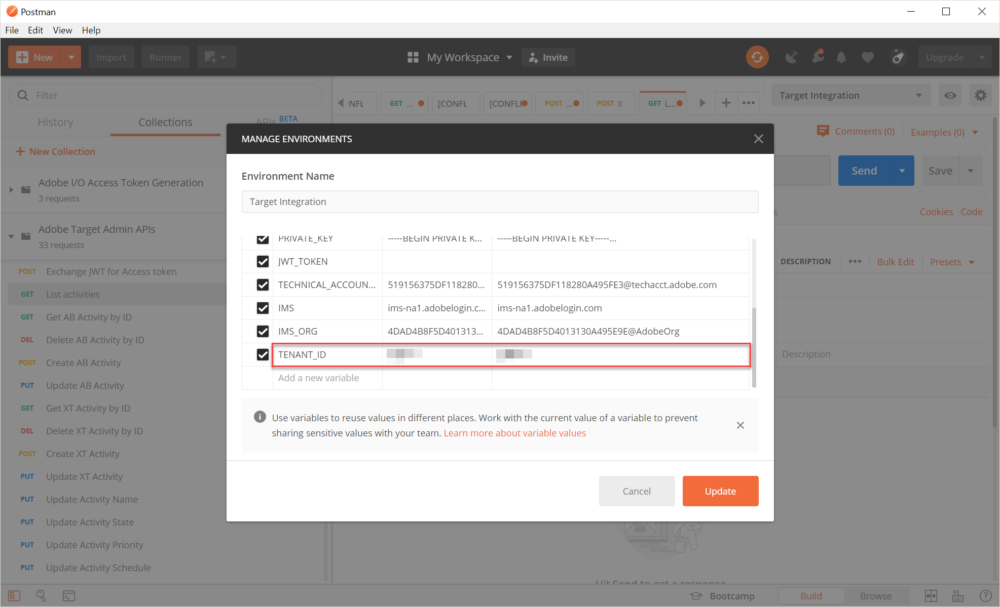

# 設定Adobe Target API的驗證

Adobe Target管理API（包括[!DNL Recommendations]管理API）會透過驗證加以保護，以確保只有經過授權的使用者才能使用這些API存取Adobe Target。 使用[Adobe開發人員控制台](https://console.adobe.io/)管理所有Adobe Experience Cloud解決方案（包括[!DNL Target]）的此驗證。

本課程逐步說明產生驗證Token所需的初步步驟，以順利與Adobe Target API互動。 在後續章節中，您將：

1. 在「Adobe開發人員控制台」中建立專案（先前稱為整合）。
2. 將項目詳細資訊導出到Postman。
3. 產生承載存取權杖。
4. 測試承載存取權杖。

## 先決條件

| 資源 | 詳細資料 |
| --- | --- |
| 郵遞員 | 若要成功完成這些步驟，請取得作業系統的[Postman應用程式](https://www.postman.com/downloads/)。 Postman基本免費建立帳戶。 雖然一般而言不需要Adobe Target API，但Postman可讓API工作流程更輕鬆，而Adobe Target提供數個Postman集合，以協助執行其API並了解其運作方式。 本教學課程的其餘部分假設您具備Postman的工作知識。 如需協助，請參閱[Postman檔案](https://learning.getpostman.com/)。 |
| 參考 | 在本教學課程的其餘部分中，我們假設您熟悉以下資源：<UL><li>[Adobe I/OGithub](https://github.com/adobeio)</li><li>[TargetAdobe I/O檔案](https://developers.adobetarget.com/api/#introduction)</li><li>[Recommendations API檔案](https://developers.adobetarget.com/api/recommendations/)</li></ul> |

## 建立Adobe I/O專案

在本節中，您將訪問Adobe開發人員控制台並建立[!DNL Adobe Target]的項目。 如需詳細資訊，請參考關於專案](https://www.adobe.io/apis/experienceplatform/console/docs.html#!AdobeDocs/adobeio-console/master/projects.md)的[檔案。

<!--1. Generate your private key and public certificate, per the [documentation on authentication](https://www.adobe.io/authentication/auth-methods.html#!AdobeDocs/adobeio-auth/master/JWT/JWTCertificate.md). //<!--as described in **Step 1** of [How to set up Adobe IO: Authentication - Step by Step](https://helpx.adobe.com/marketing-cloud-core/kb/adobe-io-authentication-step-by-step.html). After completing Step 1, return to this tutorial and resume with Step 2, below. // The outcome of this step should be the creation of a `private.key` file and a `certificate_pub.crt` file. Return to this tutorial once you have generated these two files.-->

1. 在[Adobe Admin Console](https://adminconsole.adobe.com/)中，確認您的Adobe使用者帳戶已同時獲得[產品管理員](https://helpx.adobe.com/enterprise/using/admin-roles.html)和[開發人員](https://helpx.adobe.com/enterprise/using/manage-developers.html)層級[!DNL Target]存取權。

2. 在[Adobe開發人員控制台](https://console.adobe.io/)中，選取您要建立此整合的Experience Cloud組織。 (請注意，您可能只能存取單一Experience Cloud組織)。

   

3. 按一下「**[!UICONTROL 建立新項目]**」。

   

4. 按一下「**[!UICONTROL 新增API]**」 ，將REST API新增至您的專案，以存取Adobe服務和產品。

   

5. 選擇&#x200B;**[!DNL Adobe Target]**&#x200B;作為要整合的Adobe服務。 按一下顯示的&#x200B;**[!UICONTROL Next]**&#x200B;按鈕。

   

6. 選取選項，將公開金鑰和私密金鑰與您為Target建立的服務帳戶整合相關聯。 在本教程中，選擇&#x200B;**[!UICONTROL 選項1:生成密鑰對]**，然後按一下&#x200B;**[!UICONTROL 生成密鑰對]**。
   

7. 記下結果！ 請依照指示，記下自動下載的組態檔(`config`)，其中包含您的私密金鑰。 按&#x200B;**[!UICONTROL 「下一步」]**。
   
8. 在檔案系統中，驗證`config`的位置，該位置是在上一步中建立的壓縮配置檔案。 同樣，此`config`檔案包含您以後需要的私鑰。 檔案系統中的確切位置可能與此處所示的位置不同。
   
9. 返回「Adobe開發人員控制台」，選取與您使用[!DNL Recommendations]的屬性對應的[產品設定檔](https://helpx.adobe.com/enterprise/using/manage-products-and-profiles.html)。 （如果您未使用屬性，請選取「預設工作區」選項。） 按一下「**[!UICONTROL 儲存已設定的API]**」。
   

10. 按一下&#x200B;**[!UICONTROL 建立整合]**。 您應會收到暫時訊息，指出您的API已成功設定。

11. 最後，將專案重新命名為比原始`Project 1`更有意義的名稱。 若要這麼做，請使用如所示的導覽路徑導覽至專案，按一下&#x200B;**[!UICONTROL 編輯專案]**&#x200B;以存取**[!UICONTROL 編輯專案]強制回應視窗，然後重新命名專案。

>[!NOTE]
> 
>在本教學課程中，我們將專案命名為「Target整合」。 如果您預計不只會將專案用於Adobe Target，您可能會想據以命名。 例如，您可能會選擇將其命名為「AdobeAPI」或「Experience CloudAPI」，因為此API可能與Adobe Experience Cloud中的其他解決方案搭配使用。

## 匯出專案詳細資訊

現在您有了可用來存取[!DNL Target]的Adobe專案，您必須確定傳送該專案的詳細資訊以及您的AdobeAPI請求。 若要與數個AdobeAPI（包括數個[!DNL Target] API）互動，需要提供這些詳細資料。 例如，整合詳細資訊包含[!DNL Target]管理API所需的授權和驗證資訊。 因此，若要將API與Postman搭配使用，您必須將這些詳細資訊匯入Postman。

您可以透過許多方式在Postman中指定專案的詳細資訊，但在本節中，我們會運用一些預先建立的功能和集合。 首先（在本節中），您會將整合的詳細資訊匯出至Postman環境。 接下來（在下節中），您將產生承載存取權杖，以授與您對必要Adobe資源的存取權。

>[!NOTE]
>
>如需適用於任何Experience Cloud解決方案（包括[!DNL Target]）的視訊指示，請參閱[使用Postman搭配Experience PlatformAPI](https://docs.adobe.com/content/help/en/platform-learn/tutorials/apis/postman.html)。 以下各節與[!DNL Target] API相關：
>
> 1. 將Adobe I/O整合詳細資訊匯出至Postman
> 2. 使用Postman產生存取權杖

>
> 以下也提供這些步驟。

1. 仍然在[Adobe開發人員控制台](https://console.adobe.io/)中，導覽至檢視新專案的&#x200B;**[!UICONTROL 服務帳戶(JWT)]**&#x200B;憑證。 使用左側導航或&#x200B;**[!UICONTROL Credentials]**部分，如所示。
   
在 **[!UICONTROL 憑證詳細資訊]**&#x200B;中，請注意，您可以檢視 **公開金鑰**、用戶 **端ID**，以及與服務帳戶相關的其他資訊。
   
2. 按一下以導覽至&#x200B;**[!UICONTROL Adobe Target]** API的相關資訊。 使用左側導航或&#x200B;**[!UICONTROL 已連接的產品和服務]**部分，如所示。
   
3. 按一下&#x200B;**[!UICONTROL 下載Postman]** > **[!UICONTROL 服務帳戶(JWT)]**以建立JSON檔案，擷取您對Postman環境的驗證資訊。
   
請在您的檔案系統中記下JSON檔案。
   
4. 在Postman中，按一下齒輪圖示來管理您的環境，然後按一下「**匯入**」以匯入JSON檔案（環境）。
   
5. 選擇您的檔案，然後按一下&#x200B;**Open**。
   
6. 在Postman **管理環境**強制回應中，按一下新匯入環境的名稱以檢查它。 (您的環境名稱可能與此處顯示的名稱不同。 視需要編輯名稱。 它不一定需要符合Adobe專案的名稱。)
   
7. 注意`CLIENT_SECRET`和`API_KEY`（連同其他變數）已預先填入其值，取自於Adobe開發人員控制台中定義的整合。 (Postman `CLIENT_SECRET`變數應符合開發人員控制台中顯示的`CLIENT SECRET`Adobe憑證，而Postman中的`API_KEY`也應符合開發人員控制台中的`CLIENT ID`。) 相反地，附註`PRIVATE_KEY`、`JWT_TOKEN`和`ACCESS_TOKEN`為空白。 先提供`PRIVATE_KEY`值。
   

   >[!NOTE]
   >
   >**驚喜！**
   >
   >小測驗！ 你記得你的私密金鑰在哪裡嗎？
   >沒錯，它位於先前從Adobe開發人員控制台下載的`config`檔案中！

8. 從檔案系統中，開啟`config`檔案，然後開啟`private`密鑰檔案。
   
9. 選擇並複製`private`密鑰檔案的整個內容。
   
10. 在Postman中，將私密金鑰值貼到&#x200B;**INITIAL VALUE**&#x200B;和&#x200B;**CURRENT VALUE**欄位中。
   
11. 按一下&#x200B;**[!UICONTROL 更新]**，然後關閉環境強制回應視窗。

## 產生承載存取權杖

在本節中，您會產生不記名存取權杖，此權杖是驗證您與Adobe Target API互動的必要條件。 若要產生您的無記名存取權杖，您必須將整合詳細資訊（於前述章節建立）傳送至[AdobeIdentity Management服務(IMS)](https://www.adobe.io/authentication/auth-methods.html#!AdobeDocs/adobeio-auth/master/AuthenticationOverview/AuthenticationGuide.md)。 您可以透過一些不同的方式完成此作業，但在本教學課程中，您已針對IMS API建置自訂的POST請求。 開玩笑吧。 在本教學課程中，我們善用包含預先建置之IMS呼叫的Postman集合，讓程式直接且簡單。 匯入集合後，您可以視需要重複使用集合，以產生新的代號，不僅供Adobe Target使用，也供其他AdobeAPI使用。

1. 導覽至[AdobeIdentity Management服務API呼叫範例](https://github.com/adobe/experience-platform-postman-samples/tree/master/apis/ims)。
   
2. 按一下&#x200B;**Adobe I/O存取權杖產生Postman集合**。
   
3. 按一下&#x200B;**Raw**，然後將產生的JSON複製到剪貼簿，即可取得此集合的原始JSON。 （您也可以將原始JSON儲存為.json檔案。）
   
4. 在Postman中，從剪貼簿貼上和提交原始JSON以匯入集合。 （您也可以上傳您儲存的.json檔案。） 按一下&#x200B;**「繼續」**。
   
5. 選取&#x200B;**[!UICONTROL IMS:JWT在Adobe I/O存取權杖產生Postman集合中，透過使用者權杖]**&#x200B;請求產生+驗證，請確定您已選取環境，然後按一下&#x200B;**傳送**&#x200B;以產生權杖。

   

   >[!NOTE]
   >
   >此無記名存取權杖的有效期為24小時。 每當您需要產生新Token時，就再次傳送要求。

6. 再次開啟「管理環境」強制回應視窗，然後選取您的環境。
   
7. 請注意，現在會填入`ACCESS_TOKEN`和`JWT_TOKEN`值。
   

>[!NOTE]
>
>問：我是否必須使用Adobe I/O存取權杖產生Postman集合來產生JSON網頁權杖(JWT)和持有者存取權杖？
>
>答：不！ Adobe I/O存取權杖產生Postman集合是為了方便您在Postman中更輕鬆產生JWT和記名存取權杖。 或者，您也可以使用Adobe開發人員控制台中的功能，手動產生承載存取權杖。

## 測試承載存取權杖

在本練習中，您會傳送API請求，從您的[!DNL Target]帳戶擷取活動清單，以使用新的持有者存取權杖。 成功的回應表示您的Adobe專案和驗證正如預期般運作，以便使用API。

1. 匯入[Adobe Target Admin API Postman Collection](https://developers.adobetarget.com/api/#admin-postman-collection)。 遵循所有提示，直到集合匯入Postman。
   
1. 展開集合，並記下「**[!UICONTROL 清單活動]**」請求。
   
1. 請注意，`{{access_token}}`等變數最初未解析。 您可以透過數種不同方式解決此問題，例如，您可以定義名為`{{access_token}}`的新收集變數，但在本教學課程中，您會改變API要求，以運用您先前使用的Postman環境。 這可讓環境繼續以單一、一致的方式整合所有在AdobeAPI中通用的變數。
   
1. 鍵入以`{{ACCESS_TOKEN}}`替換`{{access_token}}`。
   
1. 鍵入以`{{API_KEY}}`替換`{{api_key}}`。
   
1. 鍵入以`{{TENANT_ID}}`替換`{{tenant}}`。 尚未識別`{{TENANT_ID}}`。
   
1. 開啟「管理環境」強制回應視窗，然後選取您的環境。
   
1. 鍵入以添加新的`{{TENANT_ID}}`環境變數。 將您的租用戶ID值複製並貼到新`TENANT_ID`環境變數的&#x200B;**INITIAL VALUE**&#x200B;和&#x200B;**CURRENT VALUE**&#x200B;欄位中。

   

   >[!NOTE]
   >
   >租用戶ID與您的[!DNL Target] `clientcode`不同。 當您登入[!DNL Target]時，URL中存在租用戶ID。 若要取得您的租用戶ID，請登入[!DNL Adobe Experience Cloud]，開啟[!DNL Target]，然後按一下[!DNL Target]卡片。 使用「租用戶ID」值，如URL子網域中所述。
   >
   >例如，若您登入Adobe Target時的URL為
   >
   >`<https://mycompany.experiencecloud.adobe.com/...>`
   >
   >您的租用戶ID為「mycompany」。

1. 在確定您已選取正確的環境後，傳送您的要求。 您應會收到包含活動清單的回應。
   

恭喜！ 現在您已驗證Adobe驗證，可以使用它與Adobe Target API(以及其他AdobeAPI)互動。 例如，您可以[使用Recommendations API](https://experienceleague.adobe.com/docs/target-learn/recommendations-api-tutorial/recs-api-overview.html?lang=en)來建立或管理建議。
