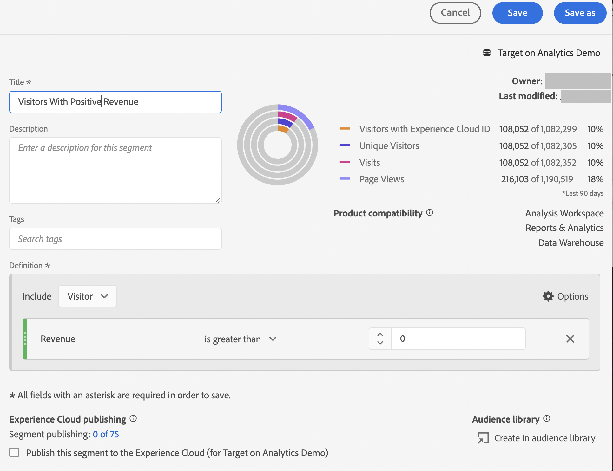

# 在Analysis Workspace中設定A4T報表，以 [!DNL Auto-Allocate] 活動

安 [!DNL Auto-Allocate] 活動會從兩個或多個體驗中識別獲勝者，並在測試繼續執行和學習時自動重新分配更多流量給獲勝者。 目標分析(A4T)整合 [!DNL Auto-Allocate] 可讓您在Adobe Analytics中查看報表資料，甚至可針對Adobe Analytics中定義的自訂事件或量度進行最佳化。

雖然Adobe Analytics Analysis Workspace提供豐富分析功能，但對預設值進行了一些修改 **[!UICONTROL Analytics for Target]** 需要面板才能正確解譯 [!DNL Auto-Allocate] 活動，由於 [最佳化准則](https://experienceleague.adobe.com/docs/target/using/integrate/a4t/a4t-at-aa.html?lang=en#supported).

本教學課程將逐步說明分析時的建議修改 [!DNL Auto-Allocate] 活動。 主要概念包括：

* 訪客應一律作為 [!DNL Auto-Allocate] 活動。
* 當量度為Adobe Analytics量度時，轉換率的適當分子取決於活動設定期間選擇的最佳化條件類型。
   * 「最大化獨特訪客轉換率」最佳化標準的轉換率，其分子是具有量度正值的獨特訪客計數。
   * 「每位訪客最大量度值*」的轉換率，其分子為Adobe Analytics中的一般量度值。 預設會提供於 **[!UICONTROL Analytics for Target]** 面板。
* 當您的最佳化量度是Target定義的轉換量度時，預設為 **[!UICONTROL Analytics for Target]** 工作區中的面板會處理面板的設定。
* 工作區中顯示的可信度數字不會反映 [自動分配使用的更保守的統計資料](https://experienceleague.adobe.com/docs/target/using/activities/auto-allocate/automated-traffic-allocation.html?lang=en#section_98388996F0584E15BF3A99C57EEB7629)，則應移除。

## 為建立A4T [!DNL Auto-Allocate] 工作區中的面板

為建立A4T [!DNL Auto-Allocate] 報表從 **[!UICONTROL Analytics for Target]** 面板，如下所示。 然後進行下列選取：

1. **[!UICONTROL 控制體驗]**:您可以選擇任何體驗
2. **[!UICONTROL 標準化量度]**:選取訪客 — 自動分配一律會依不重複訪客將轉換率標準化。
3. **[!UICONTROL 成功量度]**:選取您在活動建立期間使用的相同量度，如果這是Target定義的轉換量度，請選取 **活動轉換**. 否則，請選取您使用的Adobe Analytics量度。

*圖1:Analytics for Target面板設定，適用於 [!DNL Auto-Allocate] 活動。*

>[!NOTE]
>
> 您也可能會收到預先建立的 **[!UICONTROL Analytics for Target]** 的URL區段。

## 使用「每位訪客最大化量度值」最佳化條件來定位轉換量度或Analytics量度

預設的A4T面板控點 [!DNL Auto-Allocate] 目標量度為「目標轉換」或具有最佳化標準「每位訪客最大化量度值」的Analytics量度的活動。

此面板的一個範例顯示為收入量度，其中「每位訪客最大化量度值」在活動建立時選為最佳化條件。 如前所述， [!DNL Auto-Allocate] 使用比 **[!UICONTROL Analytics for Target]** 中。 因此，建議您移除信賴度量，以及相關的上下提升度量。

*圖2:建議的 [!DNL Auto-Allocate] 具有Analytics量度的活動，將每個訪客的最佳化條件的量度值最大化。 對於這些類型的量度，以及Target定義的轉換量度，預設為&#x200B;**[!UICONTROL Analytics for Target]**「 」面板。*

## 具有「最大化獨特訪客轉換率」最佳化條件的Analytics量度

將Adobe Analytics量度與 *最大化獨特訪客轉換率*，預設值 **[!UICONTROL Analytics for Target]** 必須修改工作區中的面板。

成功量度現在是轉換量度為正的不重複訪客計數。 您可以建立群體來篩選具有量度正值的點擊，借此達成此目的。 建立此區段的方式如下：

1. 選取 **元件** > **建立區段** 選項。
1. 從左側面板拖曳活動建立時使用的量度至 **定義** 框。
1. 選取以下量度的值： **大於** 0的數值。
1. 從 **包括** 下拉式清單，選取 **訪客**
1. 為您的區段指定適當的名稱

區段建立的範例如下圖所示，我們在此選取收入為正數的訪客。

*圖3:最佳化條件等於最大化獨特訪客轉換率之Adobe Analytics量度的區段建立。 在此範例中，量度為收入，最佳化目標是以正收入最大化訪客數量。*

建立適當的區段後，系統會預設  **[!UICONTROL Analytics for Target]** 可修改工作區中的面板。

1. 新增秒數 **不重複訪客** 量度與現有訪客量度欄
2. 將剛建立的段拖動到第一列下，以生成類似圖4的面板。 請注意差異 — 收入為正的獨特訪客數量，是指派給每個體驗之獨特訪客總數的一小部分。
   
   *圖4:依新建立的區段篩選獨特訪客*
3. 轉換率可以是 [快速計算](https://experienceleague.adobe.com/docs/analytics-learn/tutorials/components/calculated-metrics/quick-calculated-metrics-in-analysis-workspace.html?lang=en) 按一下右鍵，選擇 **從選取範圍建立量度** > **除**. 預設轉換率應已移除，並取代為這個新計算量度，如下圖所示。 您可能必須編輯新建立的計算量度，才會顯示為 **格式** > **百分比** 最多兩位小數，如所示。
   

   *圖4:最終的「自動分配」面板會顯示二進位收入轉換量度的轉換率*

## 結論

上述步驟已示範如何正確設定 [!DNL Workspace] 顯示自動分配報表資料。 總而言之:

* 當量度為Target定義的轉換量度，或具有最佳化標準的Adobe Analytics量度 *將每個訪客的量度值最大化*，則應使用以訪客為標準化量度的預設工作區面板。
* 當量度是具有最佳化標準「最大化獨特訪客轉換率」的Adobe Analytics量度時，您必須使用的轉換率定義為量度為正的訪客比例。 若要這麼做，請建立對應的區段，以篩選不重複訪客量度。
