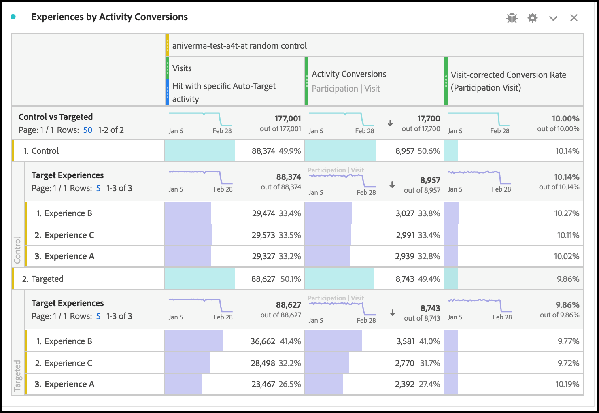

# 在中設定A4T報表 [!DNL Analysis Workspace] 的 [!DNL Auto-Target] 活動

>[!IMPORTANT]
>
>的 [!UICONTROL 自動鎖定目標] 活動，您必須簽入中的報告 [!DNL Analytics Workspace] 和手動建立A4T面板。

此 [!UICONTROL 目標分析] (A4T)整合 [!DNL Auto-Target] 活動使用 [!DNL Adobe Target] Ensemble Machine Learning (ML)演演算法，可在使用 [!DNL Adobe Analytics] 目標量度。

雖然提供豐富的分析功能，但 [!DNL Adobe Analytics] [!DNL Analysis Workspace]，對預設值進行了一些修改 **[!UICONTROL 目標分析]** 需要面板才能正確解譯 [!DNL Auto-Target] 活動，由於實驗活動之間的差異（手動） [!UICONTROL A/B測試] 和 [!UICONTROL 自動分配])和個人化活動([!UICONTROL [!UICONTROL 自動鎖定目標]])。

本教學課程會逐步引導您瞭解建議的修改方式，以便分析 [!UICONTROL 自動鎖定目標] 中的活動 [!DNL Analysis Workspace]，根據下列重要概念：

* 此 **[!UICONTROL 控制與目標]** 維度可用來區分 [!UICONTROL 控制] 體驗與由提供的體驗 [!UICONTROL 自動鎖定目標] 組合ML演演算法。
* 檢視體驗層級的效能劃分時，瀏覽應作為標準化量度使用。 此外， [Adobe Analytics的預設計數方法可能包括使用者實際上看不到活動內容的造訪](https://experienceleague.adobe.com/docs/target/using/integrate/a4t/a4t-faq/a4t-faq-viewing-reports.html#metrics){target=_blank}，但此預設行為可藉由使用適當範圍的區段來修改（詳細資訊如下）。
* 造訪回顧範圍歸因（在指定的歸因模型上也稱為「造訪回顧期間」）是由 [!DNL Adobe Target] ML模型在其培訓階段期間，以及分解目標量度時應使用相同（非預設）的歸因模型。

## 建立A4T用於 [!UICONTROL 自動鎖定目標] 中的面板 [!DNL Analysis Workspace]

建立A4T的方式 [!UICONTROL 自動鎖定目標] 報告，開頭為 **[!UICONTROL 目標分析]** 中的面板 [!DNL Analysis Workspace]，如下所示，或以自由表格開始。 然後進行下列選取：

1. **[!UICONTROL 控制體驗]**：您可以選取任何體驗；不過您稍後會覆寫此選項。 請注意，對於 [!UICONTROL 自動鎖定目標] 活動，控制體驗其實是一種控制策略，其目的在於a)在所有體驗中隨機提供，或b)提供單一體驗(此選項是在活動建立時於以下位置做出的： [!DNL Adobe Target])。 即使您選擇使用(b)，您的 [!UICONTROL 自動鎖定目標] 活動會指定特定體驗作為控制。 您仍然應該遵循本教學課程中概述的方法，分析A4T [!UICONTROL 自動鎖定目標] 活動。
2. **[!UICONTROL 標準化量度]**：選取 [!UICONTROL 造訪].
3. **[!UICONTROL 成功量度]**：雖然您可以選取要報告的任何量度，但您通常應該檢視有關在活動建立期間選擇最佳化的相同量度的報告 [!DNL Target].

   ![[!UICONTROL 目標分析] 面板設定 [!UICONTROL 自動鎖定目標] 活動。](assets/Figure1.png)

   *圖1： [!UICONTROL 目標分析] 面板設定 [!UICONTROL 自動鎖定目標] 活動。*

>[!TIP]
>
>若要設定您的 [!UICONTROL 目標分析] 面板 [!UICONTROL 自動鎖定目標] 活動，選擇任何控制體驗，選擇 [!UICONTROL 造訪] 作為標準化量度，並選擇在此期間為最佳化選擇的相同目標量度 [!DNL Target] 活動建立。

## 使用 [!UICONTROL 控制與目標] 要比較 [!DNL Target] 將ML模型組合到您的控制項

預設A4T面板是專為傳統設計（手動） [!UICONTROL A/B測試] 或 [!UICONTROL 自動分配] 目標是將個別體驗的效能與控制體驗進行比較的活動。 在 [!UICONTROL 自動鎖定目標] 不過，控制項之間的第一個順序比較應該是 *策略* 和目標 *策略*. 換言之，決定整體效能的提升度 [!UICONTROL 自動鎖定目標] 在控制策略上組合ML模型。

若要執行此比較，請使用 **[!UICONTROL 控制與目標（目標分析）]** 維度。 拖放以取代 **[!UICONTROL Target體驗]** A4T報表中的維度。

請注意，此取代會讓預設失效 [!UICONTROL 提升度和可信度] 計算。 為避免混淆，您可以從預設面板中移除這些量度，並留下下列報表：

![[!UICONTROL 依活動轉換的體驗] 中的面板 [!DNL Analysis Workspace]](assets/Figure2.png)

*圖2：建議的基準線報告 [!DNL Auto-Target] 活動。 此報表已設定為將目標流量（由整體ML模型提供）與控制流量進行比較。*

>[!NOTE]
>
>目前， [!UICONTROL 提升度和可信度] 數字不可用於 [!UICONTROL 控制與目標] A4T報表的維度 [!UICONTROL 自動鎖定目標]. 在新增支援之前， [!UICONTROL 提升度和可信度] 可透過下載以下網址手動計算： [信賴度計算器](https://experienceleague.adobe.com/docs/target/assets/complete_confidence_calculator.xlsx).

## 新增量度的體驗層級劃分

若要進一步瞭解整體ML模型的執行方式，您可以檢查 **[!UICONTROL 控制與目標]** 維度。 在 [!DNL Analysis Workspace]，拖曳 **[!UICONTROL Target體驗]** 維度至您的報表，然後分別劃分每個控制項和目標維度。

![[!UICONTROL 依活動轉換的體驗] 中的面板 [!DNL Analysis Workspace]](assets/Figure3.png)

*圖3：依目標體驗劃分目標維度*

產生的報表範例顯示於此處。

![[!UICONTROL 依活動轉換的體驗] 中的面板 [!DNL Analysis Workspace]](assets/Figure4.png)

*圖4：A標準 [!UICONTROL 自動鎖定目標] 具有體驗層級劃分的報表。 請注意，您的目標量度可能不同，您的控制策略可能只有單一體驗。*

>[!TIP]
>
>在 [!DNL Analysis Workspace]，按一下齒輪圖示以隱藏 [!UICONTROL 轉換率] 欄，協助您將焦點保持在體驗轉換率上。 轉換率隨後將格式化為小數，但會據此將其解譯為百分比。

## 為什麼&quot;[!UICONTROL 造訪]「是正確的標準化量度 [!UICONTROL 自動鎖定目標] 活動

分析 [!UICONTROL 自動鎖定目標] 活動，請一律選擇 [!UICONTROL 造訪] 作為預設標準化量度。 [!UICONTROL 自動鎖定目標] 個人化會為訪客選取每次造訪一次體驗（正式方式為每次造訪一次） [!DNL Target] 工作階段)，這表示向訪客顯示的體驗可在每次造訪時變更。 因此，如果您使用 [!UICONTROL 不重複訪客] 做為標準化量度，單一使用者最後可能會看到多個體驗（跨不同造訪）的事實會導致轉換率令人困惑。

一個簡單的範例將示範這一點：假設有兩個訪客進入一個只有兩個體驗的行銷活動。 第一個訪客造訪兩次。 他們會在第一次造訪時指派給體驗A，但在第二次造訪時指派給體驗B （因為其設定檔狀態在第二次造訪時變更）。 在第二次造訪後，訪客會下訂單進行轉換。 此轉換可歸因於最近顯示的體驗（體驗B）。 第二個訪客也會造訪兩次，且兩次都會顯示體驗B，但絕不會轉換。

讓我們比較訪客層級和造訪層級報表：

| 體驗 | 獨特訪客 | 瀏覽次數 | 轉換 | 訪客標準化轉換率 | 造訪標準化轉換率 |
| --- | --- | --- | --- | --- | --- |
| A | 1 | 1 | - | 0% | 0% |
| B | 2 | 3 | 1 | 50% | 33.3% |
| 總計 | 2 | 4 | 1 | 50% | 25% |

*表1：比較訪客標準化與造訪標準化報表的範例，適用於決策對造訪有粘性的情況（而非訪客，如同一般A/B測試）。 此情境中的訪客標準化量度令人困惑。*

如表格所示，訪客層級數字明顯不一致。 雖然不重複訪客總數有兩位，但這不是每個體驗的個別不重複訪客的總和。 雖然訪客層級的轉換率未必錯誤，但在比較個別體驗時，造訪層級的轉換率可能更有意義。 在形式上，分析單位（「造訪」）與決定粘著度單位相同，這表示可新增並比較量度的體驗層級劃分。

## 篩選活動的實際造訪

此 [!DNL Adobe Analytics] 造訪的預設計數方法 [!DNL Target] 活動可能包含使用者未與互動的造訪 [!DNL Target] 活動。 這是由於以下方式 [!DNL Target] 活動指派會持續存在於 [!DNL Analytics] 訪客內容。 因此，瀏覽的次數 [!DNL Target] 活動有時會膨脹，導致轉換率降低。

如果您偏好報告使用者實際與互動的造訪 [!UICONTROL 自動鎖定目標] 活動（透過進入活動、顯示或造訪事件或轉換），您可以：

1. 建立特定區段，包含來自的點選 [!DNL Target] 有問題的活動，然後
1. 篩選 [!UICONTROL 造訪] 量度使用此區段。

**若要建立區段：**

1. 選取 **[!UICONTROL 元件>建立區段]** 中的選項 [!DNL Analysis Workspace] 工具列。
2. 指定 **[!UICONTROL 標題]** 區段的。 在以下範例中，區段名為 [!DNL "Hit with specific Auto-Target activity"].
3. 拖曳 **[!UICONTROL 目標活動]** 區段的維度 **[!UICONTROL 定義]** 區段。
4. 使用 **[!UICONTROL 等於]** 運運算元。
5. 搜尋您專屬的 [!DNL Target] 活動。
6. 按一下齒輪圖示，然後選取 **[!UICONTROL 歸因模型>例項]** 如下圖所示。
7. 按一下&#x200B;**[!UICONTROL 儲存]**。

![中的區段 [!DNL Analysis Workspace]](assets/Figure5.png)

*圖5：使用如圖所示的區段來篩選 [!UICONTROL 造訪] A4T中的量度 [!UICONTROL 自動鎖定目標] 報告*

建立區段後，請使用該區段來篩選 [!UICONTROL 造訪] 量度，因此 [!UICONTROL 造訪] 量度僅包含使用者與其互動的造訪 [!DNL Target] 活動。

**若要篩選 [!UICONTROL 造訪] 使用此區段：**

1. 從元件工具列拖曳新建立的區段，並將滑鼠游標停留在 **[!UICONTROL 造訪]** 量度標籤，直到藍色為止 **[!UICONTROL 篩選依據]** 提示會出現。
2. 發行區段。 篩選器會套用至該量度。

最終面板顯示如下：

![[!UICONTROL 依活動轉換的體驗] 中的面板 [!DNL Analysis Workspace]](assets/Figure6.png)

*圖6：套用了「具有特定自動鎖定目標活動的點選」區段的報告面板 [!UICONTROL 造訪] 量度。 此區段可確保只有使用者實際與互動的造訪 [!DNL Target] 有問題的活動會包含在報表中。*

## 確保目標量度和歸因符合最佳化標準

A4T整合可讓 [!UICONTROL 自動鎖定目標] ML模型將成為 *已訓練* 使用與下列專案相同的轉換事件資料 [!DNL Adobe Analytics] 使用至 *產生效能報表*. 不過，在訓練ML模型時，必須使用某些假設來解譯此資料，這些假設與在中報告階段期間所做的預設假設不同 [!DNL Adobe Analytics].

具體而言， [!DNL Adobe Target] ML模型使用造訪範圍的歸因模型。 也就是說，ML模型假設轉換必須發生在活動內容的顯示同一次造訪中，才能將轉換「歸因」於ML模型所做的決定。 下列專案需要此專案： [!DNL Target] 確保及時訓練其模型； [!DNL Target] 最多無法等待30天轉換（中報表的預設歸因期間） [!DNL Adobe Analytics])，然後將其納入模型的訓練資料中。

因此，所使用的歸因與 [!DNL Target] 模型（在培訓期間）與查詢資料中使用的預設歸因（在報告產生期間）可能會導致差異。 ML模型甚至可能表現不佳，而實際上問題出在歸因上。

>[!TIP]
>
>如果ML模型針對某一量度進行最佳化，而該量度的歸因不同於您在報表中檢視的量度，則模型可能無法如預期般執行。 若要避免此問題，請確認報表上的目標量度使用與以下專案相同的量度定義和歸因： [!DNL Target] ML模型。

確切的量度定義和歸因設定取決於 [最佳化准則](https://experienceleague.adobe.com/docs/target/using/integrate/a4t/a4t-at-aa.html#supported){target=_blank} 您在活動建立期間指定。

### 目標定義的轉換，或 [!DNL Analytics] 量度與 *最大化的每次造訪量度值*

當量度為 [!DNL Target] 轉換，或 [!DNL Analytics] 量度與 **最大化的每次造訪量度值**，目標量度定義可在同一次造訪中發生多個轉換事件。

若要檢視具有相同歸因方法的目標量度， [!DNL Target] ML模型，請遵循下列步驟：

1. 將游標停留在目標量度的齒輪圖示上：

   

1. 從產生的選單捲動至 **[!UICONTROL 資料設定]**.
1. 選取 **[!UICONTROL 使用非預設歸因模型]** （如果尚未選取）。

   

1. 按一下&#x200B;**[!UICONTROL 編輯]**。
1. 選取 **[!UICONTROL 模型]**： **[!UICONTROL 參與率]**、和 **[!UICONTROL 回顧期間]**： **[!UICONTROL 造訪]**.

   

1. 按一下&#x200B;**[!UICONTROL 「套用」]**。

如果發生目標量度事件，這些步驟可確保報表將目標量度歸因於體驗的顯示 *任何時間* （「參與率」）的瀏覽次數。

### [!DNL Analytics] 量度與 *不重複造訪轉換率*

**定義具有正面量度區段的造訪**

在您選取的案例中 *將不重複造訪轉換率最大化* 就最佳化標準而言，轉換率的正確定義是量度值為正數的造訪分數。 若要這麼做，可建立區段篩選，找出量度值為正值的造訪，然後篩選造訪量度。

1. 和之前一樣，選取 **[!UICONTROL 元件>建立區段]** 中的選項 [!DNL Analysis Workspace] 工具列。
2. 指定 **[!UICONTROL 標題]** 區段的。

   在以下範例中，區段名為 [!DNL "Visits with an order"].

3. 將您用於最佳化目標的基本量度拖曳至區段。

   在下列範例中，我們使用 **訂購** 量度，讓轉換率測量已記錄訂單的造訪比例。

4. 在區段定義容器的左上角，選取「 」 **[!UICONTROL 包含]** **造訪**.
5. 使用 **[!UICONTROL 大於]** 運運算元，並將值設為0。

   將值設為0表示此區段包含訂單量度為正數的造訪。

6. 按一下&#x200B;**[!UICONTROL 儲存]**。

*圖7：區段定義會篩選順序列出的造訪。 根據活動的最佳化量度，您必須使用適當的量度來取代訂單*

**將此套用至活動篩選量度中的造訪**

此區段現在可用於篩選具有正數訂單的造訪，以及曾經的點選位置。 [!DNL Auto-Target] 活動。 篩選量度的程式與之前類似，而且在套用新區段至已篩選的造訪量度後，報表面板應該會如圖8所示

*圖8：具有正確不重複造訪轉換量度的報表面板：記錄來自活動的點選，且轉換量度（此範例中的訂單）非零的造訪次數。*

## 最後步驟：建立可擷取上述神奇的轉換率

修改 [!UICONTROL 造訪] 以及前幾節中的目標量度，您應該對預設A4T進行的最終修改 [!DNL Auto-Target] 報表面板會建立正確比率的轉換率，也就是正確的目標量度與適當篩選的「造訪」量度的比率。

若要這麼做，請建立 [!UICONTROL 計算量度] 使用下列步驟：

1. 選取 **[!UICONTROL 元件>建立量度]** 中的選項 [!DNL Analysis Workspace] 工具列。
1. 指定 **[!UICONTROL 標題]** （以量度表示）。 例如，「活動XXX的造訪修正轉換率」。
1. 選取 **[!UICONTROL 格式]** =百分比和 **[!UICONTROL 小數位數]** = 2.
1. 拖曳活動的相關目標量度(例如， [!UICONTROL 活動轉換])，然後使用此目標量度上的齒輪圖示，將歸因模型調整為（參與率|造訪），如先前所述。
1. 選取 **[!UICONTROL 新增>容器]** 從的右上角 **[!UICONTROL 定義]** 區段。
1. 選取兩個容器之間的除(÷)運運算元。
1. 拖曳您先前建立的區段（名為「具特定之點選次數」） [!UICONTROL 自動鎖定目標] 活動」一節 [!DNL Auto-Target] 活動。
1. 拖曳 **[!UICONTROL 造訪]** 量度放入區段容器中。
1. 按一下&#x200B;**[!UICONTROL 儲存]**。

>[!TIP]
>
> 您也可以使用建立此量度 [快速計算量度功能](https://experienceleague.adobe.com/docs/analytics-learn/tutorials/components/calculated-metrics/quick-calculated-metrics-in-analysis-workspace.html).

此處顯示完整的計算量度定義。

*圖7：造訪校正和歸因校正的模型轉換率量度定義。 (請注意，此量度取決於您的目標量度和活動。 換句話說，此量度定義無法跨活動重複使用。)*

>[!IMPORTANT]
>
>此 [!UICONTROL 轉換] A4T面板中的比率量度未連結至表格中的轉換事件或標準化量度。 進行本教學課程建議的修改時， [!UICONTROL 轉換] 費率不會自動適應變更。 因此，如果您修改轉換事件歸因或標準化量度（或兩者），您必須記住作為最後步驟也要修改 [!UICONTROL 轉換] 費率計算，如上所示。

## 摘要：最終範例 [!DNL Analysis Workspace] 面板 [!UICONTROL 自動鎖定目標] 報表

將上述所有步驟合併成單一面板，下圖顯示建議報表的完整檢視 [!UICONTROL 自動鎖定目標] A4T活動。 此報表與 [!DNL Target] 用來最佳化目標量度的ML模型。 此報表包含本教學課程中討論的所有細微差別和建議。 此報表也最接近傳統方式中使用的計數方法 [!DNL Target] — 報告導向 [!UICONTROL 自動鎖定目標] 活動。

按一下以展開影像。

![中的最終A4T報表 [!DNL Analysis Workspace]](assets/Figure10.png "Analysis Workspace中的A4T報表"){width="600" zoomable="yes"}

*圖10：最終的A4T [!UICONTROL 自動鎖定目標] 報告位置 [!DNL Adobe Analytics] [!DNL Workspace]，結合本教學課程前幾節所述之量度定義的所有調整。*
