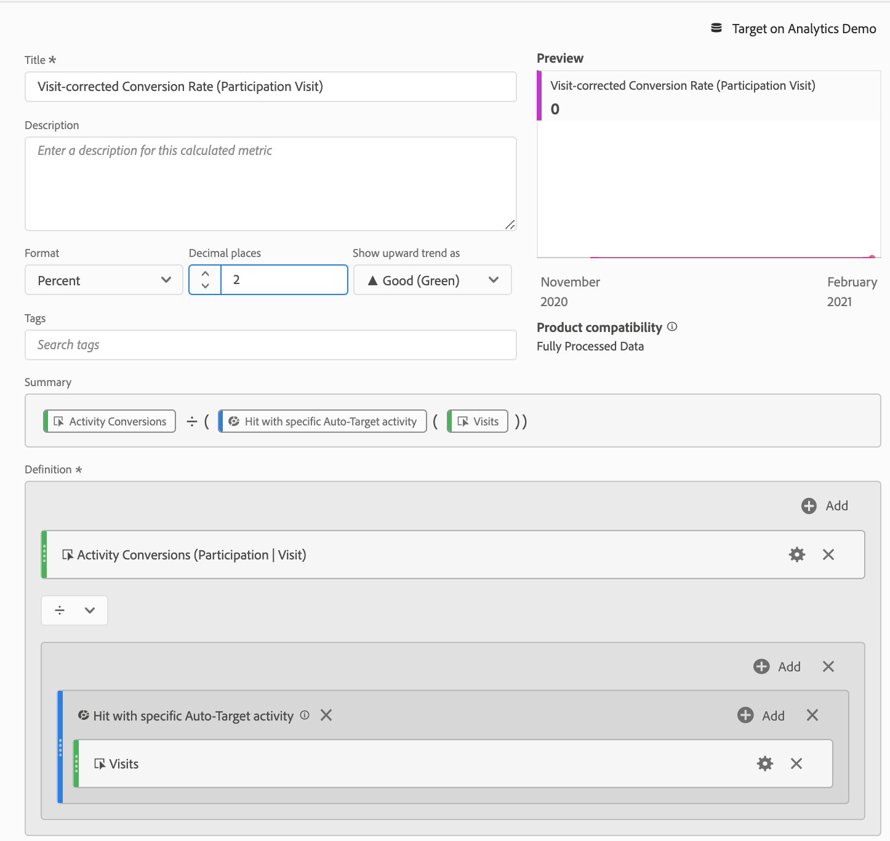

# 在Analysis Workspace中設定A4T報表，以 [!DNL Auto-Target] 活動

目標分析(A4T)整合 [!DNL Auto-Target] 活動使用Adobe Target的整體機器學習(ML)演算法，根據訪客的設定檔、行為和內容為每位訪客選擇最佳體驗，同時使用Adobe Analytics目標量度。

雖然Adobe Analytics Analysis Workspace提供豐富分析功能，但對預設值進行了一些修改 **[!UICONTROL Analytics for Target]** 需要面板才能正確解譯 [!DNL Auto-Target] 活動，因為實驗活動（手動A/B和自動分配）與個人化活動([!DNL Auto-Target])。

本教學課程將逐步說明分析時的建議修改 [!DNL Auto-Target] 活動，這些活動以下列重要概念為基礎：

* 此 **[!UICONTROL 控制與目標]** 維度可用來區分控制體驗和提供的體驗 [!DNL Auto-Target] 整合ML算法。
* 檢視體驗層級績效劃分時，應將造訪設為標準化量度。 此外， [Adobe Analytics的預設計數方法可能包含使用者實際上看不到活動內容的造訪](https://experienceleague.adobe.com/docs/target/using/integrate/a4t/a4t-faq/a4t-faq-viewing-reports.html?lang=en#metrics)，但可使用適當範圍的區段來修改此預設行為（詳見下方）。
* Adobe Target的ML模型在訓練階段會使用造訪回顧範圍歸因（在指定的歸因模型上也稱為「造訪回顧期間」），而劃分目標量度時應使用相同（非預設）的歸因模型。

## 為建立A4T [!DNL Auto-Target] 工作區中的面板

為建立A4T [!DNL Auto-Target] 報表，以開頭 **[!UICONTROL Analytics for Target]** 工作區中的面板，如下所示，或以自由表格開頭。 然後進行下列選取：

1. **[!UICONTROL 控制體驗]**:您可以選擇任何體驗；不過，您稍後會覆寫此選項。 請注意， [!DNL Auto-Target] 活動中，控制體驗其實是一種控制策略，可能是a)在所有體驗中隨機提供，或b)提供單一體驗(此選項是在Adobe Target中的活動建立時進行)。 即使您選擇(b)- [!DNL Auto-Target] 將特定體驗指定為控制的活動 — 您仍應遵循本教學課程中概述的方法，來分析 [!DNL Auto-Target] 活動。
2. **[!UICONTROL 標準化量度]**:選取造訪。
3. **[!UICONTROL 成功量度]**:雖然您可以選取要報告的任何量度，但您通常應檢視所選用於最佳化的相同量度在Adobe Target中建立活動期間的報表。

*圖1:Analytics for Target面板設定，適用於 [!DNL Auto-Target] 活動。*

>[!NOTE]
>
>若要針對自動鎖定目標活動設定Analytics for Target面板，請選擇任何控制體驗，選擇造訪作為標準化量度，然後選擇在建立Target活動期間為最佳化所選的相同目標量度。

## 使用控制項與目標維度，比較Adobe Target的整體ML模型與您的控制項

預設的A4T面板專為傳統（手動）A/B測試或自動分配活動而設計，其目標是比較個別體驗與控制體驗的效能。 在 [!DNL Auto-Target] 不過，第一階比較應該是控制項之間 *策略* 和目標 *策略* (換言之，決定 [!DNL Auto-Target] 整體ML模型（控制策略）。

若要執行此比較，請使用 **[!UICONTROL 控制與鎖定(Analytics for Target)]** 維度。 拖放以取代 **[!UICONTROL 目標體驗]** 維度。

請注意，此取代會讓A4T面板的預設提升度和可信度計算失效。 若要避免混淆，您可以從預設面板中移除這些量度，並保留下列報表：

*圖2:建議的基準報告 [!DNL Auto-Target] 活動。 此報表已設定來比較目標流量（由整體ML模型提供）和您的控制流量。*

>[!NOTE]
>
>目前，針對自動鎖定目標的A4T報表，控制與鎖定維度無法使用提升度和可信度數字。 在新增支援之前，您可以借由下載 [信賴度計算器](https://experienceleague.adobe.com/docs/target/assets/complete_confidence_calculator.xlsx?lang=en).

## 加入量度的體驗層級劃分

若要進一步了解整體ML模型的執行方式，您可以檢查 **[!UICONTROL 控制與目標]** 維度。 在工作區中，拖曳 **[!UICONTROL 目標體驗]** 維度，然後分別劃分「控制」和「目標」維度。

*圖3:依目標體驗劃分目標維度*

產生的報表範例如下所示。

*圖4:標準 [!DNL Auto-Target] 包含體驗層級劃分的報表。 請注意，您的目標量度可能不同，而您的控制策略可能只有單一體驗。*

>[!TIP]
>
>在工作區中，按一下齒輪圖示以隱藏「轉換率」欄中的「百分比」，協助您專注於體驗轉換率。 請注意，轉換率將格式化為小數，但會據此解譯為百分比。

## 為何「造訪」是 [!DNL Auto-Target] 活動

分析 [!DNL Auto-Target] 活動中，請一律選擇「造訪」作為預設標準化量度。 [!DNL Auto-Target] 「個人化」會為訪客選取每次造訪一次的體驗(正式為，每次Adobe Target工作階段一次)，這表示向使用者顯示的體驗可在每次造訪時變更。 因此，如果您使用獨特訪客作為標準化量度，單一使用者最終可能看到多個體驗（跨不同造訪）的事實，將導致混淆轉換率。

一個簡單的示例演示了此點：假設有兩個訪客進入一個只有兩個體驗的促銷活動。 第一個訪客瀏覽兩次。 他們會在第一次造訪時指派給體驗A，但在第二次造訪時指派給體驗B（因為其設定檔狀態在第二次造訪時有所變更）。 第二次造訪後，訪客會透過下單進行轉換。 轉換會歸因於最近顯示的體驗（體驗B）。 第二個訪客也瀏覽了兩次，且兩次都顯示體驗B，但從未轉換。

讓我們比較訪客層級和造訪層級報表：

| 體驗 | 獨特訪客 | 瀏覽次數 | 轉換 | 訪客基準。 康夫。 比率 | 訪問規範。 康夫。 比率 |
| --- | --- | --- | --- | --- | --- |
| A | 1 | 1 | - | 0% | 0% |
| B | 2 | 3 | 1 | 50% | 33.3% |
| 總計 | 2 | 4 | 1 | 50% | 25% |
*表1:比較訪客標準化報表和造訪標準化報表的範例，其中決策與造訪有黏性（而非訪客，如同一般A/B測試）。 此情境中會混淆訪客標準化量度。*

如表格所示，訪客層級的數字有明顯的不一致。 儘管事實上有兩個不重複訪客總計，但這並非每個體驗的個別不重複訪客總和。 雖然訪客層級轉換率不一定是錯誤的，但比較個別體驗時，瀏覽層級的轉換率可以說更合理。 從形式上講，分析單位（「造訪」）與決策黏著度單位相同，這表示可以新增和比較量度的體驗層級劃分。

## 篩選活動的實際造訪次數

Adobe Analytics的Target活動造訪預設計數方法可能包含使用者未與Target活動互動的造訪。 這是由於Target活動指派在Analytics訪客內容中持續存在的方式。 因此，對Target活動的造訪次數有時會膨脹，導致轉換率下降。

如果您偏好報告使用者實際與自動鎖定目標活動互動的造訪（透過活動項目、顯示/造訪事件或轉換），您可以：

1. 建立特定區段，其中包含來自相關Target活動的點擊，然後
1. 使用此區段篩選「造訪」量度。

**若要建立區段：**

1. 選取 **[!UICONTROL 元件>建立區段]** 選項。
2. 輸入 **[!UICONTROL 標題]** 的URL區段。 在下列範例中，區段的名稱為 [!DNL "Hit with specific Auto-Target activity"].
3. 拖曳 **[!UICONTROL 目標活動]** 維度至區段 **[!UICONTROL 定義]** 區段。
4. 使用 **[!UICONTROL 等於]** 運算元。
5. 搜尋您的特定Target活動。
6. 選取齒輪圖示，然後選取 **[!UICONTROL 歸因模型>例項]** 如下圖所示。
7. 按一下&#x200B;**[!UICONTROL 儲存]**。

*圖5:使用此處顯示的區段等區段，在A4T中篩選「造訪」量度以 [!DNL Auto-Target] 報告*

建立區段後，請使用它來篩選造訪量度，因此造訪量度僅包含使用者與Target活動互動的造訪。

**若要使用此區段篩選造訪：**

1. 從元件工具列拖曳新建立的區段，並將滑鼠移到 **[!UICONTROL 瀏覽]** 量度標籤直到藍色 **[!UICONTROL 篩選依據]** 出現提示。
2. 發行區段。 篩選器會套用至該量度。

最終面板將顯示如下。

*圖6:報表面板，其中「點擊特定自動鎖定目標活動」區段已套用至 [!UICONTROL 瀏覽] 量度。 這可確保只有當使用者實際與相關Target活動互動時，才會納入報表中的造訪。*

## 確定目標量度和歸因與您的最佳化標準一致

A4T整合允許 [!DNL Auto-Target]&#39;s ML型號為 *訓練* 使用Adobe Analytics用到的相同轉換事件資料 *生成效能報告*. 然而，在培訓ML模型時，在解釋此資料時必須採用某些假設，這與在Adobe Analytics報告階段所作的預設假設不同。

具體而言，Adobe Target的ML模型會使用造訪範圍歸因模型。 也就是說，他們假設轉換必須發生在活動內容顯示的相同瀏覽中，以便將轉換「歸因」至ML模型所做的決策。 這是Target保證及時培訓其模型的必要條件；Target最多等候30天的轉換(Adobe Analytics中報表的預設歸因視窗)，才能將其納入其模型的訓練資料中。

因此，Target模型（訓練期間）所使用的歸因，與查詢資料（產生報表期間）所使用的預設歸因之間的差異，可能會導致差異。 事實上，歸因問題所在， ML模型的效能甚至可能看起來很差。

>[!TIP]
>
>如果ML模型針對與您在報表中檢視的量度不同而歸因的量度進行最佳化，則模型可能無法如預期般執行！ 為避免此情況，請確定報表上的目標量度使用與Target ML模型所使用相同的量度定義和歸因。

確切的量度定義和歸因設定取決於 [優化准則](https://experienceleague.adobe.com/docs/target/using/integrate/a4t/a4t-at-aa.html?lang=en#supported) 在活動建立期間指定。

### 定位定義的轉換，或使用 *將每次造訪的量度值最大化*

當量度為Target轉換，或Analytics量度具有 **將每次造訪的量度值最大化**，目標量度定義可讓多個轉換事件在同一次造訪中發生。
若要檢視與Adobe Target ML模型所使用歸因方法相同的目標量度，請遵循下列步驟：

1. 將滑鼠指標暫留在目標量度的齒輪圖示上：
   
1. 從產生的功能表，捲動至 **[!UICONTROL 資料設定]**.
1. 選擇 **[!UICONTROL 使用非預設歸因模型]** （如果尚未選取）:
   
1. 按一下&#x200B;**[!UICONTROL 編輯]**。
1. 選擇 **[!UICONTROL 模型]**: **[!UICONTROL 參與率]**，和 **[!UICONTROL 回顧期間]**: **[!UICONTROL 瀏覽]**.
   
1. 按一下&#x200B;**[!UICONTROL 「套用」]**。

這些步驟可確保如果目標量度事件發生，您的報表會將目標量度歸因於體驗的顯示 *任何時間* （「參與率」）。

### Analytics量度搭配 *不重複造訪轉換率*

**以正量度區段定義造訪**

在您選取的案例中 *最大化獨特造訪轉換率* 作為最佳化條件，則轉換率的正確定義是度量值為正的造訪次數的百分比。 這可透過建立區段來達成，依量度的正值向下篩選至造訪，然後篩選造訪量度。

1. 和之前一樣，選取 **[!UICONTROL 元件>建立區段]** 選項。
2. 輸入 **[!UICONTROL 標題]** 的URL區段。 在下列範例中，區段的名稱為 [!DNL "Visits with an order"].
3. 將您在最佳化目標中使用的基礎量度拖曳至區段。 在下列範例中，我們會使用 **訂購** 量度，因此轉換率會測量記錄訂單的造訪比例。
4. 在區段定義容器的左上角，選取 **[!UICONTROL 包括]** **瀏覽**.
5. 使用 **[!UICONTROL 大於]** 運算元，並將值設為0（亦即，此區段包含訂購量度為正的造訪）
6. 按一下&#x200B;**[!UICONTROL 儲存]**。

*圖7:以正序篩選瀏覽的區段定義。 根據活動的最佳化量度，您必須以適當的量度取代訂單*

**將此項目套用至活動篩選量度中的造訪**

此區段現在可用來篩選具有正數訂購的造訪，以及 [!DNL Auto-Target]活動。 篩選量度的程式與之前類似，而將新區段套用至已篩選的造訪量度後，報表面板看起來應該類似圖8

*圖8:具有正確獨特造訪轉換量度的報表面板 — 亦即記錄來自活動點擊的造訪次數，以及轉換量度（此範例中的訂購）非零的造訪次數。*

## 最後一步：建立擷取上述神奇效果的轉換率

在前幾節中修改造訪和目標量度後，您應針對 [!DNL Auto-Target] 「報表」面板是用來建立正確比率（即已更正之目標量度與已適當篩選之「造訪」量度的比率）。

請使用下列步驟建立計算量度來執行此操作：

1. 選取 **[!UICONTROL 元件>建立量度]** 選項。
1. 輸入 **[!UICONTROL 標題]** ，以取得量度。 例如，「活動XXX的瀏覽更正轉換率」。
1. 選擇 **[!UICONTROL 格式]** =百分比和 **[!UICONTROL 小數位數]** = 2。
1. 將您活動的相關目標量度（例如活動轉換）拖曳至定義中，並使用此目標量度上的齒輪圖示，將歸因模型調整為（參與率|造訪），如先前所述。
1. 選擇 **[!UICONTROL 新增>容器]** 從 **[!UICONTROL 定義]** 區段。
1. 選取兩個容器之間的除法(÷)運算子。
1. 拖曳先前建立的區段 — 名為「特定點擊」 [!DNL Auto-Target] 本教學課程中的「活動」，針對此特定 [!DNL Auto-Target] 活動。
1. 拖曳 **[!UICONTROL 瀏覽]** 量度放入區段容器中。
1. 按一下&#x200B;**[!UICONTROL 儲存]**。

>[!TIP]
>
> 您也可以使用 [快速計算量度功能](https://experienceleague.adobe.com/docs/analytics-learn/tutorials/components/calculated-metrics/quick-calculated-metrics-in-analysis-workspace.html?lang=en).

完整的計算量度定義會顯示在此處。

*圖9:修正造訪和歸因的模型轉換率量度定義。 (請注意，此量度取決於您的目標量度和活動。 換句話說，此量度定義無法在各活動間重複使用。)*

>[!IMPORTANT]
>
>A4T面板中的轉換率量度沒有連結至表格中的轉換事件或標準化量度。 當您進行本教學課程中建議的修改時，轉換率不會自動適應變更。 因此，如果您對轉換事件歸因和標準化量度中的一個（或兩者）進行修改，則您必須記住，最後一步也要修改轉換率，如上所示。

## 摘要：的最終範例工作區面板 [!DNL Auto-Target] 報告

將上述所有步驟合併成單一面板，下圖將顯示建議報表的完整檢視 [!DNL Auto-Target] A4T活動。 此報表與Target的機器學習模型用來最佳化您的目標量度相同，並納入本教學課程中討論的所有細微差別和建議。 此報表也與傳統Target報告導向中使用的計數方法最接近 [!DNL Auto-Target] 活動。

*圖10:最終的A4T [!DNL Auto-Target] Adobe Analytics工作區中的報表，其中結合本檔案前幾節所述之量度定義的所有調整。*
