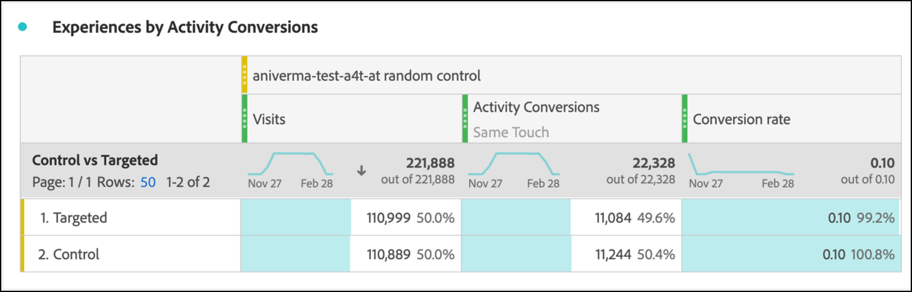

# 在Analysis Workspace中為[!DNL Auto-Target]活動設定A4T報表

[!DNL Auto-Target]活動的Analytics for Target(A4T)整合使用Adobe Target的整體機器學習(ML)演算法，根據訪客的設定檔、行為和內容為每個訪客選擇最佳體驗，同時使用Adobe Analytics目標量度。

雖然Adobe Analytics Analysis Workspace中提供豐富分析功能，但由於實驗活動（手動A/B和自動分配）與個人化活動([!DNL Auto-Target])之間的差異，若要正確解譯[!DNL Auto-Target]活動，需對預設的&#x200B;**[!UICONTROL Analytics for Target]**&#x200B;面板進行一些修改。

本教學課程會逐步說明在Workspace中分析[!DNL Auto-Target]活動的建議修改，這些修改是根據下列重要概念：

* **[!UICONTROL 控制與目標]**&#x200B;維度可用來區分控制體驗與[!DNL Auto-Target]整體ML演算法提供的體驗。
* 檢視體驗層級績效劃分時，應將造訪設為標準化量度。 此外，[Adobe Analytics的預設計數方法可能包含使用者實際上未看見活動內容](https://experienceleague.adobe.com/docs/target/using/integrate/a4t/a4t-faq/a4t-faq-viewing-reports.html?lang=en#metrics)的造訪，但可使用適當範圍的區段來修改此預設行為（詳見下方）。
* Adobe Target的ML模型在訓練階段會使用造訪回顧範圍歸因（在指定的歸因模型上也稱為「造訪回顧期間」），而劃分目標量度時應使用相同（非預設）的歸因模型。

## 在工作區中建立[!DNL Auto-Target]面板的A4T

若要為[!DNL Auto-Target]報表建立A4T，請從工作區中的&#x200B;**[!UICONTROL Analytics for Target]**&#x200B;面板開始（如下所示），或從自由表格開始。 然後進行下列選取：

1. **[!UICONTROL 控制體驗]**:您可以選擇任何體驗；不過，您稍後會覆寫此選項。請注意，對於[!DNL Auto-Target]活動，控制體驗實際上是一種控制策略，可以是a)在所有體驗中隨機提供，或b)提供單一體驗(此選項是在Adobe Target中的活動建立時進行的)。 即使您選擇(b) — 您的[!DNL Auto-Target]活動將特定體驗指定為控制，您仍應遵循本教學課程中概述的方法，分析[!DNL Auto-Target]活動的A4T。
2. **[!UICONTROL 標準化量度]**:選取造訪。
3. **[!UICONTROL 成功量度]**:雖然您可以選取要報告的任何量度，但您通常應檢視所選用於最佳化的相同量度在Adobe Target中建立活動期間的報表。

*pngFigure 1:活動的Analytics for Target面板設 [!DNL Auto-Target] 定。*

>[!NOTE]
>
>若要針對自動鎖定目標活動設定Analytics for Target面板，請選擇任何控制體驗，選擇造訪作為標準化量度，然後選擇在建立Target活動期間為最佳化所選的相同目標量度。

## 使用控制項與目標維度，比較Adobe Target的整體ML模型與您的控制項

預設的A4T面板專為傳統（手動）A/B測試或自動分配活動而設計，其目標是比較個別體驗與控制體驗的效能。 但是，在[!DNL Auto-Target]活動中，第一階比較應該在控制&#x200B;*策略*&#x200B;和目標&#x200B;*策略*&#x200B;之間（換句話說，確定[!DNL Auto-Target]整合ML模型在控制策略上的整體效能提升度）。

若要執行此比較，請使用&#x200B;**[!UICONTROL 控制與鎖定目標(Analytics for Target)]**&#x200B;維度。 拖放以取代預設A4T報表中的&#x200B;**[!UICONTROL Target體驗]**&#x200B;維度。

請注意，此取代會讓A4T面板的預設提升度和可信度計算失效。 若要避免混淆，您可以從預設面板中移除這些量度，並保留下列報表：

*pngFigure 2:活動的建議基準 [!DNL Auto-Target] 報告。此報告已配置為將目標流量（由整體ML模型提供）與控制流量進行比較。*

>[!NOTE]
>
>目前，針對自動鎖定目標的A4T報表，控制與鎖定維度無法使用提升度和可信度數字。 在增加支援之前，您可以下載[信賴度計算器](https://experienceleague.adobe.com/docs/target/assets/complete_confidence_calculator.xlsx?lang=en)來手動計算提升度和信賴度。

## 加入量度的體驗層級劃分

若要進一步深入了解整體ML模型的執行情形，您可以檢查&#x200B;**[!UICONTROL 控制與目標]**&#x200B;維度的體驗層級劃分。 在工作區中，將&#x200B;**[!UICONTROL Target體驗]**&#x200B;維度拖曳至報表，然後分別劃分控制和鎖定目標維度。

*pngFigure 3:依目標體驗劃分目標維度*

產生的報表範例如下所示。

*pngFigure 4:具有體 [!DNL Auto-Target] 驗層級劃分的標準報表。請注意，您的目標量度可能不同，而您的控制策略可能具有單一體驗。*

>[!TIP]
>
>在工作區中，按一下齒輪圖示以隱藏「轉換率」欄中的「百分比」，協助您專注於體驗轉換率。 請注意，轉換率將格式化為小數，但會據此解譯為百分比。

## 為何「造訪」是[!DNL Auto-Target]活動的正確標準化量度

分析[!DNL Auto-Target]活動時，請一律選擇「造訪」作為預設標準化量度。 [!DNL Auto-Target] 「個人化」會為訪客選取每次造訪一次的體驗(正式為，每次Adobe Target工作階段一次)，這表示向使用者顯示的體驗可在每次造訪時變更。因此，如果您使用獨特訪客作為標準化量度，單一使用者最終可能看到多個體驗（跨不同造訪）的事實，將導致混淆轉換率。

一個簡單的示例演示了此點：假設有兩個訪客進入一個只有兩個體驗的促銷活動。 第一個訪客瀏覽兩次。 他們會在第一次造訪時指派給體驗A，但在第二次造訪時指派給體驗B（因為其設定檔狀態在第二次造訪時有所變更）。 第二次造訪後，訪客會透過下單進行轉換。 轉換會歸因於最近顯示的體驗（體驗B）。 第二個訪客也瀏覽了兩次，且兩次都顯示體驗B，但從未轉換。

讓我們比較訪客層級和造訪層級報表：

| 體驗 | 獨特訪客 | 瀏覽次數 | 轉換 | 訪客基準。 康夫。 比率 | 訪問規範。 康夫。 比率 |
| --- | --- | --- | --- | --- | --- |
| A | 1 | 3 | - | 0% | 0% |
| B | 2 | 3 | 3 | 50% | 33.3% |
| 總計 | 2 | 4 | 3 | 50% | 25% |
*表1:比較訪客標準化報表和造訪標準化報表的範例，其中決策與造訪有黏性（而非訪客，如同一般A/B測試）。此案例中的訪客標準化量度令人困惑。*

如表格所示，訪客層級的數字有明顯的不一致。 儘管事實上有兩個不重複訪客總計，但這並非每個體驗的個別不重複訪客總和。 雖然訪客層級轉換率不一定是錯誤的，但比較個別體驗時，瀏覽層級的轉換率可以說更合理。 從形式上講，分析單位（「造訪」）與決策黏著度單位相同，這表示可以新增和比較量度的體驗層級劃分。

## 篩選活動的實際造訪次數

Adobe Analytics的Target活動造訪預設計數方法可能包含使用者未與Target活動互動的造訪。 這是由於Target活動指派在Analytics訪客內容中持續存在的方式。 因此，對Target活動的造訪次數有時會膨脹，導致轉換率下降。

如果您偏好報告使用者實際與自動鎖定目標活動互動的造訪（透過活動項目、顯示/造訪事件或轉換），您可以：

1. 建立特定區段，其中包含來自相關Target活動的點擊，然後
1. 使用此區段篩選「造訪」量度。

**若要建立區段：**

1. 在工作區工具列中選取&#x200B;**[!UICONTROL 元件>建立區段]**&#x200B;選項。
2. 輸入區段的&#x200B;**[!UICONTROL 標題]**。 在下列範例中，區段的名稱為[!DNL "Hit with specific Auto-Target activity"]。
3. 將&#x200B;**[!UICONTROL Target活動]**&#x200B;維度拖曳至區段&#x200B;**[!UICONTROL Definition]**&#x200B;區段。
4. 使用&#x200B;**[!UICONTROL equals]**&#x200B;運算子。
5. 搜尋您的特定Target活動。
6. 選取齒輪圖示，然後選取&#x200B;**[!UICONTROL 歸因模型>例項]**，如下圖所示。
7. 按一下&#x200B;**[!UICONTROL 「儲存」]**。

*png圖5:使用此處顯示的區段等區段，為報表篩選A4T中的造訪量 [!DNL Auto-Target] 度*

建立區段後，請使用它來篩選造訪量度，因此造訪量度僅包含使用者與Target活動互動的造訪。

**若要使用此區段篩選造訪：**

1. 從元件工具列拖曳新建立的區段，並將滑鼠移至&#x200B;**[!UICONTROL 造訪]**&#x200B;量度標籤的底端，直到出現藍色&#x200B;**[!UICONTROL 依]**&#x200B;篩選提示為止。
2. 發行區段。 篩選器會套用至該量度。

最終面板將顯示如下。

*pngFigure 6:報表面板，其中「點擊搭配特定的自動鎖定目標活動」區段已套用至  訪客量度。這可確保只有當使用者實際與相關Target活動互動時，才會納入報表中。*

## 協調ML模型訓練和目標量度產生之間的歸因

A4T整合可讓[!DNL Auto-Target]的ML模型透過Adobe Analytics用於&#x200B;*產生效能報表*&#x200B;的相同轉換事件資料，*訓練*。 然而，在培訓ML模型時，在解釋此資料時必須採用某些假設，這與在Adobe Analytics報告階段所作的預設假設不同。

具體而言，Adobe Target的ML模型會使用造訪範圍歸因模型。 也就是說，他們假設轉換必須發生在活動內容顯示的相同瀏覽中，以便將轉換「歸因」至ML模型所做的決策。 這是Target保證及時培訓其模型的必要條件；Target最多等候30天的轉換(Adobe Analytics中報表的預設歸因視窗)，才能將其納入其模型的訓練資料中。

因此，Target模型（訓練期間）所使用的歸因，與查詢資料（產生報表期間）所使用的預設歸因之間的差異，可能會導致差異。 事實上，歸因問題所在， ML模型的效能甚至可能看起來很差。

>[!TIP]
>
>如果ML模型針對與您在報表中檢視的量度不同而歸因的量度進行最佳化，則模型可能無法如預期般執行！ 為避免此情況，請確定報表上的目標量度使用與Target的ML模型所使用的相同歸因。

若要檢視與Adobe Target ML模型所使用歸因方法相同的目標量度，請遵循下列步驟：

1. 將滑鼠指標暫留在目標量度的齒輪圖示上：
   
1. 從產生的功能表，捲動至&#x200B;**[!UICONTROL 資料設定]**。
1. 選擇&#x200B;**[!UICONTROL 使用非預設歸因模型]**（如果尚未選擇）:
   
1. 按一下&#x200B;**[!UICONTROL 編輯]**。
1. 選擇&#x200B;**[!UICONTROL Model]**:**[!UICONTROL 參與率]**&#x200B;及&#x200B;**[!UICONTROL 回顧期間]**:**[!UICONTROL 造訪]**。
   
1. 按一下&#x200B;**[!UICONTROL 「套用」]**。

如果目標量度事件在顯示體驗的同一次造訪中隨時發生&#x200B;**（「參與率」），這些步驟可確保您的報表將目標量度歸因於體驗的顯示。

## 最後一步：建立擷取上述神奇效果的轉換率

在前幾節中對造訪和目標量度所做的修改後，您應對[!DNL Auto-Target]報表面板的預設A4T進行的最終修改是建立正確比率（具有正確歸因之目標量度與適當篩選之「造訪」量度的比率）。

請使用下列步驟建立計算量度來執行此操作：

1. 在工作區工具列中選取&#x200B;**[!UICONTROL 元件>建立量度]**&#x200B;選項。
1. 輸入量度的&#x200B;**[!UICONTROL 標題]**。 例如，「活動XXX的瀏覽更正轉換率」。
1. 選擇「**[!UICONTROL 格式]** =百分比」和「**[!UICONTROL 小數位數]** = 2」。
1. 將您活動的相關目標量度（例如活動轉換）拖曳至定義中，並使用此目標量度上的齒輪圖示，將歸因模型調整為（參與率|造訪），如先前所述。
1. 從&#x200B;**[!UICONTROL Definition]**&#x200B;區段的右上角選擇&#x200B;**[!UICONTROL 添加>容器]**。
1. 選取兩個容器之間的除法(÷)運算子。
1. 針對此特定[!DNL Auto-Target]活動，拖曳您先前建立的區段（在本教學課程中命名為「特定[!DNL Auto-Target]活動的點擊」）。
1. 將&#x200B;**[!UICONTROL 造訪]**&#x200B;量度拖曳至區段容器。
1. 按一下&#x200B;**[!UICONTROL 「儲存」]**。

完整的計算量度定義會顯示在此處。

*pngFigure 7:修正造訪和歸因的模型轉換率量度定義。(請注意，此量度取決於您的目標量度和活動。 換言之，此量度定義無法在各活動間重複使用。)*

>[!IMPORTANT]
>
>A4T面板中的轉換率量度沒有連結至表格中的轉換事件或標準化量度。 當您進行本教學課程中建議的修改時，轉換率不會自動適應變更。 因此，如果您對轉換事件歸因和標準化量度中的一個（或兩者）進行修改，則您必須記住，最後一步也要修改轉換率，如上所示。

## 摘要：[!DNL Auto-Target]報表的最終範例Workspace面板

將上述所有步驟合併為單一面板，下圖顯示[!DNL Auto-Target] A4T活動之建議報表的完整檢視。 此報表與Target的機器學習模型用來最佳化您的目標量度相同，並納入本教學課程中討論的所有細微差別和建議。 此報表也最接近傳統Target報表導向[!DNL Auto-Target]活動中使用的計數方法。

*pngFigure 8:Adobe Analytics工作區中 [!DNL Auto-Target] 的最終A4T報表，結合本檔案前幾節所述之量度定義的所有調整。*
