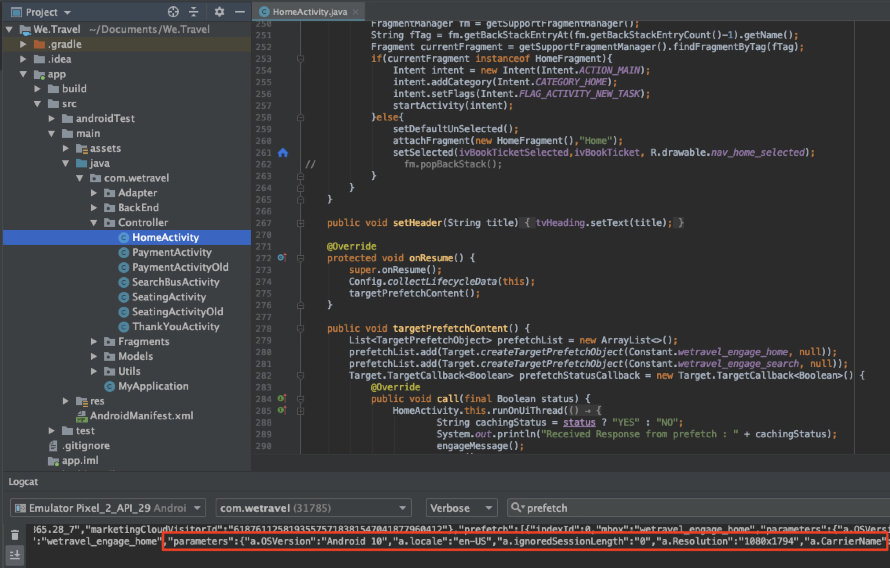

# 新增參數至請求

在本課中，我們將新增Adobe生命週期度量和自訂參數至上 [!DNL Target] 一課中新增的請求。 這些度量和參數將在教學課程的稍後部份用於建立個人化的觀眾。

## 學習目標

在本課程結束時，您將能夠：

* 新增Adobe行動生命週期量度
* 將參數添加到預回遷請求
* 新增參數至即時位置
* 驗證兩個請求的參數

## 添加生命週期參數

讓我們啟用 [Adobe行動生命週期度量](https://docs.adobe.com/content/help/en/mobile-services/android/metrics.html)。 這會將參數新增至位置要求，其中包含使用者裝置的豐富資訊以及與應用程式的互動。 我們將使用生命週期要求提供的資料，在下一課中建立受眾。

若要啟用生命週期度量，請再次開啟HomeActivity控制器， `Config.collectLifecycleData(this);` 並新增至onResume()函式：


### 驗證預回遷請求的生命週期參數

運行模擬器並使用日誌來驗證生命週期參數。 篩選「預回遷」以查找預回遷響應並查找新參數：


即使我們只新增至HomeActivity `Config.collectLifecycleData()` 控制器，您也應該會在ThankYou螢幕上看到隨Target要求傳送的生命週期度量。

## 將at_property參數新增至預回遷請求

Adobe Target屬性是在介面中定義， [!DNL Target] 用來建立個人化應用程式和網站的界限。 at_property參數可識別存取和維護選件和活動的特定屬性。 我們將向預回遷和即時位置請求添加屬性。

>[!NOTE]
>
>視您的授權而定，您可能會或不會在介面中看 [!DNL Target] 到「屬性」選項。 如果您沒有這些選項，或者您的公司中未使用「屬性」，請跳至本課的下一節。

您可以在「設定」>「屬性」下的介面中 [!DNL Target] 擷取at_property [!UICONTROL 值] 。 您可以  將滑鼠指標暫留在屬性上，選取程式碼片段圖示並複製 `at_property` 值：


將其作為預回遷請求中每個位置的參數添加，如下所示：
Here is the updated code for the `targetPrefetchContent()` function(sure to update your at_property value goes there __placeholder text!):

```java
public void targetPrefetchContent() {
        List<TargetPrefetchObject> prefetchList = new ArrayList<>();

        Map<String, Object> params1;
        params1 = new HashMap<String, Object>();
        params1.put("at_property", "your at_property value goes here");

        prefetchList.add(Target.createTargetPrefetchObject(Constant.wetravel_engage_home, params1));
        prefetchList.add(Target.createTargetPrefetchObject(Constant.wetravel_engage_search, params1));
        Target.TargetCallback<Boolean> prefetchStatusCallback = new Target.TargetCallback<Boolean>() {
            @Override
            public void call(final Boolean status) {
                HomeActivity.this.runOnUiThread(new Runnable() {
                    @Override
                    public void run() {
                        String cachingStatus = status ? "YES" : "NO";
                        System.out.println("Received Response from prefetch : " + cachingStatus);
                        engageMessage();
                        setUp();

                    }
                });
            }};
        Target.prefetchContent(prefetchList, null, prefetchStatusCallback);
    }
```

### 關於參數的注意事項

對於未來的專案，您可能想要實作其他參數。 此方 `createTargetPrefetchObject()` 法允許三種參數： `locationParams`、 `orderParams`和 `productParams`。 有關將這些參數 [添加到預回遷請求的詳細資訊，請參閱文檔](https://docs.adobe.com/content/help/en/mobile-services/android/target-android/c-mob-target-prefetch-android.html)。

另請注意，可以將不同的位置參數添加到預回遷請求中的每個位置。 例如，您可以建立另一個名為param2的Map，在其中加入新參數，然後將param2設定在一個位置，並將param1設定在另一個位置。 以下是一個例子：

```java
prefetchList.add(Target.createTargetPrefetchObject(location1_name, params1);
prefetchList.add(Target.createTargetPrefetchObject(location2_name, params2);
```

## 驗證預回遷請求中的at_property參數

現在，運行模擬器並使用Logcat來驗證at_property是否在預回遷請求和兩個位置的響應中顯示：


## 新增自訂參數至即時位置請求

即時位置要求(wetravel_context_dest)已新增至上一課，因此我們可以在預訂程式的最終確認畫面上顯示相關促銷。 我們希望根據使用者的目的地個人化促銷活動，並將其新增為請求的參數。 我們也會新增trop原點和at_property值的參數。

將下列參數新增至ThankYouActivity控制器中的targetLoadRequest()函式：
Here is the updated code for targetLoadRequest()function(sure serve to update &quot;add your at_property value here&quot; placeholder text!):

```java
public void targetLoadRequest(final ArrayList<Recommandation> recommandations) {
    Map<String, Object> locationParams = new HashMap<>();
    locationParams.put("at_property","add your at_property value here");
    locationParams.put("locationSrc", (""+Utility.getInSharedPreference(ThankYouActivity.this,Constant.departure,"")));
    locationParams.put("locationDest", (""+Utility.getInSharedPreference(ThankYouActivity.this,Constant.destination,"")));

    Target.loadRequest(Constant.wetravel_context_dest, "", null, null, locationParams, new Target.TargetCallback<String>() {
        @Override
        public void call(final String response) {
        try {
            runOnUiThread(new Runnable() {
                @Override
                public void run() {
                    AppDialogs.dialogLoaderHide();
                    filterRecommendationBasedOnOffer(recommandations, response);
                    recommandationbAdapter.notifyDataSetChanged();
                }
            });
        } catch (Exception e) {
            e.printStackTrace();
        }
        }
    });
    Target.clearPrefetchCache();
}
```

### 驗證即時位置請求中的自訂參數

運行模擬器並開啟日誌。 篩選其中一個參數，以驗證請求是否包含所需的參數：


>[!NOTE]
>
>訂單確認請求和參數： 雖然此示範專案中未使用訂單詳細資訊，但訂單詳細資訊通常會在實際實作中擷取， [!DNL Target] 因此可以將訂單詳細資訊當做度量／維度。 請參閱檔案以取得如何實作訂 [單確認要求和參數的指示](https://docs.adobe.com/content/help/en/mobile-services/android/target-android/c-target-methods.html)。

>[!NOTE]
>
>Analytics for Target(A4T): Adobe Analytics可以設定為的報表來源 [!DNL Target]。 這可讓Target SDK收集的所有量度／維度在Adobe Analytics中檢視。 如需詳細 [資訊，請參閱A4T概觀](https://docs.adobe.com/content/help/en/target/using/integrate/a4t/a4t.html) 。

幹得好！ 現在已有參數可供使用，我們已準備好使用這些參數在Adobe Target中建立觀眾和選件。

**[下一個： 「建立觀眾和選件」>](create-audiences-and-offers.md)**
