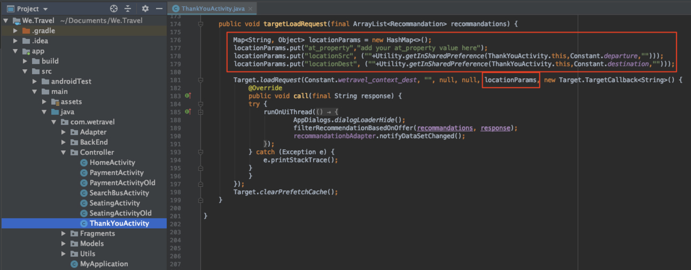

# 新增參數至請求

在本課程中，我們將新增Adobe生命週期量度和自訂參數至上一課中新增的[!DNL Target]請求。 在稍後的教學課程中，將會使用這些量度和參數來建立個人化對象。

## 學習目標

在本課程結束時，您將能夠：

* 新增Adobe行動生命週期量度
* 將參數新增至預先擷取請求
* 將參數新增至即時位置
* 驗證兩個請求的參數

## 新增生命週期參數

啟用[Adobe行動生命週期量度](https://experienceleague.adobe.com/docs/mobile-services/android/metrics.html?lang=en)。 這會將參數新增至位置請求，其中包含使用者裝置的豐富資訊以及與應用程式的互動。 我們將使用生命週期請求提供的資料，在下一堂課中建立對象。

若要啟用生命週期量度，請再次開啟HomeActivity控制器，並將`Config.collectLifecycleData(this);`新增至onResume()函式：


### 驗證預先擷取請求的生命週期參數

運行模擬器並使用Logcat驗證生命週期參數。 篩選「預先擷取」，以尋找預先擷取回應並尋找新參數：


即使我們只將`Config.collectLifecycleData()`新增至HomeActivity控制器，您也應該會在「感謝您」畫面上看到隨Target請求傳送的生命週期量度。

## 將at_property參數新增至預先擷取請求

Adobe Target屬性定義於[!DNL Target]介面中，用於建立個人化應用程式和網站的界限。 at_property參數可識別存取及維護您的選件和活動的特定屬性。 我們會將屬性新增至預先擷取和即時位置請求。

>[!NOTE]
>
>視您的許可證而定，您可能會或不會在[!DNL Target]介面中看到「屬性」選項。 如果您沒有這些選項，或者您公司中未使用屬性，請直接跳到本課程的下一節。

您可以在[!UICONTROL Setup] > [!UICONTROL Properties]下的[!DNL Target]介面中擷取at_property值。  將滑鼠指標暫留在屬性上，選取程式碼片段圖示並複製`at_property`值：


將其新增為預先擷取請求中每個位置的參數，如下所示：

以下是`targetPrefetchContent()`函式的更新程式碼（請務必更新&#x200B;_[!UICONTROL 您的at_property值，請前往此處]_&#x200B;預留位置文字！）:

```java
public void targetPrefetchContent() {
        List<TargetPrefetchObject> prefetchList = new ArrayList<>();

        Map<String, Object> params1;
        params1 = new HashMap<String, Object>();
        params1.put("at_property", "your at_property value goes here");

        prefetchList.add(Target.createTargetPrefetchObject(Constant.wetravel_engage_home, params1));
        prefetchList.add(Target.createTargetPrefetchObject(Constant.wetravel_engage_search, params1));
        Target.TargetCallback<Boolean> prefetchStatusCallback = new Target.TargetCallback<Boolean>() {
            @Override
            public void call(final Boolean status) {
                HomeActivity.this.runOnUiThread(new Runnable() {
                    @Override
                    public void run() {
                        String cachingStatus = status ? "YES" : "NO";
                        System.out.println("Received Response from prefetch : " + cachingStatus);
                        engageMessage();
                        setUp();

                    }
                });
            }};
        Target.prefetchContent(prefetchList, null, prefetchStatusCallback);
    }
```

### 關於參數的注意

若是未來的專案，您可能想要實作其他參數。 `createTargetPrefetchObject()`方法允許三種類型的參數：`locationParams`、`orderParams`和`productParams`。 請參閱[的檔案，了解如何將這些參數新增至預先擷取請求](https://experienceleague.adobe.com/docs/mobile-services/android/target-android/c-mob-target-prefetch-android.html?lang=en)的詳細資訊。

另請注意，預先擷取請求中的每個位置都可以新增不同的位置參數。 例如，您可以建立另一個名為param2的地圖，在其中放入新參數，然後在一個位置中設定param2，在另一個位置中設定param1。 以下是範例：

```java
prefetchList.add(Target.createTargetPrefetchObject(location1_name, params1);
prefetchList.add(Target.createTargetPrefetchObject(location2_name, params2);
```

## 驗證預先擷取請求中的at_property參數

現在，執行模擬器並使用Logcat來驗證at_property是否顯示在這兩個位置的預先擷取請求和回應上：


## 新增自訂參數至即時位置請求

上一堂課新增了即時位置請求(wetravel_context_dest)，因此我們可以在預訂程式的最終確認畫面上顯示相關促銷。 我們想根據使用者的目的地個人化促銷活動，並將其新增為請求的參數。 我們也會為trop來源和at_property值新增參數。

將下列參數新增至ThankYouActivity控制器中的targetLoadRequest()函式：

以下是targetLoadRequest()函式的更新程式碼（請務必更新「將at_property值新增至此處」預留位置文字！）:

```java
public void targetLoadRequest(final ArrayList<Recommandation> recommandations) {
    Map<String, Object> locationParams = new HashMap<>();
    locationParams.put("at_property","add your at_property value here");
    locationParams.put("locationSrc", (""+Utility.getInSharedPreference(ThankYouActivity.this,Constant.departure,"")));
    locationParams.put("locationDest", (""+Utility.getInSharedPreference(ThankYouActivity.this,Constant.destination,"")));

    Target.loadRequest(Constant.wetravel_context_dest, "", null, null, locationParams, new Target.TargetCallback<String>() {
        @Override
        public void call(final String response) {
        try {
            runOnUiThread(new Runnable() {
                @Override
                public void run() {
                    AppDialogs.dialogLoaderHide();
                    filterRecommendationBasedOnOffer(recommandations, response);
                    recommandationbAdapter.notifyDataSetChanged();
                }
            });
        } catch (Exception e) {
            e.printStackTrace();
        }
        }
    });
    Target.clearPrefetchCache();
}
```

### 驗證即時位置請求中的自訂參數

運行模擬器並開啟Logcat。 篩選其中一個參數，以確認請求包含所需的參數：


>[!NOTE]
>
>訂單確認請求和參數：雖然此示範專案中未使用，但訂單詳細資料通常會在實際實施中擷取，因此[!DNL Target]可以使用訂單詳細資料作為量度/維度。 請參閱本檔案，了解如何[實作訂單確認請求和參數](https://experienceleague.adobe.com/docs/mobile-services/android/target-android/c-target-methods.html?lang=en)的指示。

>[!NOTE]
>
>目標分析(A4T):Adobe Analytics可設定為[!DNL Target]的報表來源。 這可讓Target SDK收集的所有量度/維度在Adobe Analytics中檢視。 如需詳細資訊，請參閱[A4T概述](https://experienceleague.adobe.com/docs/target/using/integrate/a4t/a4t.html?lang=en) 。

幹得好！ 現在參數已就緒，我們準備好使用這些參數來在Adobe Target中建立對象和選件。

**[下一個：「建立對象和選件」>](create-audiences-and-offers.md)**
