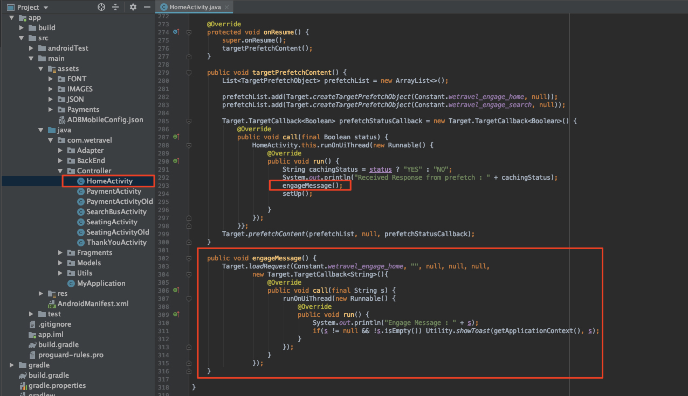

# 新增Adobe Target請求

Adobe Mobile Services SDK (v4)提供Adobe Target方法與功能，可讓您為不同使用者提供不同體驗，以個人化您的應用程式。 通常會從應用程式向Adobe Target提出一或多個請求，以擷取個人化內容並測量該內容的影響。

在本課程中，您將透過實作[!DNL Target]要求來準備We.Travel應用程式以進行個人化。

## 先決條件

請確定[下載並更新範例應用程式](download-and-update-the-sample-app.md)。

## 學習目標

在本課程結束時，您將能夠：

* 使用批次預先擷取請求快取多個[!DNL Target]選件（即個人化內容）
* 載入預先擷取的[!DNL Target]個位置
* 即時載入[!DNL Target]位置（非預先擷取）
* 清除從快取預先擷取的位置
* 驗證預先擷取的和即時請求

## 術語

以下是我們將在本教學課程的其餘部分中使用的一些重要Target術語。

* **要求：**&#x200B;向Adobe Target伺服器傳送網路要求
* **選件：**&#x200B;程式碼片段或其他文字型內容，定義於[!DNL Target]使用者介面（或透過API），在回應中傳送。 一般是在原生行動應用程式中使用[!DNL Target]時為JSON。
* **位置：**&#x200B;指定給要求的使用者定義名稱，用於[!DNL Target]介面以將優惠與特定要求建立關聯
* **批次要求：**&#x200B;包含多個位置的單一要求
* **預先擷取要求：**&#x200B;單一要求，可擷取選件並將它們快取到記憶體中，以供日後在應用程式中使用
* **批次預先擷取要求：**&#x200B;預先擷取多個位置選件的單一要求
* **對象：**&#x200B;在[!DNL Target]介面中定義或從其他Adobe應用程式共用給[!DNL Target]的訪客群組(例如「iPhone X訪客」、「加州訪客」、「首次應用程式開啟」)
* **活動：** [!DNL Target]建構，定義於[!DNL Target]使用者介面（或使用API），可連結位置、選件與對象以建立個人化體驗

## 新增批次預先擷取請求

我們將在We.Travel中實作的第一個要求是批次預先擷取要求，主畫面上具有兩個[!DNL Target]位置。 在稍後的課程中，我們將為這些顯示訊息的位置設定選件，以協助引導新使用者完成預訂流程。

預先擷取要求會快取Adobe Target伺服器回應（選件），以最低擷取[!DNL Target]內容。 批次預先擷取請求會擷取並快取多個選件，每個選件都與不同位置相關聯。 所有預先擷取的位置都會在裝置上快取，以供日後在使用者工作階段中使用。 藉由預先擷取首頁畫面上的多個位置，我們可以擷取選件，以供訪客導覽應用程式時稍後使用。 如需預先擷取方法的詳細資訊，請參閱[預先擷取檔案](https://experienceleague.adobe.com/docs/mobile-services/android/target-android/c-mob-target-prefetch-android.html?lang=en)。

### 新增批次預先擷取請求

讓我們更新HomeActivity控制器（主畫面的原始程式碼），它位於app > main > java > com.wetravel > Controller下方。 我們將新增兩個以紅色顯示的程式碼區塊：

我們將從HomeActivity控制器（主畫面的原始程式碼）開始，它位於app > main > java > com.wetravel > Controller下方。

我們將新增兩個以紅色顯示的程式碼區塊：


向下捲動至HomeActivity程式碼的結尾，並在`setHeader()`函式和&#x200B;*取代*&#x200B;目前的`onResume()`函式之後新增下面提供的程式碼：

```java
@Override
protected void onResume() {
    super.onResume();
    targetPrefetchContent();
}

public void targetPrefetchContent() {
    List<TargetPrefetchObject> prefetchList = new ArrayList<>();
    prefetchList.add(Target.createTargetPrefetchObject(Constant.wetravel_engage_home, null));
    prefetchList.add(Target.createTargetPrefetchObject(Constant.wetravel_engage_search, null));
    Target.TargetCallback<Boolean> prefetchStatusCallback = new Target.TargetCallback<Boolean>() {
        @Override
        public void call(final Boolean status) {
            HomeActivity.this.runOnUiThread(new Runnable() {
                @Override
                public void run() {
                    String cachingStatus = status ? "YES" : "NO";
                    System.out.println("Received Response from prefetch : " + cachingStatus);
                    setUp();

                }
            });
        }};
    Target.prefetchContent(prefetchList, null, prefetchStatusCallback);
}
```

您的IDE可能會警告您檔案中未匯入[!DNL Target]類別。 請務必匯入HomeActivity控制器頂端的[!DNL Target]類別，如下所示：

```java
import com.adobe.mobile.Target;
import com.adobe.mobile.TargetPrefetchObject;
```


您也可能看到「找不到符號變數wetravel_engage_home」和「找不到符號變數wetravel_engage_search」的錯誤。 將這些專案新增至`Constant.java`檔案（在應用程式> src > main > java > com > wetravel > Utils中）：

```java
public static final String wetravel_engage_home = "wetravel_engage_home";
public static final String wetravel_engage_search = "wetravel_engage_search";
```


### 批次預先擷取請求代碼說明

| 程式碼 | 說明 |
|--- |--- |
| `targetPrefetchContent()` | 使用者定義的函式(不是SDK的一部分)，它使用[!DNL Target]方法來擷取和快取兩個[!DNL Target]位置。 |
| `prefetchContent()` | 傳送預先擷取要求的[!DNL Target] SDK方法 |
| `Constant.wetravel_engage_home` | 預先擷取[!DNL Target]位置名稱，將在主畫面上顯示其選件內容 |
| `Constant.wetravel_engage_search` | 預先擷取[!DNL Target]位置名稱，此名稱將在搜尋結果畫面上顯示其選件內容。 由於這是預先擷取中的第二個位置，因此此預先擷取請求稱為「預先擷取批次請求」。 |
| setup() | 使用者定義的函式，在預先擷取[!DNL Target]選件後呈現應用程式的主畫面 |

### 關於非同步與同步

使用我們剛實作的程式碼時，會在主畫面呈現之前，以同步、封鎖呼叫的形式提出預先擷取要求。 將新程式碼貼入HomeActivity控制器時，我們將`setUp()`函式的執行從`onResume()`函式移動到Target要求之後。 若您想在應用程式首次開啟時個人化內容，這會很有幫助，因為它可確保在第一個畫面呈現之前來自Target伺服器的個人化內容已傳回（或逾時）。 若要允許要求非同步載入（在背景中），請改為呼叫`setUp()`函式中的`onCreate()`。

### 驗證批次預先擷取請求

重新建置應用程式並開啟Android模擬器。 (下列熒幕擷取畫面使用Android Q 9+、API Level 29上的Pixel 2)。 預先擷取回應應為「已收到預先擷取回應」：

當主畫面呈現時，應載入預先擷取請求。 使用Logcat篩選[!DNL "Target"]以檢視請求和回應：


如果您沒有看到成功的回應，請驗證`ADBMobileConfig.json`檔案中的設定和HomeActivity檔案中的程式碼語法。

兩個位置現在已快取至裝置。 位置名稱將很快延遲載入到[!DNL Target]介面中，當您在活動中使用它們時，可以在各種下拉式選單中選取它們。

### 為每個快取的位置新增載入請求

現在已預先擷取位置，且其回應已快取至裝置，接下來讓我們新增`Target.loadRequest()`方法，該方法會從快取中擷取選件內容，以便您使用它來更新應用程式。 我們將新增名為`engageMessage()`的新自訂方法，使用預先擷取要求執行。 `engageMessage()`將呼叫`Target.loadRequest()`。 `engageMessage()`會在`setUp()`之前執行，以確保在設定畫面之前呼叫載入要求。

首先，為HomeActivity中的wetravel_engage_home位置新增`engageMessage()`呼叫和方法：



以下是更新的程式碼：

```java
    public void targetPrefetchContent() {
        List<TargetPrefetchObject> prefetchList = new ArrayList<>();
        Map<String, Object> params1;
        params1 = new HashMap<String, Object>();
        params1.put("at_property", "your at_property value goes here");
        prefetchList.add(Target.createTargetPrefetchObject(Constant.wetravel_engage_home, params1));
        prefetchList.add(Target.createTargetPrefetchObject(Constant.wetravel_engage_search, params1));
        Target.TargetCallback<Boolean> prefetchStatusCallback = new Target.TargetCallback<Boolean>() {
            @Override
            public void call(final Boolean status) {
                HomeActivity.this.runOnUiThread(new Runnable() {
                    @Override
                    public void run() {
                        String cachingStatus = status ? "YES" : "NO";
                        System.out.println("Received Response from prefetch : " + cachingStatus);
                        engageMessage();
                        setUp();
                    }
                });
            }};
        Target.prefetchContent(prefetchList, null, prefetchStatusCallback);
    }
    public void engageMessage() {
        Target.loadRequest(Constant.wetravel_engage_home, "", null, null, null,
            new Target.TargetCallback<String>(){
                @Override
                public void call(final String s) {
                    runOnUiThread(new Runnable() {
                        @Override
                        public void run() {
                            System.out.println("Engage Message : " + s);
                            if(s != null && !s.isEmpty()) Utility.showToast(getApplicationContext(), s);
                        }
                    });
                }
            });
    }
```

現在為SearchBusActivity中的wetravel_engage_search位置新增`engageMessage()`呼叫和方法。 請注意，`engageMessage()`呼叫是在呼叫`onResume()`之前設定在`setUpSearch()`方法中，因此會在設定畫面之前執行：


以下是更新的程式碼：

```java
    @Override
    public void onResume() {
        super.onResume();
        engageMessage();
        setUpSearch();
    }
    public void engageMessage() {
        Target.loadRequest(Constant.wetravel_engage_search, "", null, null, null,
                new Target.TargetCallback<String>(){
                    @Override
                    public void call(final String s) {
                        runOnUiThread(new Runnable() {
                            @Override
                            public void run() {
                                System.out.println("Engage Message : " + s);
                                if(s != null && !s.isEmpty()) Utility.showToast(getApplicationContext(), s);
                            }
                        });
                    }
                });
    }
```

由於您剛才已將Target方法新增至SearchBusActivity，請務必匯入[!DNL Target]類別：

```java
import com.adobe.mobile.Target;
import com.adobe.mobile.TargetPrefetchObject;
```

## 新增即時請求

我們將新增至應用程式的下一個要求將是「感謝您」畫面上的即時要求。 「即時」是指將會提出要求並立即套用回應（稍後不會快取）。 在稍後的課程中，我們將使用此請求建立體驗，根據使用者的旅行目的地進行個人化。

所以讓我們在「感謝您」畫面上新增即時請求。 在ThankYouActivity檔案中，我們會以紅色顯示變更：


捲動至ThankYouActivity檔案的結尾。 註解`getRecommandations()`函式中的三行並新增`targetLoadRequest()`函式的引動過程：

```java
// AppDialogs.dialogLoaderHide();
// recommandations.addAll(recommandation.recommandations);
// recommandationbAdapter.notifyDataSetChanged();
```

將此行程式碼新增至`getRecommandations()`函式：

```java
targetLoadRequest(recommandation.recommandations);
```

現在，我們需要定義`targetLoadRequest()`函式：


在`filterRecommendationBasedOnOffer()`函式之後新增此程式碼區塊：

```java
public void targetLoadRequest(final ArrayList<Recommandation> recommandations) {
    Target.loadRequest(Constant.wetravel_context_dest, "", null, null, null, new Target.TargetCallback<String>() {
        @Override
        public void call(final String response) {
            try {
                runOnUiThread(new Runnable() {
                    @Override
                    public void run() {
                        AppDialogs.dialogLoaderHide();
                        filterRecommendationBasedOnOffer(recommandations, response);
                        recommandationbAdapter.notifyDataSetChanged();
                    }
                });
            } catch (Exception e) {
                e.printStackTrace();
            }
        }
    });
}
```

由於您剛才已將Target方法新增至ThankYouActivity，請務必匯入Target類別：

```java
import com.adobe.mobile.Target;
import com.adobe.mobile.TargetPrefetchObject;
```

### targetLoadRequest()程式碼說明

| 程式碼 | 說明 |
|--- |--- |
| `targetLoadRequest()` | 使用者定義函式(不是SDK的一部分)會引發`Target.loadRequest()`，載入並顯示wetravel_context_dest位置 |
| `Target.loadRequest()` | 向Target伺服器發出請求的SDK方法 |
| Constant.wetravel_context_dest | 指派給要求的位置名稱，我們稍後會在[!DNL Target]介面中建置活動時使用 |
| `filterRecommendationBasedOnOffer()` | 應用程式中的使用者定義函式，會從Target回應中取得位置選件，並根據選件內容決定應用程式的變更方式 |
| `recommandations.addAll()` | 應用程式中的使用者定義函式，過去會在ThankYou畫面載入時預設執行，但現在會在`filterRecommendationBasedOnOffer()`收到並剖析Target回應之後執行 |

這是我們使用新增至主畫面的請求對應用程式進行的更複雜更新，所以讓我們花點時間檢閱一下我們的工作：

1. 我們已標註出程式碼行，中斷應用程式先前顯示三個預設促銷活動的行為
1. 我們改為讓應用程式執行新函式，我們將其隨意命名為targetLoadRequest
1. 我們已定義`targetLoadRequest`函式，以使用Target.loadRequest方法向Target提出要求，並在收到`filterRecommendationBasedOnOffer()`選件回應時立即執行[!DNL Target]函式
1. `filterRecommendationBasedOnOffer()`函式會解譯回應，並決定應將哪些促銷活動套用至熒幕

在行動應用程式中使用[!DNL Target]時，這是非常常見的使用模式。  兩者皆非常強大，因為您可將行動應用程式的幾乎所有方面個人化。 這還需要應用程式程式碼與我們稍後將在[!DNL Target]介面中定義的選件之間的協調。 由於這種協調性，某些個人化使用案例可能會要求您在應用程式商店中更新應用程式，才能啟動活動。

### 驗證即時請求

開啟Android模擬器，然後進行所有步驟以預訂行程：首頁>巴士搜尋結果>座位選擇、付款選項（包含空白資料的任何付款選項都將有效）。

在最後的「感謝您」畫面上，觀看Logcat的回應。 回應應為「已傳回&quot;wetravel_context_dest&quot;的預設內容：


## 正在從快取中清除預先擷取的位置

在某些情況下，預先擷取的位置可能需要在工作階段期間清除。 例如，發生預訂時，清除快取位置是可行的做法，因為使用者現在已「參與」並瞭解預訂程式。 如果他們在工作階段中預訂另一個行程，則不需要主畫面和搜尋結果畫面上的原始位置來指導預訂。 從快取中清除位置，並針對打折的第二次預訂或其他相關案例預先擷取新選件，會比較合理。 如果工作階段期間已進行預訂，則可以將邏輯新增至首頁畫面和搜尋結果畫面，以預先擷取新位置。

在此範例中，我們將在預訂發生時清除工作階段的預先擷取位置。 這是透過呼叫`Target.clearPrefetchCache()`函式完成的。 設定`targetLoadRequest()`函式內的函式，如下所示：

```java
Target.clearPrefetchCache()
```


恭喜！您的應用程式現在已有個人化的架構。 在下一個課程中，我們將透過新增引數至這些位置來增強個人化功能。

**[下一步：「新增引數」>](add-parameters.md)**
