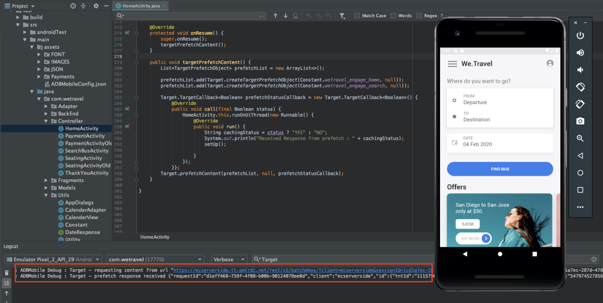

# 新增Adobe Target請求

AdobeMobile Services SDK(v4)提供Adobe Target方法與功能，可讓您為不同的使用者提供不同體驗，以個人化您的應用程式。 通常會從應用程式向Adobe Target提出一或多個請求，以擷取個人化內容並評估該內容的影響。

在本課程中，您將透過實作[!DNL Target]要求，準備We.Travel應用程式以進行個人化。

## 必要條件

請務必[下載並更新範例應用程式](download-and-update-the-sample-app.md)。

## 學習目標

在本課程結束時，您將能夠：

* 使用批次預先擷取請求快取多個[!DNL Target]選件（即個人化內容）
* 載入預取的[!DNL Target]位置
* 即時載入[!DNL Target]位置（未預先擷取）
* 清除從快取中預取的位置
* 驗證預先擷取和即時請求

## 術語

以下是我們將在本教學課程的其餘部分中使用的一些重要Target術語。

* **請求：**  向Adobe Target伺服器的網路請求
* **選件：**  在使用者介面（或使用API）中定義， [!DNL Target] 並在回應中傳送的程式碼片段或其他文字內容。當原生行動應用程式中使用[!DNL Target]時，通常為JSON。
* **位置：**  為請求指定的使用者定義名稱，用於介 [!DNL Target] 面，將選件與特定請求建立關聯
* **批次請求：**  包含多個位置的單一請求
* **預先擷取請求：**  可擷取選件並將其快取至記憶體中的單一請求，以供日後在應用程式中使用
* **批次預先擷取請求：**  為多個位置預先擷取選件的單一請求
* **對象：**  在介面中定義或從其 [!DNL Target] 他Adobe應 [!DNL Target] 用程式共用至的一組訪客(例如「iPhone X訪客」、「加州的訪客」、「第一個應用程式開啟」)
* **活動：**  一種 [!DNL Target] 結構，在使用者介面中 [!DNL Target] 定義（或透過API），可連結位置、選件和對象以建立個人化體驗

## 新增批次預先擷取請求

我們將在We.Travel中實作的第一個要求是批次預先擷取要求，主畫面上有兩個[!DNL Target]位置。 在稍後的課程中，我們將針對顯示訊息的位置設定優惠方案，以協助引導新使用者完成預訂程式。

預先擷取請求會快取Adobe Target伺服器回應（選件），盡可能最少擷取[!DNL Target]內容。 批次預先擷取請求會擷取和快取多個選件，每個選件都與不同位置相關聯。 所有預先擷取的位置都會快取在裝置上，以供日後在使用者工作階段中使用。 透過在主畫面上預先擷取多個位置，我們可以擷取選件，以供訪客在應用程式中導覽時稍後使用。 如需預先擷取方法的詳細資訊，請參閱[預先擷取檔案](https://experienceleague.adobe.com/docs/mobile-services/android/target-android/c-mob-target-prefetch-android.html?lang=en)。

### 新增批次預先擷取請求

現在來更新HomeActivity控制器（主畫面的原始碼），此控制器位於「應用程式>主要> java > com.wetravel >控制器」下。 我們將新增以紅色顯示的兩個程式碼區塊：

我們從HomeActivity控制器（主螢幕的原始碼）開始，該控制器位於「應用程式>主> java > com.wetravel >控制器」下。

我們將新增以紅色顯示的兩個程式碼區塊：


向下捲動至HomeActivity代碼的結尾，並在`setHeader()`函式和&#x200B;*replacing*&#x200B;目前的`onResume()`函式之後新增下方提供的代碼：

```java
@Override
protected void onResume() {
    super.onResume();
    targetPrefetchContent();
}

public void targetPrefetchContent() {
    List<TargetPrefetchObject> prefetchList = new ArrayList<>();
    prefetchList.add(Target.createTargetPrefetchObject(Constant.wetravel_engage_home, null));
    prefetchList.add(Target.createTargetPrefetchObject(Constant.wetravel_engage_search, null));
    Target.TargetCallback<Boolean> prefetchStatusCallback = new Target.TargetCallback<Boolean>() {
        @Override
        public void call(final Boolean status) {
            HomeActivity.this.runOnUiThread(new Runnable() {
                @Override
                public void run() {
                    String cachingStatus = status ? "YES" : "NO";
                    System.out.println("Received Response from prefetch : " + cachingStatus);
                    setUp();

                }
            });
        }};
    Target.prefetchContent(prefetchList, null, prefetchStatusCallback);
}
```

IDE可能會警告您檔案中未導入[!DNL Target]類。 請務必匯入HomeActivity控制器頂端的[!DNL Target]類別，如下方紅色所示：

```java
import com.adobe.mobile.Target;
import com.adobe.mobile.TargetPrefetchObject;
```


您可能還會看到「找不到符號變數wetravel_engage_home」和「找不到符號變數wetravel_engage_search」的錯誤。 將下列項目新增至`Constant.java`檔案（在「應用程式」 > 「src」 > 「main」 > 「java」 > 「com」 > 「wetravel」 > 「應用程式」）:

```java
public static final String wetravel_engage_home = "wetravel_engage_home";
public static final String wetravel_engage_search = "wetravel_engage_search";
```


### 批次預先擷取請求程式碼說明

| 程式碼 | 說明 |
|--- |--- |
| `targetPrefetchContent()` | 使用者定義的函式（不屬於SDK），其使用[!DNL Target]方法來擷取和快取兩個[!DNL Target]位置。 |
| `prefetchContent()` | 傳送預先擷取請求的[!DNL Target] SDK方法 |
| `Constant.wetravel_engage_home` | 預先擷取[!DNL Target]位置名稱，該名稱將在主畫面上顯示其選件內容 |
| `Constant.wetravel_engage_search` | 預先擷取[!DNL Target]位置名稱，該名稱將在搜尋結果畫面上顯示其選件內容。 由於這是預先擷取中的第二個位置，因此此預先擷取請求稱為「預先擷取批次請求」。 |
| setUp() | 使用者定義的函式，會在預先擷取[!DNL Target]選件後轉譯應用程式的主畫面 |

### 關於非同步與同步

使用我們剛實作的程式碼，預先擷取要求會在主畫面轉譯前，以同步封鎖呼叫的形式提出。 將新代碼貼入HomeActivity控制器時，我們將`setUp()`函式執行從`onResume()`函式移至Target請求之後。 在您想要在應用程式首次開啟時個人化內容的情況下，這可能有所助益，因為它可確保來自Target伺服器的個人化內容在第一個畫面轉譯前已傳回（或逾時）。 若要允許非同步載入請求（在背景），只需改為在`onCreate()`函式中呼叫`setUp()`即可。

### 驗證批次預先擷取請求

重新建置應用程式並開啟Android模擬器。 （下列螢幕擷取畫面使用Android Q版本9+、API層級29上的Pixel 2）。 預先擷取回應應為「已收到預先擷取回應」：

當主畫面轉譯時，應載入預先擷取請求。 使用Logcat，篩選[!DNL "Target"]以查看要求和回應：



如果您未看到成功的回應，請驗證`ADBMobileConfig.json`檔案中的設定，以及HomeActivity檔案中的程式碼語法。

系統現在會快取兩個位置給裝置。 位置名稱很快會延遲載入至[!DNL Target]介面，當您在活動中使用這些名稱時，可在各種下拉式功能表中加以選取。

### 為每個快取位置新增載入請求

現在系統已預先擷取位置，並將其回應快取至裝置，接下來請新增`Target.loadRequest()`方法，此方法會從快取中擷取選件內容，以便您使用它來更新應用程式。 我們將新增名為`engageMessage()`的新自訂方法，此方法將搭配預先擷取請求執行。 `engageMessage()` 會呼叫 `Target.loadRequest()`。`engageMessage()` 在之 `setUp()` 前執行，以確保在設定畫面之前呼叫載入請求。

首先，為HomeActivity中的wetravel_engage_home位置新增`engageMessage()`呼叫和方法：


以下是更新的程式碼：

```java
    public void targetPrefetchContent() {
        List<TargetPrefetchObject> prefetchList = new ArrayList<>();
        Map<String, Object> params1;
        params1 = new HashMap<String, Object>();
        params1.put("at_property", "your at_property value goes here");
        prefetchList.add(Target.createTargetPrefetchObject(Constant.wetravel_engage_home, params1));
        prefetchList.add(Target.createTargetPrefetchObject(Constant.wetravel_engage_search, params1));
        Target.TargetCallback<Boolean> prefetchStatusCallback = new Target.TargetCallback<Boolean>() {
            @Override
            public void call(final Boolean status) {
                HomeActivity.this.runOnUiThread(new Runnable() {
                    @Override
                    public void run() {
                        String cachingStatus = status ? "YES" : "NO";
                        System.out.println("Received Response from prefetch : " + cachingStatus);
                        engageMessage();
                        setUp();
                    }
                });
            }};
        Target.prefetchContent(prefetchList, null, prefetchStatusCallback);
    }
    public void engageMessage() {
        Target.loadRequest(Constant.wetravel_engage_home, "", null, null, null,
            new Target.TargetCallback<String>(){
                @Override
                public void call(final String s) {
                    runOnUiThread(new Runnable() {
                        @Override
                        public void run() {
                            System.out.println("Engage Message : " + s);
                            if(s != null && !s.isEmpty()) Utility.showToast(getApplicationContext(), s);
                        }
                    });
                }
            });
    }
```

現在，為SearchBusActivity中的wetravel_engage_search位置新增`engageMessage()`呼叫和方法。 請注意，在呼叫`setUpSearch()`之前，`engageMessage()`呼叫是在`onResume()`方法中設定，因此會在設定畫面之前執行：


以下是更新的程式碼：

```java
    @Override
    public void onResume() {
        super.onResume();
        engageMessage();
        setUpSearch();
    }
    public void engageMessage() {
        Target.loadRequest(Constant.wetravel_engage_search, "", null, null, null,
                new Target.TargetCallback<String>(){
                    @Override
                    public void call(final String s) {
                        runOnUiThread(new Runnable() {
                            @Override
                            public void run() {
                                System.out.println("Engage Message : " + s);
                                if(s != null && !s.isEmpty()) Utility.showToast(getApplicationContext(), s);
                            }
                        });
                    }
                });
    }
```

由於您剛將Target方法新增至SearchBusActivity，請務必匯入[!DNL Target]類別：

```java
import com.adobe.mobile.Target;
import com.adobe.mobile.TargetPrefetchObject;
```

## 新增即時請求

我們將新增至應用程式的下一個要求是「感謝」畫面上的即時要求。 所謂「即時」，是指會同時提出要求並立即套用回應（稍後不會快取）。 在稍後的課程中，我們將使用此請求建置體驗，並針對使用者的旅行目的地進行個人化。

因此，我們將在感謝畫面中新增即時請求。 在ThankYouActivity檔案中，我們會進行紅色顯示的變更：


捲動至ThankYouActivity檔案的結尾。 注釋`getRecommandations()`函式中的三行，並添加`targetLoadRequest()`函式調用：

```java
// AppDialogs.dialogLoaderHide();
// recommandations.addAll(recommandation.recommandations);
// recommandationbAdapter.notifyDataSetChanged();
```

將此行代碼添加到`getRecommandations()`函式中：

```java
targetLoadRequest(recommandation.recommandations);
```

現在，我們需要定義`targetLoadRequest()`函式：


在`filterRecommendationBasedOnOffer()`函式後面新增此程式碼區塊：

```java
public void targetLoadRequest(final ArrayList<Recommandation> recommandations) {
    Target.loadRequest(Constant.wetravel_context_dest, "", null, null, null, new Target.TargetCallback<String>() {
        @Override
        public void call(final String response) {
            try {
                runOnUiThread(new Runnable() {
                    @Override
                    public void run() {
                        AppDialogs.dialogLoaderHide();
                        filterRecommendationBasedOnOffer(recommandations, response);
                        recommandationbAdapter.notifyDataSetChanged();
                    }
                });
            } catch (Exception e) {
                e.printStackTrace();
            }
        }
    });
}
```

由於您剛將Target方法新增至ThankYouActivity，請務必匯入Target類別：

```java
import com.adobe.mobile.Target;
import com.adobe.mobile.TargetPrefetchObject;
```

### targetLoadRequest()程式碼說明

| 程式碼 | 說明 |
|--- |--- |
| `targetLoadRequest()` | 用戶定義的函式（不屬於SDK的一部分）會引發`Target.loadRequest()`，該函式會載入並顯示wetravel_context_dest位置 |
| `Target.loadRequest()` | 向Target伺服器提出要求的SDK方法 |
| Constant.wetravel_context_dest | 在[!DNL Target]介面中建置活動時，指派給我們稍後將使用之請求的位置名稱 |
| `filterRecommendationBasedOnOffer()` | 應用程式中的使用者定義函式，會從Target回應中擷取位置的選件，並根據選件的內容決定應如何變更 |
| `recommandations.addAll()` | 應用程式中的使用者定義函式，過去在ThankYou畫面載入時預設執行，但現在會在`filterRecommendationBasedOnOffer()`收到Target回應並剖析後執行 |

這是我們對應用程式所做的更複雜的更新，當時我們在主螢幕上添加了請求，因此，讓我們花點時間回顧一下我們所做的：

1. 我們借由註解出程式碼行來中斷應用程式先前顯示三個預設促銷活動的行為
1. 我們告訴應用程式執行新函式，我們任意命名為targetLoadRequest
1. 我們定義了`targetLoadRequest`函式，以使用Target.loadRequest方法向Target提出要求，並在收到[!DNL Target]選件回應時立即執行`filterRecommendationBasedOnOffer()`函式
1. `filterRecommendationBasedOnOffer()`函式會解譯回應並決定應將哪些促銷活動套用至畫面

在行動應用程式中使用[!DNL Target]時，這是非常常見的使用模式。  這兩項功能都非常強大，讓您幾乎可以個人化行動應用程式的任何層面。 此外，還需要協調應用程式程式碼和選件，我們稍後將在[!DNL Target]介面中定義選件。 由於這種協調，某些個人化使用案例可能會要求您更新應用程式商店中的應用程式，以啟動活動。

### 驗證即時請求

開啟Android模擬器，並完成所有步驟以預訂行程：「首頁」>「匯流排搜索結果」>「座位選擇」、「付款選項」（任何包含空白資料的付款選項都將起作用）。

在最後的感謝畫面上，觀看Logcat以取得回應。 回應內容應為「Default context_dest」（傳回「wetravel_context_dest」的預設內容）:


## 清除從快取預取的位置

在某些情況下，預先擷取的位置可能需要在工作階段期間清除。 例如，訂房發生時，清除快取位置是合理的，因為使用者現在是「參與」的，而且了解預訂程式。 如果他們在工作階段中預訂另一次旅行，則不需要主螢幕和搜索結果螢幕上的原始位置來指導預訂。 從快取中清除位置，並預先擷取新選件（可能是折扣的第二次預訂或其他相關案例），這更有意義。 如果在工作階段期間發生預訂，可將邏輯新增至主畫面和搜尋結果畫面，以預先擷取新位置。

在此範例中，我們只會在進行預訂時，清除工作階段的預先擷取位置。 這可透過呼叫`Target.clearPrefetchCache()`函式來完成。 在`targetLoadRequest()`函式內設定函式，如下所示：

```java
Target.clearPrefetchCache()
```


恭喜！ 您的應用程式現在具有個人化的架構。 在下堂課中，我們將透過將參數新增至這些位置來增強個人化功能。

**[下一個：&quot;添加參數&quot;>](add-parameters.md)**
