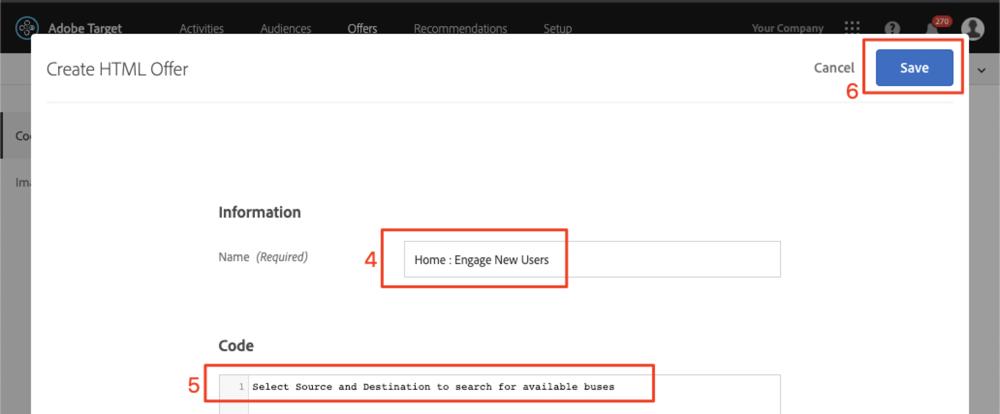

# 在Adobe Target中建立觀眾和選件

在本課中，我們將進入介面， [!DNL Target] 並為上節課中的三個地點建立受眾和優惠。

## 學習目標

在本課程結束時，您將能夠：

* 在 Adobe Target 中建立受眾
* 在Adobe Target中建立選件

更具體地說，在本課中，我們將建立所需的受眾和優惠，以完成教學課程開頭定義的個人化使用案例。 我們想使用「首頁」和「搜尋」畫面來協助應用程式使用者預訂行程，而我們想使用「感謝」畫面來根據使用者的目的地顯示一些相關的促銷活動。 下表顯示了我們在本課中為每個位置建立的內容：

| 位置 | 對象 | 優惠 |
| --- | --- | --- |
| wetravel_engage_home | 新行動應用程式使用者 | &quot;選擇您的源和目標以搜索可用的匯流排路由&quot; |
| wetravel_engage_search | 新行動應用程式使用者 | &quot;使用篩選器縮小搜索結果&quot; |
| wetravel_engage_home | 舊版行動應用程式使用者 | 「歡迎回來！ 在結帳期間使用促銷代碼BACK30可享有10%的折扣。」 |
| wetravel_engage_search | 舊版行動應用程式使用者 | 預設內容 |
| wetravel_context_dest | 目標： 聖地牙哥 | &quot;DJ&quot; |
| wetravel_context_dest | 目標： 洛杉磯 | &quot;通用&quot; |

## 選擇您的工作區

如果您的公司使用「屬性」和「工作區」來建立個人化應用程式和網站的界限，而您在上一課中實作了at_property參數，則在繼續本課之前，請先確定您所在的工作區正確。 如果您不使用「屬性」和「工作區」，請忽略此步驟。 選取您在上一課中使用的Workspace，以複製at_property值：

## 建立觀眾

現在，讓我們建立將用來個人化應用程式的受眾。

### 為新使用者建立對象

Adobe Target觀眾可用來識別特定訪客群組。 然後，選件可以定位至這些特定群組。 在前兩個位置，我們會使用「新使用者」對象：

1. 按一 **[!UICONTROL 下頂端導覽]** 中的「觀眾」。
1. Click the **[!UICONTROL Create Audience]** button.
   

1. 輸入「 **[!UICONTROL 新行動應用程式使用者]** 」作為對象名稱。
1. 選擇 **[!UICONTROL 添加規則]**。
1. 選取自 **[!UICONTROL 訂規]** 則。
   

1. 選 **[!UICONTROL 取a.Launches]**。
1. Select **[!UICONTROL is less than]**.
1. Enter **5**.
1. 儲存新的觀眾。
   

### 為舊使用者建立對象

依照上述步驟建立舊使用者的對象。

1. 為舊版行動應 _用程式使用者命名_。
1. 使 **[!UICONTROL 用a.Launches大於或等於5]** 作為自訂規則。
1. 儲存新的觀眾。

   

>[!NOTE] 在行動 [!DNL Target] SDK中收集的所有生命週期度量和維度都會前置&quot;a&quot;（例如a.Launches），並可在下拉式選單的&quot;Custom&quot;選項中使用，可用來建立觀眾。

### 為預訂聖地亞哥之行的用戶建立觀眾

接下來，我們將為We.Travel應用程式提供的部分目的地建立一些觀眾。 在上堂課中，我們在wetravel_context_dest位置請求中將目的地作為位置參數傳遞。 該參數可在下拉式功能表的「自訂」選項中使用。

>[!NOTE] 如果您預期在「自訂」下拉式清單中看到的參數未出現在介面中，請 [!DNL Target] 連按兩下確認該參數確實傳入請求中。 如果您已驗證是在請求中，但未延遲載入介面，則只需輸入參數名稱並按下 [!DNL Target] enter鍵，即可繼續定義您的觀眾

1. 為對象命名 _目標： 聖地牙哥_。
1. 使用此定義的自訂規則： _locationDest包含San Diego_。
1. 儲存新的觀眾。

   

### 為預訂洛杉磯之行的使用者建立觀眾

1. 為對象命名 _目標： 洛杉磯_
1. 使用此定義的自訂規則： _locationDest包含洛杉磯_
1. 儲存新的觀眾。

## 建立選件

現在，讓我們建立選件來顯示這些訊息。 提醒您，選件是回應中傳遞的程式碼／內容片 [!DNL Target] 段。 它們最常在使用者介面中 [!DNL Target] 建立，但也可以透過API或使用與Adobe Experience Manager整合的Experience Fragments來建立。 在行動應用程式中，JSON選件是常見的。 在本教學課程中，我們將使用HTML選件，此選件可用來將任何明文內容（包括JSON）傳送至應用程式。

### 為新使用者建立選件

首先，讓我們為新使用者的訊息建立選件：

1. 按一下 **[!UICONTROL 頂端導覽]** 中的「選件」。
1. 按一下&#x200B;**[!UICONTROL 「建立」]**。
1. 選擇 **[!UICONTROL HTML選件]**。

   

1. 為選件命名 _首頁： 吸引新使用者_。
1. 輸入 _選擇源和目標以搜索可用匯流排_ ，作為代碼。
1. 儲存新選件。

   

### 為舊使用者建立選件

現在，讓我們為舊用戶建立一個選件（第二個選件將是預設內容，將不顯示任何內容）:

1. 為選件命名 _首頁： 傳回使用者_。
1. 歡迎 _回來！ 在結帳期間使用促銷代碼BACK30可享有10%的折扣。_ HTML程式碼。
1. 儲存新選件。

   

### 建立聖地亞哥優惠

當&quot;DJ&quot;傳回至ThankYou活動時，filterRecommendationBasedOnOffer()函式中的邏輯會顯示「Rock Night with DJ SAM」的橫幅：

1. 為San Diego的選 _件命名促銷_。
1. 輸入 _DJ_ 作為HTML代碼。
1. 儲存新選件。

### 為前往洛杉磯的使用者建立選件

當&quot;Universal&quot;傳回至ThankYou活動時，filterRecommendationBasedOnOffer()函式中的邏輯會顯示&quot;Universal Studios&quot;的橫幅：

1. 為選件命名 _為「洛杉磯促銷」_。
1. 輸入 _Universal_ 作為HTML代碼。
1. 儲存新選件。

## 結論

現在，我們有我們的「觀眾」和「選件」。 在下一課中，我們將建立將位置、受眾和優惠連結在一起的活動，以建立個人化的體驗！

**[下一個： 「個人化版面」>](personalize-layouts.md)**
