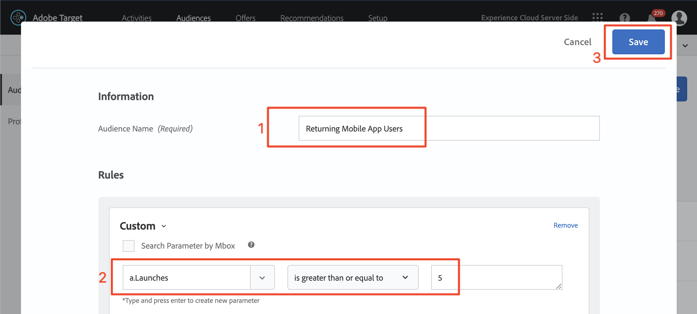
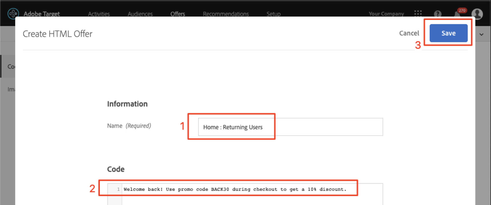

# 在Adobe Target中建立對象和選件

在本課程中，我們將前往[!DNL Target]介面，為先前課程中實作的三個位置建立受眾和選件。

## 學習目標

在本課程結束時，您將能夠：

* 在 Adobe Target 中建立受眾
* 在Adobe Target中建立優惠方案

更具體來說，在本課程中，我們將建立必要的對象和選件，以完成教學課程開始時所定義的個人化使用案例。 我們想使用「首頁」和「搜尋」畫面來協助應用程式使用者預訂行程，而我們想使用「感謝」畫面來根據使用者的目的地顯示一些相關的促銷活動。 下表呈現我們將針對每個位置在本課程中建置的內容：

| 位置 | 對象 | 選件 |
| --- | --- | --- |
| wetravel_engage_home | 新行動應用程式使用者 | &quot;選擇您的原點和目的地以搜索可用的公交線路&quot; |
| wetravel_engage_search | 新行動應用程式使用者 | &quot;使用篩選器來縮小搜尋結果&quot; |
| wetravel_engage_home | 傳回的行動應用程式使用者 | 「歡迎回來！ 結帳期間使用促銷代碼BACK30可獲得10%的折扣。」 |
| wetravel_engage_search | 傳回的行動應用程式使用者 | 預設內容 |
| wetravel_context_dest | 目的地：聖迭戈 | &quot;DJ&quot; |
| wetravel_context_dest | 目的地：洛杉磯 | &quot;通用&quot; |

## 選取您的工作區

如果您的公司使用「屬性」和「工作區」來建立個人化應用程式和網站的界限（您在上堂課中實作了at_property參數），您應先確定您位於正確的工作區中，再繼續本課程。 如果您沒有使用「屬性」和「工作區」，請忽略此步驟。 選取您在上一堂課中使用的工作區，以複製at_property值：

## 建立對象

現在來建立將用於個人化應用程式的對象。

### 為新使用者建立對象

Adobe Target對象可用來識別特定的訪客群組。 接著，選件便可定位至這些特定群組。 在前兩個位置，我們會使用「新使用者」對象：

1. 按一下頂端導覽列中的&#x200B;**[!UICONTROL 對象]**。
1. 按一下&#x200B;**[!UICONTROL 建立對象]**按鈕。
   

1. 輸入&#x200B;**[!UICONTROL 新行動應用程式使用者]**&#x200B;作為對象名稱。
1. 選擇&#x200B;**[!UICONTROL 添加規則]**。
1. 選擇&#x200B;**[!UICONTROL Custom]**規則。
   

1. 選取&#x200B;**[!UICONTROL a.Launches]**。
1. 選擇&#x200B;**[!UICONTROL 小於]**。
1. 輸入&#x200B;**5**。
1. 儲存新對象。
   

### 為再度訪問的使用者建立對象

請依照上述步驟建立舊使用者的對象。

1. 為對象命名&#x200B;_傳回行動應用程式使用者_。
1. 使用&#x200B;**[!UICONTROL a.Launches大於或等於5]**&#x200B;作為自訂規則。
1. 儲存新對象。

   

>[!NOTE]
>
>在[!DNL Target]行動SDK中收集的所有生命週期量度和維度都會以「a」為前置詞（例如a.Launches），並可在下拉式功能表的「自訂」選項中使用，且可用於建立對象。

### 為預訂聖地亞哥之旅的使用者建立受眾

接下來，我們將為We.Travel應用程式提供的某些目的地建立幾個對象。 在上堂課中，我們在wetravel_context_dest位置請求中將目的地作為位置參數傳遞。 該參數可在下拉式功能表的「自訂」選項中使用。

>[!NOTE]
>
>如果您希望在「自訂」下拉式清單中看到的參數未出現在[!DNL Target]介面中，請再次檢查請求中是否確實傳入了該參數。 如果您已驗證請求中是否存在，但未延遲載入至[!DNL Target]介面，您只需輸入參數名稱並按Enter即可繼續定義您的對象

1. 為對象命名&#x200B;_目的地：聖迭戈_。
1. 使用此定義的自訂規則：_locationDest包含San Diego_。
1. 儲存新對象。

   

### 為預訂洛杉磯之行的使用者建立對象

1. 為對象命名&#x200B;_目的地：洛杉磯_
1. 使用此定義的自訂規則：_locationDest包含洛杉磯_
1. 儲存新對象。

## 建立選件

現在，讓我們建立選件來顯示這些訊息。 提醒您，選件是程式碼/內容的片段，會在[!DNL Target]回應中傳送。 這些片段最常建立在[!DNL Target]使用者介面中，但也可透過API或使用體驗片段與Adobe Experience Manager的整合來建立。 在行動應用程式中，JSON選件是常見的。 在本教學課程中，我們將使用HTML選件，可用來將任何純文字內容（包括JSON）傳遞至應用程式。

### 為新使用者建立優惠方案

首先，為新使用者建立訊息選件：

1. 按一下頂端導覽中的&#x200B;**[!UICONTROL 選件]**。
1. 按一下&#x200B;**[!UICONTROL 「建立」]**。
1. 選取&#x200B;**[!UICONTROL HTML選件]**。

   

1. 將選件命名為&#x200B;_首頁：與新使用者互動_。
1. 輸入&#x200B;_選擇源和目標以搜索可用匯流排_&#x200B;作為代碼。
1. 儲存新選件。

   

### 為再度訪問的用戶建立優惠方案

現在，我們為再度訪問的使用者建立一個選件（第二個選件為預設內容，不會顯示為任何內容）:

1. 將選件命名為&#x200B;_首頁：傳回的使用者_。
1. 輸入&#x200B;_歡迎返回！ 結帳期間使用促銷代碼BACK30可獲得10%的折扣。_ 作為HTML代碼。
1. 儲存新選件。

   

### 建立聖地亞哥優惠方案

當&quot;DJ&quot;傳回至ThankYou活動時，filterRecommendationBasedOnOffer()函式中的邏輯會顯示「Rock Night with DJ SAM」的橫幅：

1. 為選件命名&#x200B;_Promotion for San Diego_。
1. 輸入&#x200B;_DJ_&#x200B;作為HTML代碼。
1. 儲存新選件。

### 為前往洛杉磯的使用者建立優惠方案

當「通用」傳回至感謝您活動時，filterRecommendationBasedOnOffer()函式中的邏輯會顯示「通用工作室」的橫幅：

1. 將選件命名為&#x200B;_Promotion for Los Angeles_。
1. 輸入&#x200B;_Universal_&#x200B;作為HTML代碼。
1. 儲存新選件。

## 結論

現在，我們有對象和優惠方案。 在下一堂課中，我們將建立將位置、對象和選件系結在一起的活動，以建立個人化體驗！

**[下一個：「個人化配置」>](personalize-layouts.md)**
