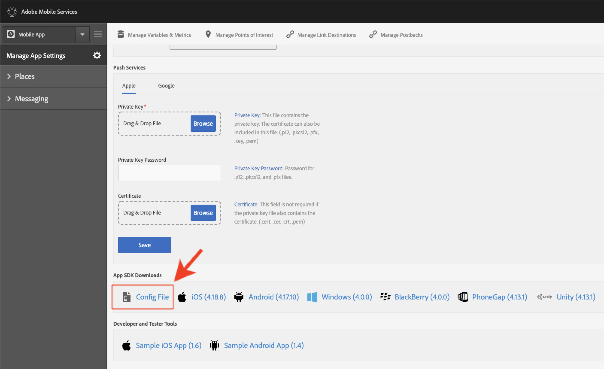

# 下載並更新We.Travel範例應用程式

We.Travel範例應用程式已預先與Adobe Mobile Services SDK v4實作。 您只需要更新它，它就能指向您自己的Experience Cloud組織和解決方案帳戶。

## 學習目標

在本課程結束時，您將能夠：

* 在Android Studio中下載並開啟We.Travel範例應用程式
* 驗證並更新Mobile Services SDK設定 [!DNL Target]

## 下載We.Travel應用程式

* 下載 [sample-app-android-SDKv4-Base-Version.zip](assets/sample-app-android-SDKv4-Base-Version.zip)
* 解壓縮zip檔案
* 在Android Studio中以現有專案的形式開啟應用程式（忽略有關「無效VCS根對應」的任何錯誤）
* 在模擬器中執行應用程式，以確認應用程式已建立，而您可以看見首頁畫面
* 瀏覽應用程式並確認您可以完成預訂程式（選擇任何付款選項，然後按一下「繼續」即可略過帳單畫面！）

   

## 驗證並更新Mobile Services SDK設定 [!DNL Target]

Adobe Mobile Services SDK已預先安裝在We.Travel應用程式中， [這是檔案所說的](https://docs.adobe.com/content/help/en/mobile-services/android/getting-started-android/requirements.html)。 現在，您將更新安裝，以指向您自己的 [!DNL Target] 帳戶。

首先，在Mobile Services使用者介面中建立新的應用程式：

1. Log in to the [Adobe Mobile Services interface](https://mobilemarketing.adobe.com).
1. 前往「管 [!UICONTROL 理應用程式]」，然後按一下「新增」以新增要搭配本教學課程使用的新應用程式(「 **[!UICONTROL 管理應用程式]** >新&#x200B;********&#x200B;增」)。
1. 選擇含有非生產資料的Analytics報表套裝、為應用程式指定名稱、選取「標準」類 **[!UICONTROL 型]** ，然後按一下「 **[!UICONTROL 儲存」]**。
1. 新增應用程式後，請在下一個畫面的「 [!DNL Target] SDK Target [!UICONTROL Options」區段中新增您的用戶端程式碼(您可在] SDK Target Options介面的「Setup [!DNL Target] > Implementation Settings ************`at.js` > Deitings」（Download Alignments的下載Oment）按鈕旁邊，在客戶端介面中找到您的代碼))。
1. 「請 [!UICONTROL 求逾時] 」設定會決定應用程式在執行逾時指示前，等待伺服器 [!DNL Target] 回應的時間。 只要保留預設設定即可。
1. 啟用 [!UICONTROL 訪客ID服務] ，並確定在下拉式清單中 [!UICONTROL 選取了您的組織] 。
1. 按一下視窗右上方的「 **[!UICONTROL Save]** 」(而非「 [!UICONTROL Universal Links]」、「 [!UICONTROL App Links] 」選項或「推送服務  Jozing」區段)，以儲存您的變更。
1. 捲動至頁面底部的「應用程式SDK下載」區段，並下載設定檔案：

   

1. 取代Android `ADBMobileConfig.json` Studio專案資產檔案夾（應用程式> src >主>資產）中的檔案。

1. 現在開啟檔 `ADBMobileConfig.json` 案，並確定它包含預期的變更，例如您的用戶端程式碼 [!DNL Target] 和您的Analytics詳細資訊：
   

如果您未看到設定，請確認您已按一下 **[!UICONTROL Mobile Services]** （行動服務）介面中的「儲存  」按鈕，並將檔案複製至正確位置。

恭喜！ 您已更新SDK及您的帳戶詳 [!DNL Target] 細資訊！ 在下一課添加請求後，我們將對配置進 [!DNL Target] 行其他驗證。

**[下一個： &quot;添加目標請求&quot; >](add-requests.md)**
