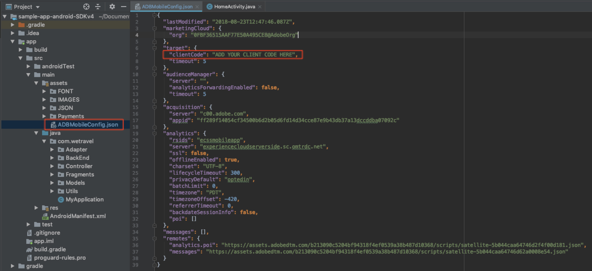

# 下載並更新We.Travel範例應用程式

We.Travel範例應用程式已預先建置在AdobeMobile Services SDK v4中。 您只需要更新它，它就能指向您自己的Experience Cloud組織和解決方案帳戶。

## 學習目標

在本課程結束時，您將能夠：

* 在Android Studio中下載並開啟We.Travel範例應用程式
* 驗證並更新[!DNL Target]的Mobile Services SDK設定

## 下載We.Travel應用程式

* 下載[sample-app-android-SDKv4-Base-Version.zip](assets/sample-app-android-SDKv4-Base-Version.zip)
* 解壓縮zip檔案
* 在Android Studio中以現有專案的形式開啟應用程式（忽略有關「無效VCS根對應」的任何錯誤）
* 在模擬器中執行應用程式，以確認應用程式已建立，而您可以看見首頁畫面
* 瀏覽應用程式並確認您可以完成預訂程式（選擇任何付款選項，然後按一下「繼續」即可略過帳單畫面！）

   

## 驗證並更新[!DNL Target]的Mobile Services SDK設定

We.Travel應用程式[中已預先安裝AdobeMobile Services SDK，說明檔案](https://docs.adobe.com/content/help/en/mobile-services/android/getting-started-android/requirements.html)。 現在，您將更新安裝，以指向您自己的[!DNL Target]帳戶。

首先，在Mobile Services使用者介面中建立新的應用程式：

1. 登入[AdobeMobile Services介面](https://mobilemarketing.adobe.com)。
1. 前往「管理應用程式」[!UICONTROL ，然後按一下「新增」以新增要與本教學課程搭配使用的新應用程式（「管理應用程式」]**>>「新增」**[!UICONTROL ）。]********
1. 選擇含有非生產資料的Analytics報表套裝，為應用程式指定名稱，選取&#x200B;**[!UICONTROL Standard]**&#x200B;類型，然後按一下「儲存&#x200B;**[!UICONTROL a3/>」。]**
1. 新增應用程式後，請在[!UICONTROL SDK目標選項]區段的下一個畫面上新增您的[!DNL Target]用戶端代碼（您可在&#x200B;**[!UICONTROL Setup]** > **[!UICONTROL Implementation]** > **[!UICONTROL 編輯設定]**&#x200B;下的[!DNL Target]介面中找到您的用戶端代碼，下載`at.js`按鈕旁）。
1. [!UICONTROL 請求逾時]設定可決定應用程式在執行逾時指令之前，等待[!DNL Target]伺服器回應的時間。 只要保留預設設定即可。
1. 啟用[!UICONTROL 訪客ID服務]，並確定在下拉式清單中已選取[!UICONTROL 組織]。
1. 按一下視窗右上方的&#x200B;**[!UICONTROL 儲存]**&#x200B;以儲存變更（而非[!UICONTROL 通用連結]、[!UICONTROL 應用程式連結]選項或[!UICONTROL 推播服務]區段中的）。
1. 捲動至頁面底部的「應用程式SDK下載」區段，並下載設定檔案：

   

1. 取代Android Studio專案資產資料夾（應用程式> src >主>資產）中的`ADBMobileConfig.json`檔案。

1. 現在開啟`ADBMobileConfig.json`檔案，並確定它包含預期的變更，例如您的[!DNL Target]用戶端程式碼和您的Analytics詳細資訊：
   

如果您未看到您的設定，請確認您按一下[!UICONTROL Mobile Services]介面中的右&#x200B;**[!UICONTROL Save]**&#x200B;按鈕，並將檔案複製到正確的位置。

恭喜！ 您已使用[!DNL Target]帳戶詳細資訊更新SDK! 在下一課添加[!DNL Target]請求後，我們將對配置進行其他驗證。

**[下一個：&quot;添加目標請求&quot; >](add-requests.md)**
