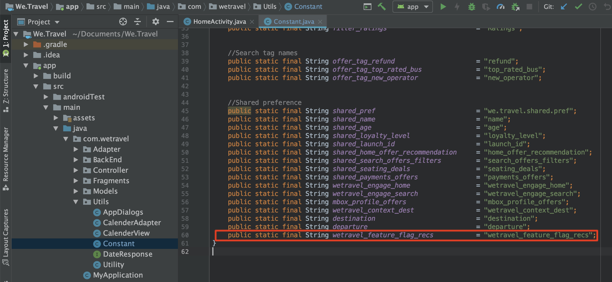

# 功能標幟

行動應用程式產品擁有者需要彈性，以在其應用程式中推出新功能，而無須投資多個應用程式發行版本。 他們也可能想要將功能逐步推出至使用者群的一定比例，以測試成效。 Adobe Target可用來試驗顏色、復本、按鈕、文字和影像等UX功能，並為特定對象提供這些功能。

在本課程中，我們將建立「功能標幟」選件，此選件可作為觸發器，以啟用特定應用程式功能。

## 學習目標

在本課程結束時，您將能夠：

* 將新位置新增至批次預先擷取請求
* 建立[!DNL Target]活動，其中包含將作為功能標幟的選件
* 載入及驗證應用程式中的功能標幟選件

## 將新位置新增至首頁活動的預先擷取請求

在先前課程的示範應用程式中，我們會將名為「wetravel_feature_flag_recs」的新位置新增至「首頁活動」中的預先擷取請求，並使用新的Java方法將其載入畫面。

>[!NOTE]
>
>使用預先擷取請求的優點之一，是新增請求不會增加任何額外的網路負載，也不會造成額外的負載工作，因為請求會封裝在預先擷取請求中

首先，驗證wetravel_feature_flag_recs常數已添加到Constant.java檔案中：



以下是程式碼：

```java
public static final String wetravel_feature_flag_recs = "wetravel_feature_flag_recs";
```

現在將位置新增至預先擷取請求，並載入名為`processFeatureFlags()`的新函式：


以下是完整更新的程式碼：

```java
public void targetPrefetchContent() {
    List<TargetPrefetchObject> prefetchList = new ArrayList<>();

    Map<String, Object> params1;
    params1 = new HashMap<String, Object>();
    params1.put("at_property", "7962ac68-17db-1579-408f-9556feccb477");

    prefetchList.add(Target.createTargetPrefetchObject(Constant.wetravel_engage_home, params1));
    prefetchList.add(Target.createTargetPrefetchObject(Constant.wetravel_engage_search, params1));
    prefetchList.add(Target.createTargetPrefetchObject(Constant.wetravel_feature_flag_recs, params1));

    Target.TargetCallback<Boolean> prefetchStatusCallback = new Target.TargetCallback<Boolean>() {
        @Override
        public void call(final Boolean status) {
            HomeActivity.this.runOnUiThread(new Runnable() {
                @Override
                public void run() {
                    String cachingStatus = status ? "YES" : "NO";
                    System.out.println("Received Response from prefetch : " + cachingStatus);
                    engageMessage();
                    processFeatureFlags();
                    setUp();

                }
            });
        }};
    Target.prefetchContent(prefetchList, null, prefetchStatusCallback);
}

public void processFeatureFlags() {
    Target.loadRequest(Constant.wetravel_feature_flag_recs, "", null, null, null,
            new Target.TargetCallback<String>(){
                @Override
                public void call(final String s) {
                    runOnUiThread(new Runnable() {
                        @Override
                        public void run() {
                            System.out.println("Feature Flags : " + s);
                            if(s != null && !s.isEmpty()) {
                                //enable or disable features
                            }
                        }
                    });
                }
            });
}
```

### 驗證功能標幟請求

新增程式碼後，在首頁活動上執行模擬器，並觀看Logcat以取得更新的回應：


## 建立功能標幟JSON選件

我們現在將建立簡單的JSON選件，作為特定對象（即會在其應用程式中接收功能推出的對象）的標幟或觸發器。 在[!DNL Target]介面中，建立新選件：


將其命名為「功能標幟v1」，值為{&quot;enable&quot;:1}


## 建立活動

現在來使用該選件建立A/B測試活動。 如需建立活動的詳細步驟，請參閱上一課。 針對此範例，活動只需要一個對象。 在即時案例中，您可能想要針對特定功能推廣建立特定自訂對象，然後設定活動以使用這些對象。 在此範例中，我們只會分配流量50/50（50%給看到功能更新的訪客，50%給看到標準體驗的訪客）。 以下是活動的設定：

1. 將活動命名為「功能標幟」
1. 選取「wetravel_feature_flag_recs」位置
1. 將內容變更為「功能標幟v1」 JSON選件

   

1. 按一下「**[!UICONTROL 新增體驗]**」以新增體驗B。
1. 離開「wetravel_feature_flag_recs」位置
1. 保留內容的&#x200B;**[!UICONTROL 預設內容]**
1. 按一下&#x200B;**[!UICONTROL Next]**&#x200B;前進至[!UICONTROL Targeting]畫面

   

1. 在[!UICONTROL 目標定位]畫面上，確認[!UICONTROL 流量分配]方法已設為預設設定（手動），且每個體驗皆有預設的50%配置。 選取&#x200B;**[!UICONTROL Next]**&#x200B;以前往&#x200B;**[!UICONTROL 目標與設定]**。

   

1. 將&#x200B;**[!UICONTROL 主要目標]**&#x200B;設定為&#x200B;**[!UICONTROL 轉換]**。
1. 將動作設為「已檢視Mbox ]**」。**[!UICONTROL &#x200B;我們將使用「wetravel_context_dest」位置（因為此位置位於「確認」畫面上，因此我們可以使用它來查看新功能是否導致更多轉換）。
1. 按一下&#x200B;**[!UICONTROL 「儲存並關閉」]**。

   

啟動活動.

## 驗證功能標幟活動

現在，請使用模擬器來監視要求。 由於我們將目標設定為50%的使用者，因此您會看到50%的功能標幟回應包含`{enable:1}`值。


如果您沒有看見`{enable:1}`值，表示您未鎖定體驗的目標。 作為暫時測試，若要強制顯示選件，您可以：

1. 停用活動。
1. 將新功能體驗的流量分配變更為100%。
1. 儲存並重新啟用。
1. 在模擬器上擦去資料，然後重新啟動應用程式。
1. 選件現在應會傳回`{enable:1}`值。

在即時案例中，`{enable:1}`回應可用來在您的應用程式中啟用更多自訂邏輯，以顯示您要顯示目標受眾的特定功能集。

## 結論

幹得好！ 您現在具備向特定使用者對象推廣功能所需的技能。
