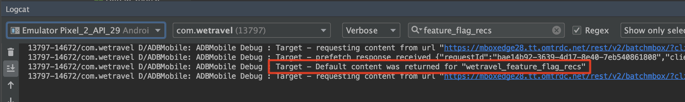

# 功能標幟

行動應用程式產品擁有者需要有彈性，在應用程式中推出新功能，而不需投資於多個應用程式版本。 他們也可能想要逐步將功能推展至使用者群的百分比，以測試效能。 Adobe Target可用來實驗UX的功能，例如顏色、復本、按鈕、文字和影像，並為特定的觀眾提供這些功能。

在本課中，我們將建立「功能標幟」選件，此選件可用作啟用特定應用程式功能的觸發器。

## 學習目標

在本課程結束時，您將能夠：

* 向批預回遷請求添加新位置
* 建立[!DNL Target]活動，其選件將用作功能標幟
* 載入並驗證應用程式中的功能標幟選件

## 將新位置添加到預回遷請求到主活動

在先前課程的示範應用程式中，我們會在「首頁活動」的預回遷請求中新增名為「wetravel_feature_flag_recs」的新位置，並使用新的Java方法將它載入畫面。

>[!NOTE]
>
>使用預回遷請求的好處之一是，添加新請求不會增加任何額外的網路開銷或導致額外的負載工作，因為請求被打包在預回遷請求中

首先，驗證wetravel_feature_flag_recs常數是否已新增至Constant.java檔案：


以下是程式碼：

```java
public static final String wetravel_feature_flag_recs = "wetravel_feature_flag_recs";
```

現在，將位置添加到預回遷請求中，並載入名為`processFeatureFlags()`的新函式：


以下是完整更新的程式碼：

```java
public void targetPrefetchContent() {
    List<TargetPrefetchObject> prefetchList = new ArrayList<>();

    Map<String, Object> params1;
    params1 = new HashMap<String, Object>();
    params1.put("at_property", "7962ac68-17db-1579-408f-9556feccb477");

    prefetchList.add(Target.createTargetPrefetchObject(Constant.wetravel_engage_home, params1));
    prefetchList.add(Target.createTargetPrefetchObject(Constant.wetravel_engage_search, params1));
    prefetchList.add(Target.createTargetPrefetchObject(Constant.wetravel_feature_flag_recs, params1));

    Target.TargetCallback<Boolean> prefetchStatusCallback = new Target.TargetCallback<Boolean>() {
        @Override
        public void call(final Boolean status) {
            HomeActivity.this.runOnUiThread(new Runnable() {
                @Override
                public void run() {
                    String cachingStatus = status ? "YES" : "NO";
                    System.out.println("Received Response from prefetch : " + cachingStatus);
                    engageMessage();
                    processFeatureFlags();
                    setUp();

                }
            });
        }};
    Target.prefetchContent(prefetchList, null, prefetchStatusCallback);
}

public void processFeatureFlags() {
    Target.loadRequest(Constant.wetravel_feature_flag_recs, "", null, null, null,
            new Target.TargetCallback<String>(){
                @Override
                public void call(final String s) {
                    runOnUiThread(new Runnable() {
                        @Override
                        public void run() {
                            System.out.println("Feature Flags : " + s);
                            if(s != null && !s.isEmpty()) {
                                //enable or disable features
                            }
                        }
                    });
                }
            });
}
```

### 驗證功能標幟要求

在新增程式碼後，在「首頁活動」上執行模擬器，並觀看「記錄檔」以取得更新的回應：



## 建立功能標幟JSON選件

我們現在將建立簡單的JSON選件，作為特定對象的旗標或觸發器——這些對象會收到在其應用程式中推出的功能。 在[!DNL Target]介面中，建立新選件：


讓我們將它命名為&quot;Feature Flag v1&quot;，其值為{&quot;enable&quot;:1}


## 建立活動

現在，讓我們使用該選件建立A/B測試活動。 有關建立活動的詳細步驟，請參閱上一課。 此範例的活動只需要一個對象。 在即時案例中，您可能想要針對特定功能展示建立特定的自訂對象，然後將活動設定為使用這些對象。 在此範例中，我們只會將流量分配50/50（50%給會看到功能更新的訪客，50%給會看到標準體驗的訪客）。 以下是活動的配置：

1. 將活動命名為「功能標幟」
1. 選取「wetravel_feature_flag_recs」位置
1. 將內容變更為「功能標幟v1」JSON選件

   

1. 按一下「新增體驗」，新增體驗B。****
1. 保留&quot;wetravel_feature_flag_recs&quot;位置
1. 保留&#x200B;**[!UICONTROL 內容的預設內容]**
1. 按一下「下一步」，移至「定位」畫面&#x200B;****

   

1. 在[!UICONTROL Targeting]畫面上，確認[!UICONTROL 流量分配]方法已設為預設設定（手動），且每個體驗都有預設的50%配置。 選擇&#x200B;**[!UICONTROL Next]**&#x200B;以進入&#x200B;**[!UICONTROL 目標與設定]**。

   

1. 將&#x200B;**[!UICONTROL 主要目標]**&#x200B;設定為&#x200B;**[!UICONTROL 轉換]**。
1. 將動作設定為「已檢視Mbox ]**」。**[!UICONTROL &#x200B;我們將使用&quot;wetravel_context_dest&quot;位置（因為此位置位於「確認」畫面上，因此我們可使用它來查看新功能是否帶來更多轉換）。
1. 按一下&#x200B;**[!UICONTROL 「儲存並關閉」]**。

   

啟動活動.

## 驗證功能標幟活動

現在，請使用模擬器來監視請求。 由於我們將定位設定給50%的使用者，因此您會看到50%的功能標幟回應包含`{enable:1}`值。


如果您未看到`{enable:1}`值，表示您未針對體驗設定目標。 作為臨時測試，若要強制顯示選件，您可以：

1. 停用活動。
1. 將新功能體驗的流量分配變更為100%。
1. 儲存並重新啟用。
1. 在模擬器上擦除資料，然後重新啟動應用程式。
1. 選件現在應傳回`{enable:1}`值。

在即時案例中，`{enable:1}`回應可用於啟用應用程式中的更多自訂邏輯，以顯示您要顯示目標對象的特定功能集。

## 結論

幹得好！ 您現在具備向特定使用者對象推廣功能所需的技能。
