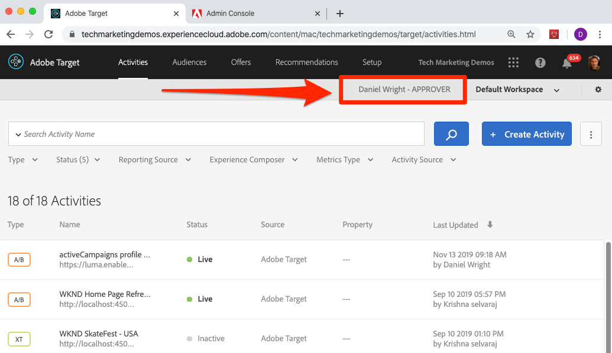

# Adobe Target搭配AdobeMobile Services SDK v4 for Android — 概觀

_Adobe Target搭配AdobeMobile Services SDK v4 for_ Android是已使用AdobeMobile Services SDK v4且想要開始透過Adobe Target個人化應用程式體驗的Android開發人員的最佳起點。

系統提供示範Android應用程式，供您完成課程。 完成本教學課程後，您應已準備好開始在自己的Android應用程式中實作[!DNL Target]!

完成此教學課程之後，您將能:

* 驗證[AdobeMobile Services SDK](https://experienceleague.adobe.com/docs/mobile-services/android/getting-started-android/requirements.html?lang=en)設定
* 實作下列[!DNL Target]請求類型：
   * 預先擷取[!DNL Target]內容
   * 在單一請求中批次多個[!DNL Target]位置(mbox)
   * 封鎖請求（在應用程式顯示前執行）
   * 非封鎖請求（在背景執行）
   * 即時（非快取）
   * 快取破壞重新擷取
* 將參數新增至要求以增強個人化
* 建立對象和選件
* 個人化配置
* 推出具有功能標幟的新功能

## 必要條件

在這些課程中，假設您：

* 擁有AdobeID和Adobe Target介面的核准者層級存取權（請參閱下方的驗證步驟）
* 了解您的Adobe Target用戶端代碼，以便向您自己的帳戶提出請求。 用戶端代碼會顯示在   「設定>實作>編輯at.js設定」畫面
* 存取和熟悉[Mobile Services使用者介面](https://mobilemarketing.adobe.com/)
* 擁有適用於Android行動應用程式開發的IDE。 本教學課程在各個步驟和螢幕擷取畫面中提供[Android Studio](https://developer.android.com/studio/install)

如果您沒有Experience Cloud解決方案的必要存取權，請洽詢您的Experience Cloud管理員。

此外，我們假設您熟悉Java的Android開發。 您不需要是Java專家就能完成這些課程，但如果您熟悉且了解程式碼，將能從中學到更多。

### 驗證對Adobe Target的存取

本課程需要存取Adobe Target。 在繼續執行後續步驟之前，請執行下列操作，確定您擁有Adobe Target的存取權：

1. 登入[Adobe Experience Cloud](https://experience.adobe.com/)
1. 在Experience Cloud主螢幕中，按一下[!DNL Target]:
   
1. 如下圖所示，您應該會進入Adobe Target中的活動清單，您應該會看到您的使用者擁有核准者層級的存取權。 如果您無法存取[!DNL Target]或無法驗證核准者層級的存取權，請連絡貴公司的其中一位Experience Cloud管理員，請求此存取權，並在授與後繼續本教學課程：

   

## 關於課程

在這些課程中，您將使用自己的Adobe Target帳戶，將Adobe Target實施至名為「We.Travel」的示範旅遊應用程式中。 在教學課程結束前，您將根據使用者對應用程式的使用情形，為使用者提供個人化訊息！ 最終的個人化體驗看起來會像這樣：

在We.Travel應用程式中逐步實作後，您就可以在自己的行動應用程式中開始使用[!DNL Target]。

開始吧！

**[下一個：「下載並更新範例應用程式」>](download-and-update-the-sample-app.md)**
