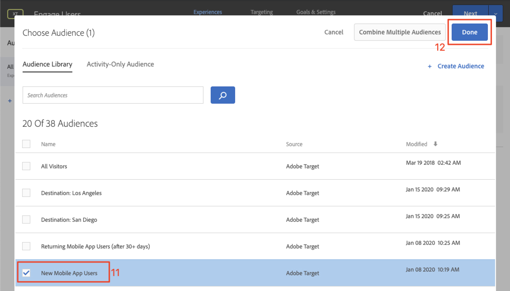
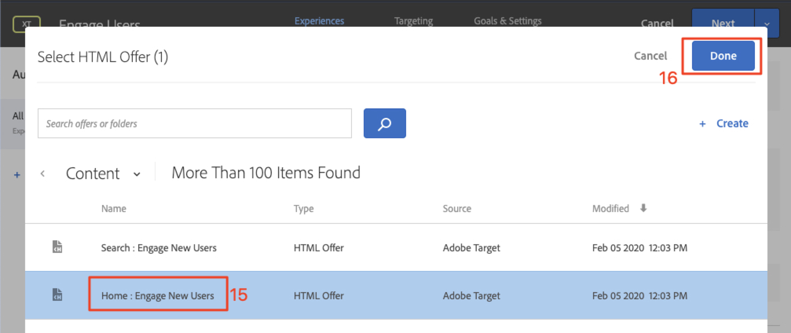
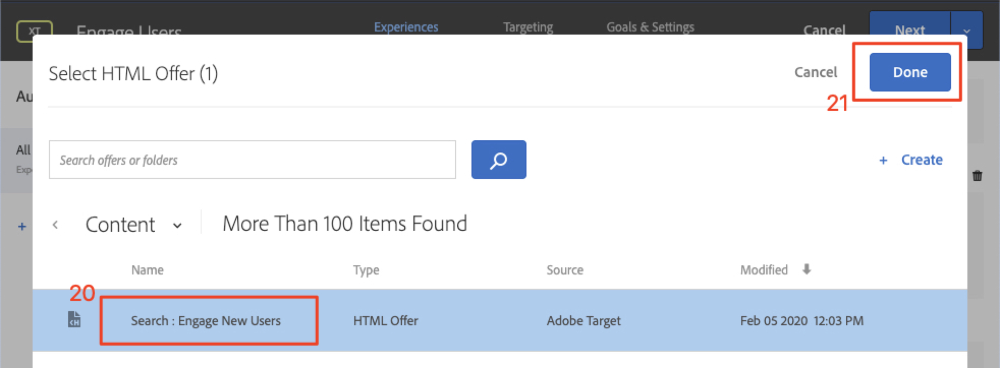
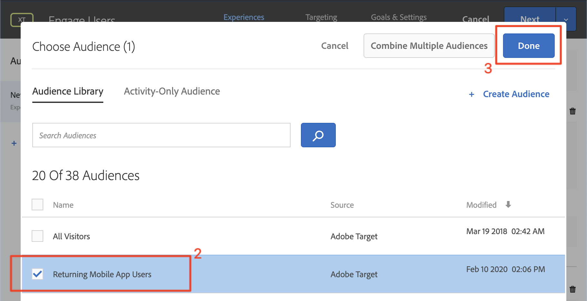
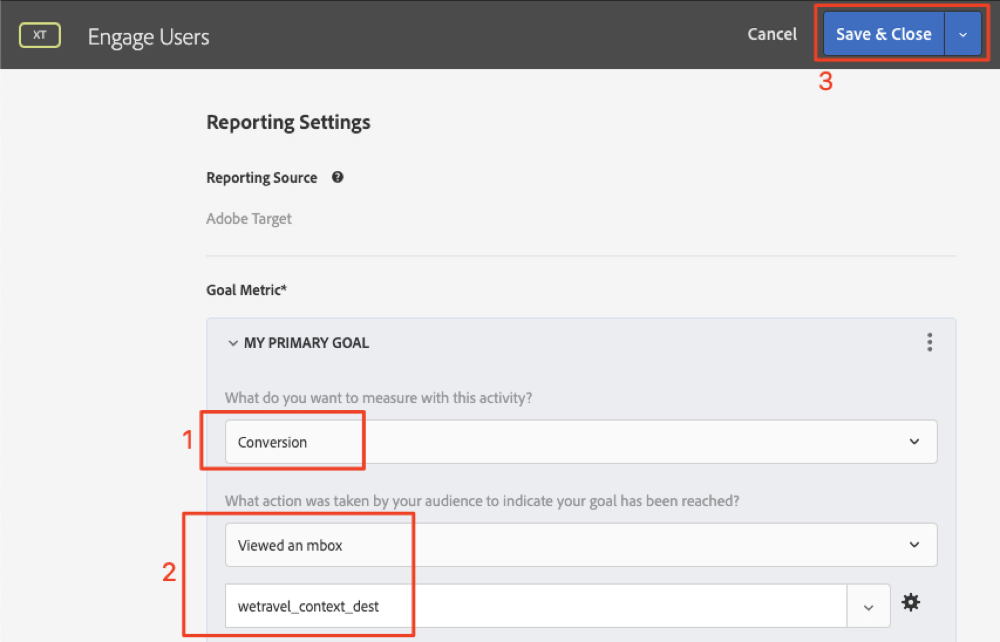
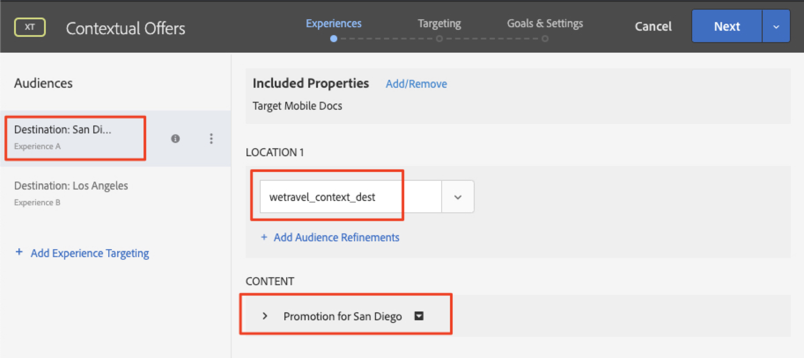
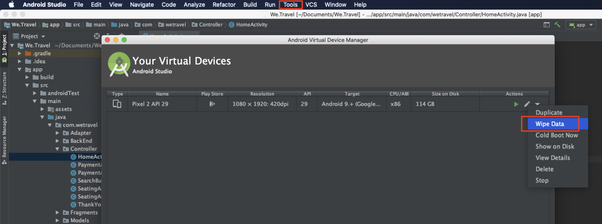
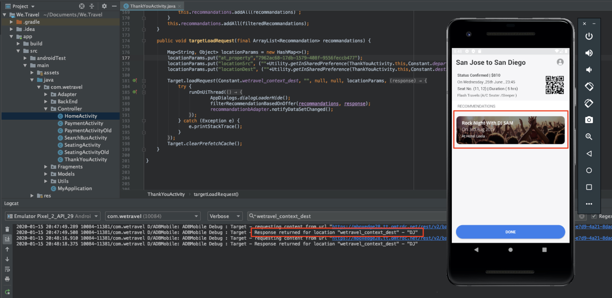
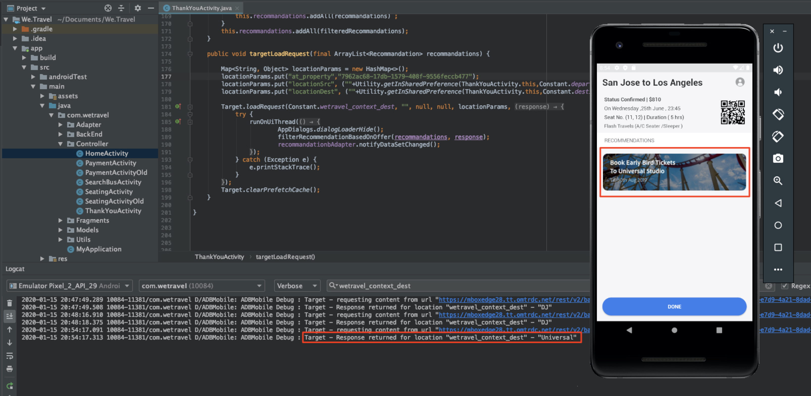

# 個人化版面

現在，您應該將一切都整合在一起，打造個人化體驗。 _活動_&#x200B;是將位置、對象和選件連結在一起的[!DNL Target]機制，以便在從應用程式發出請求時，[!DNL Target]會以個人化內容回應。 我們將在[!DNL Target]中建置兩個個人化活動，並驗證個人化內容是否會在正確的時間和正確位置向正確的使用者顯示。

## 學習目標

在本課程結束時，您將能夠：

* 在Adobe Target中建立活動
* 驗證範例應用程式中的活動

## 在Adobe Target中建立活動

瞭解如何建立參與使用者和內容選件活動。

### 第一個活動 — 「與使用者互動」

以下是我們將建立的活動摘要：

| 客群 | 位置 | 產品建議 |
|---|---|---|
| 新行動應用程式使用者 | wetravel_engage_home， wetravel_engage_search | 首頁：與新使用者互動，搜尋：與新使用者互動 |
| 回訪行動應用程式使用者 | wetravel_engage_home， wetravel_engage_search | 首頁：再度訪問的使用者，default_content |

在[!DNL Target]介面中，執行下列動作：

1. 選取&#x200B;**[!UICONTROL 活動]** > **[!UICONTROL 建立活動]** > **[!UICONTROL 體驗鎖定目標]**。

   

1. 按一下&#x200B;**[!UICONTROL 行動應用程式]**。
1. 選取&#x200B;**[!UICONTROL 表單撰寫器]**。
1. 選取您的工作區（與您在先前課程中使用的工作區相同）。
1. 選取您的屬性（與您在先前課程中使用的屬性相同）。
1. 按一下&#x200B;**[!UICONTROL 下一步]**。

   

1. 將活動標題變更為&#x200B;**[!UICONTROL 與使用者互動]**。
1. 選取&#x200B;**[!UICONTROL 省略符號]** > **[!UICONTROL 變更對象]**。
   
1. 將對象設為&#x200B;**[!UICONTROL 新的行動應用程式使用者]**。
1. 按一下&#x200B;**[!UICONTROL 「完成」]**。
   

1. 將位置變更為&#x200B;_wetravel_ engage_home_。
1. 選取「預設內容」旁的下拉箭頭，然後選取「**[!UICONTROL 變更HTML選件]**」。

   

1. 選取&#x200B;**[!UICONTROL 首頁：與新使用者互動]**&#x200B;選件。
1. 選取&#x200B;**[!UICONTROL 完成]**。

   

1. 選取&#x200B;**[!UICONTROL 新增位置]**。
   

1. 選取&#x200B;_wetravel_ engage_search_位置。
1. 變更HTML選件。

   

1. 選取&#x200B;**[!UICONTROL 搜尋：與新使用者互動]**&#x200B;選件。
1. 按一下&#x200B;**[!UICONTROL 「完成」]**。

   

您剛剛將受眾連線至位置和選件，為新的行動應用程式使用者建立個人化體驗！ 體驗現在看起來應該像這樣：

現在為回訪的行動應用程式使用者建立體驗：

1. 選取左側的&#x200B;**[!UICONTROL 新增體驗鎖定目標]**。
1. 選取對象&#x200B;**[!UICONTROL 傳回行動應用程式使用者]**。
1. 選取&#x200B;**[!UICONTROL 完成]**。
   

現在請使用先前用來設定新體驗的相同程式。 回訪行動應用程式使用者體驗的設定應該如下所示：

讓我們繼續設定中的下一個畫面：

1. 按一下[下一步]****&#x200B;以前進到&#x200B;**[!UICONTROL [鎖定目標]]**&#x200B;畫面。
1. 使用定位的預設設定。 如果您有重疊對象的體驗（例如&#x200B;_紐約使用者_&#x200B;和&#x200B;_首次使用者_），您可以在此畫面中安排優先順序。
1. 按一下[下一步]****&#x200B;以前進到&#x200B;**[!UICONTROL 目標與設定]**。

   

現在，讓我們完成活動設定：

1. 將&#x200B;**[!UICONTROL 主要目標]**&#x200B;設定為&#x200B;**[!UICONTROL 轉換]**。
1. 將動作設為&#x200B;**[!UICONTROL 已檢視mbox]** > _wetravel_ context_dest_ （由於此位置位於確認畫面上，因此我們可以使用它來測量轉換）。

   

1. 將熒幕上的其他設定保留為預設值。
1. 按一下&#x200B;**[!UICONTROL 儲存並關閉]**&#x200B;以儲存活動。
1. 在下一個畫面啟動&#x200B;**[!UICONTROL 活動]**。

我們的第一個活動現在已上線並準備好進行測試！

### 第二個活動 — 「內容選件」

以下是我們將建置的第二個活動的摘要：

| 客群 | 位置 | 產品建議 |
| --- | --- | --- |
| 目的地：聖地亞哥 | wetravel_context_dest | San Diego促銷活動 |
| 目的地：洛杉磯 | wetravel_context_dest | 洛杉磯促銷活動 |

對下一個活動「內容選件」重複上述相同程式。 這兩個體驗的最終設定如下所示：

#### 聖地亞哥

#### 洛杉磯

在「目標與設定」步驟中，我們會將主要目標變更為預訂確認畫面上的位置：

1. 在&#x200B;**[!UICONTROL 報告設定]**&#x200B;下，將&#x200B;**[!UICONTROL 主要目標]**&#x200B;設定為&#x200B;**[!UICONTROL 轉換]**。
1. 將動作設為&#x200B;**[!UICONTROL 已檢視mbox]** > _wetravel_ context_dest_ （在此活動中，此量度基本上沒有意義，因為這也是提供體驗的位置）。
1. 按一下&#x200B;**[!UICONTROL 「儲存並關閉」]**。

在下一個畫面中啟動活動。

現在我們的第二個活動已上線並準備好進行測試！

## 驗證首頁選件

執行模擬器，並觀看首頁畫面底部顯示的第一個選件。 如果您是具有5個或更多應用程式啟動的回訪使用者，則會看到顯示&#x200B;_歡迎回來_&#x200B;選件。 如果您是新使用者（啟動少於5個應用程式），您應該會看到&#x200B;_新使用者_&#x200B;訊息：

如果未顯示新的使用者選件，請嘗試擦拭模擬器的資料。 這會在您下次啟動時將應用程式啟動次數重設為1。 這是在&#x200B;**[!UICONTROL 工具]** > **[!UICONTROL AVD管理員]**&#x200B;下完成的。 如果Logcat無法正常運作，您可能也需要重新啟動Android Studio：

您也可以篩選&#x200B;_wetravel_ engage_home_，以在Logcat中驗證回應：

## 驗證搜尋選件

選取&#x200B;**[!UICONTROL San Jose]**&#x200B;作為您的&#x200B;**[!UICONTROL 出發]**，選取&#x200B;**[!UICONTROL San Diego]**&#x200B;作為您的&#x200B;**[!UICONTROL 目的地]**，然後按一下&#x200B;**[!UICONTROL 尋找巴士]**&#x200B;以搜尋可用的巴士。

在結果畫面上，您應該會看到&#x200B;_使用篩選器_&#x200B;訊息。 如果您是具有5個或更多應用程式啟動的回訪使用者，則不會在這裡顯示任何訊息，因為此位置的預設內容已設定（為空白）：

## 驗證「感謝您」畫面上的內容選件

現在，請繼續處理預訂程式：

* 在結果畫面上選取匯流排。
* 在結帳熒幕上選取一個座位。
* 在付款畫面上選取「**[!UICONTROL 信用卡]**」（付款資訊保留空白 — 不會進行實際預訂）。

由於已選取San Diego作為目的地，您應該會在確認畫面上看到&#x200B;_DJ SAM_&#x200B;優惠橫幅：

現在選取&#x200B;**[!UICONTROL 完成]**，然後嘗試以洛杉磯作為目的地進行其他預訂。 確認畫面應顯示&#x200B;_Universal Studios_&#x200B;橫幅：

## 結論

恭喜！ 此部分結束適用於Android的Adobe Target SDK 4.x教學課程的主要部分。 您現在擁有在Android應用程式中實作個人化的技能！ 您可以參考此檔案和示範應用程式，作為未來專案的參考。

下一步：功能標幟是另一個可在Android中透過Adobe Target實作的功能。 若要瞭解功能標幟，請參閱下一個課程。

**[下一步：功能標幟>](feature-flagging.md)**
