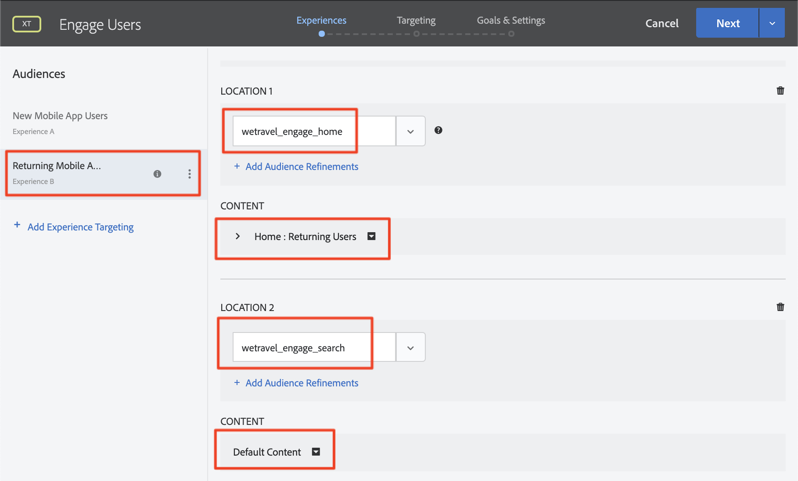

# 個人化版面

現在，是時候將一切整合在一起，打造個人化體驗了。 _Activity_&#x200B;是[!DNL Target]機制，將位置、觀眾和優惠連結在一起，以便當從應用程式提出請求時，[!DNL Target]會以個人化內容回應。 我們將在[!DNL Target]中建立兩個個人化活動，並驗證個人化內容會在適當的時間和位置顯示給適當的使用者。

## 學習目標

在本課程結束時，您將能夠：

* 在Adobe Target建設活動
* 驗證範例應用程式中的活動

## 在Adobe Target建立活動

瞭解如何建立「吸引使用者」和「內容相關選件」活動。

### 第一項活動-「吸引使用者」

以下是我們將建立的活動摘要：

| 對象 | 位置 | 選件 |
|---|---|---|
| 新行動應用程式使用者 | wetravel_engage_home、wetravel_engage_search | 首頁：吸引新用戶，搜尋：吸引新用戶 |
| 舊版行動應用程式使用者 | wetravel_engage_home、wetravel_engage_search | 首頁：傳回使用者，default_content |

在[!DNL Target]介面中，執行以下操作：

1. 選擇「**[!UICONTROL 活動]** > **[!UICONTROL 建立活動]** > **[!UICONTROL 體驗定位]**」。

   

1. 按一下「行動應用程式」。****
1. 選擇&#x200B;**[!UICONTROL 表單撰寫器]**。
1. 選擇您的工作區（與您在先前課程中使用的工作區相同）。
1. 選擇您的屬性（與您在先前課程中使用的屬性相同）。
1. 按&#x200B;**[!UICONTROL 「下一步」]**。

   

1. 將活動標題更改為&#x200B;**[!UICONTROL Engage Users]**。
1. 選擇&#x200B;**[!UICONTROL ellipsis]** > **[!UICONTROL 變更對象]**。
   
1. 將對象設為&#x200B;**[!UICONTROL 新行動應用程式使用者]**。
1. 按一下&#x200B;**[!UICONTROL 「完成」]**。
   

1. 將位置變更為&#x200B;_wetravel_engage_home_。
1. 選擇「Default Content（預設內容）」旁邊的下拉箭頭，然後選擇&#x200B;**[!UICONTROL Change HTML Offer（更改HTML選件）]**。

   

1. 選擇&#x200B;**[!UICONTROL 首頁：吸引新用戶]**&#x200B;優惠。
1. 選擇&#x200B;**[!UICONTROL Done]**。

   

1. 選擇&#x200B;**[!UICONTROL 添加位置]**。
   

1. 選擇&#x200B;_wetravel_engage_search_&#x200B;位置。
1. 變更HTML選件。

   

1. 選擇&#x200B;**[!UICONTROL 搜索：吸引新用戶]**&#x200B;優惠。
1. 按一下&#x200B;**[!UICONTROL 「完成」]**。

   

您剛剛將觀眾連結到位置和優惠，為新行動應用程式使用者建立個人化體驗！ 現在，體驗應該如下所示：

現在為舊版行動應用程式使用者建立體驗：

1. 選擇左側的&#x200B;**[!UICONTROL 新增體驗定位]**。
1. 選取「對象&#x200B;**[!UICONTROL 傳回行動應用程式使用者」]**。
1. 選擇&#x200B;**[!UICONTROL Done]**。
   

現在，請使用我們先前用來設定新體驗的相同程式。 舊版行動應用程式使用者體驗的設定應如下所示：

讓我們繼續進入設定中的下一個畫面：

1. 按一下「下一頁」，進入「定位」畫面。********
1. 使用「定位」的預設設定。 如果您有重疊的觀眾體驗(例如&#x200B;_New York Users_&#x200B;和&#x200B;_First Time Users_)，您可以在此畫面上排列優先順序。
1. 按一下&#x200B;**[!UICONTROL Next]**&#x200B;進入&#x200B;**[!UICONTROL 目標和設定]**。

   

現在，讓我們完成活動設定：

1. 將&#x200B;**[!UICONTROL 主要目標]**&#x200B;設定為&#x200B;**[!UICONTROL 轉換]**。
1. 將動作設定為「已檢視mbox ]**> _wetravel_context_dest_」（由於此位置位於確認畫面上，因此我們可用它來測量轉換）。**[!UICONTROL 

   

1. 將螢幕上的所有其他設定保留為預設值。
1. 按一下&#x200B;**[!UICONTROL 保存並關閉]**&#x200B;以保存活動。
1. 在下一個畫面上啟動&#x200B;**[!UICONTROL Activity]**。

我們的第一項活動現在已上線，可供測試！

### 第二項活動-「內容相關選件」

以下是我們將建立的第二項活動的摘要：

| 對象 | 位置 | 選件 |
| --- | --- | --- |
| 目標：聖地牙哥 | wetravel_context_dest | 聖地牙哥促銷活動 |
| 目標：洛杉磯 | wetravel_context_dest | 洛杉磯升職 |

對下一個活動重複上述相同程式-「內容相關選件」。 兩種體驗的最終設定如下所示：

#### 聖地牙哥

#### 洛杉磯

在「目標與設定」步驟中，我們會將「主要目標」變更為訂房確認畫面上的位置：

1. 在&#x200B;**[!UICONTROL 報告設定]**&#x200B;下，將&#x200B;**[!UICONTROL 主要目標]**&#x200B;設定為&#x200B;**[!UICONTROL 轉換]**。
1. 將動作設定為「已檢視mbox ]**> _wetravel_context_dest_」（在本練習中，此量度基本上沒有意義，因為這也是提供體驗的相同位置）。**[!UICONTROL 
1. 按一下&#x200B;**[!UICONTROL 「儲存並關閉」]**。

在下一個畫面上啟動「活動」。

現在，我們的第二項活動已上線，可供測試！

## 驗證首頁選件

執行模擬器並觀看首個選件在主畫面底部顯示。 如果您是有5次以上應用程式啟動的舊使用者，您會看到&#x200B;_welcome back_&#x200B;選件顯示。 如果您是新使用者（少於5個應用程式啟動），您應該會看到&#x200B;_new user_&#x200B;訊息：

如果未顯示新的使用者選件，請嘗試為模擬器擦除資料。 這會在您下次啟動時將應用程式啟動重設為1。 這是在&#x200B;**[!UICONTROL Tools]** > **[!UICONTROL AVD Manager]**&#x200B;下完成的。 如果Logcat無法正常運作，您可能也需要重新啟動Android Studio:

您也可以在Logcat中驗證回應，方法是篩選&#x200B;_wetravel_engage_home_:

## 驗證搜尋選件

選擇&#x200B;**[!UICONTROL San Jose]**&#x200B;作為&#x200B;**[!UICONTROL Departome]**&#x200B;和&#x200B;**[!UICONTROL San Diego]**&#x200B;作為&#x200B;**[!UICONTROL Destination]**，然後按一下&#x200B;**[!UICONTROL Find Bus]**&#x200B;搜索可用的匯流排。

在結果畫面上，您應該會看到&#x200B;_use filters_&#x200B;訊息。 如果您是已啟動5個以上應用程式的舊用戶，由於此位置已設定預設內容（此位置為空白），因此此處不會顯示任何訊息：

## 驗證「感謝」螢幕上的內容相關選件

現在繼續進行預訂程式：

* 在結果螢幕上選擇一個匯流排。
* 在結帳螢幕上選取座位。
* 在付款螢幕上選擇&#x200B;**[!UICONTROL 信用卡]**（將付款資訊留空——不進行實際預訂）。

由於已選擇San Diego作為目的地，因此您應該會在確認畫面上看到&#x200B;_DJ SAM_&#x200B;選件橫幅：

現在，請選取&#x200B;**[!UICONTROL Done]**，並嘗試以洛杉磯為目的地的其他預訂。 確認畫面應顯示&#x200B;_環球影城_&#x200B;橫幅：

## 結論

恭喜！ 本節將結束「Android教學課程Adobe TargetSDK 4.x」的主要部分。 您現在擁有在Android應用程式中實作個人化的技能！ 您可參閱本檔案和示範應用程式，做為未來專案的參考。

下一步：「功能標幟」是可在Android中與Adobe Target一起實施的另一項功能。 若要瞭解功能標幟，請參閱下一課。

**[下一個：功能標幟>](feature-flagging.md)**
