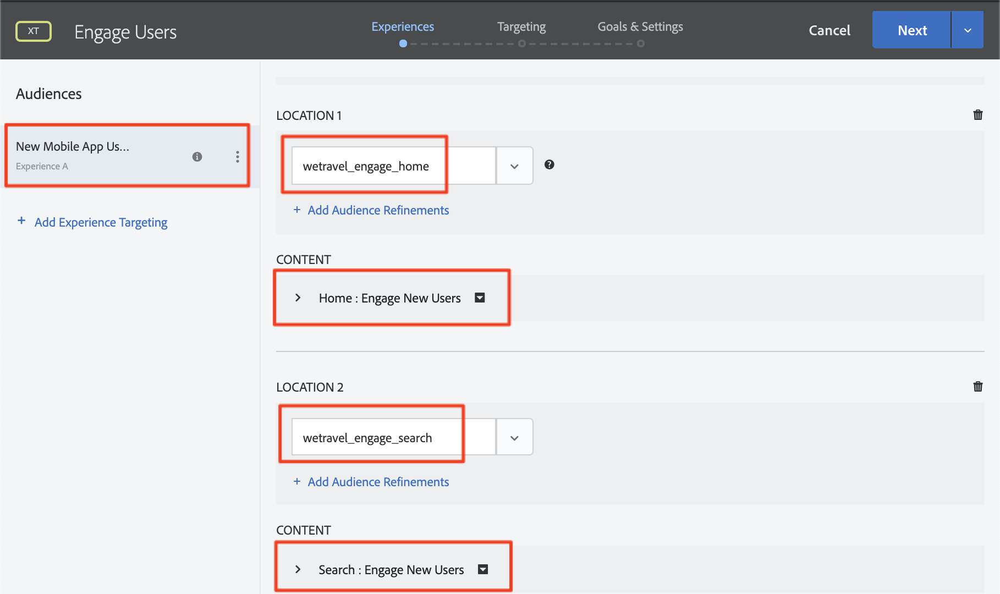

# 個人化版面

現在，您應該將一切都整合在一起，打造個人化體驗。 _活動_&#x200B;是將位置、對象和選件連結在一起的[!DNL Target]機制，以便在從應用程式發出請求時，[!DNL Target]會以個人化內容回應。 我們將在[!DNL Target]中建置兩個個人化活動，並驗證個人化內容是否會在正確的時間和正確位置向正確的使用者顯示。

## 學習目標

在本課程結束時，您將能夠：

* 在Adobe Target中建立活動
* 驗證範例應用程式中的活動

## 在Adobe Target中建立活動

瞭解如何建立參與使用者和內容選件活動。

### 第一個活動 — 「與使用者互動」

以下是我們將建立的活動摘要：

| 客群 | 位置 | 選件 |
|---|---|---|
| 新行動應用程式使用者 | wetravel_engage_home， wetravel_engage_search | 首頁：與新使用者互動，搜尋：與新使用者互動 |
| 回訪行動應用程式使用者 | wetravel_engage_home， wetravel_engage_search | 首頁：再度訪問的使用者，default_content |

在[!DNL Target]介面中，執行下列動作：

1. 選取&#x200B;**[!UICONTROL Activities]** > **[!UICONTROL Create Activity]** > **[!UICONTROL Experience Targeting]**。

   

1. 按一下 **[!UICONTROL Mobile App]**。
1. 選取&#x200B;**[!UICONTROL Form composer]**。
1. 選取您的工作區（與您在先前課程中使用的工作區相同）。
1. 選取您的屬性（與您在先前課程中使用的屬性相同）。
1. 按一下 **[!UICONTROL Next]**。

   

1. 將活動標題變更為&#x200B;**[!UICONTROL Engage Users]**。
1. 選取&#x200B;**[!UICONTROL ellipsis]** > **[!UICONTROL Change Audience]**。
   
1. 將對象設為&#x200B;**[!UICONTROL New Mobile App Users]**。
1. 按一下 **[!UICONTROL Done]**。
   

1. 將位置變更為&#x200B;_wetravel_engage_home_。
1. 選取「預設內容」旁的下拉箭頭，然後選取&#x200B;**[!UICONTROL Change HTML Offer]**。

   

1. 選取&#x200B;**[!UICONTROL Home: Engage New Users]**&#x200B;選件。
1. 選取&#x200B;**[!UICONTROL Done]**。

   

1. 選取&#x200B;**[!UICONTROL Add Location]**。
   

1. 選取&#x200B;_wetravel_engage_search_&#x200B;位置。
1. 變更HTML選件。

   

1. 選取&#x200B;**[!UICONTROL Search: Engage New Users]**&#x200B;選件。
1. 按一下 **[!UICONTROL Done]**。

   

您剛剛將受眾連線至位置和選件，為新的行動應用程式使用者建立個人化體驗！ 體驗現在看起來應該像這樣：

現在為回訪的行動應用程式使用者建立體驗：

1. 選取左側的&#x200B;**[!UICONTROL Add Experience Targeting]**。
1. 選取對象&#x200B;**[!UICONTROL Returning Mobile App Users]**。
1. 選取&#x200B;**[!UICONTROL Done]**。
   

現在請使用先前用來設定新體驗的相同程式。 回訪行動應用程式使用者體驗的設定應該如下所示：

讓我們繼續設定中的下一個畫面：

1. 按一下「**[!UICONTROL Next]**」以前往&#x200B;**[!UICONTROL Targeting]**&#x200B;畫面。
1. 使用定位的預設設定。 如果您有重疊對象的體驗（例如&#x200B;_紐約使用者_&#x200B;和&#x200B;_首次使用者_），您可以在此畫面中安排優先順序。
1. 按一下&#x200B;**[!UICONTROL Next]**&#x200B;以前進到&#x200B;**[!UICONTROL Goals & Settings]**。

   

現在，讓我們完成活動設定：

1. 將&#x200B;**[!UICONTROL Primary Goal]**&#x200B;設為&#x200B;**[!UICONTROL Conversion]**。
1. 將動作設為&#x200B;**[!UICONTROL Viewed an mbox]** > _wetravel_context_dest_ （由於此位置位於確認熒幕上，因此我們可以使用它來測量轉換）。

   

1. 將熒幕上的其他設定保留為預設值。
1. 按一下&#x200B;**[!UICONTROL Save & Close]**&#x200B;以儲存活動。
1. 在下一個畫面中啟動&#x200B;**[!UICONTROL Activity]**。

我們的第一個活動現在已上線並準備好進行測試！

### 第二個活動 — 「內容選件」

以下是我們將建置的第二個活動的摘要：

| 客群 | 位置 | 選件 |
| --- | --- | --- |
| 目的地：聖地亞哥 | wetravel_context_dest | San Diego促銷活動 |
| 目的地：洛杉磯 | wetravel_context_dest | 洛杉磯促銷活動 |

對下一個活動「內容選件」重複上述相同程式。 這兩個體驗的最終設定如下所示：

#### 聖地亞哥

#### 洛杉磯

在「目標與設定」步驟中，我們會將主要目標變更為預訂確認畫面上的位置：

1. 在&#x200B;**[!UICONTROL Reporting Settings]**&#x200B;底下，將&#x200B;**[!UICONTROL Primary Goal]**&#x200B;設定為&#x200B;**[!UICONTROL Conversion]**。
1. 將動作設為&#x200B;**[!UICONTROL Viewed an mbox]** > _wetravel_context_dest_ （在此活動中，此量度基本上沒有意義，因為這也是提供體驗的位置）。
1. 按一下 **[!UICONTROL Save & Close]**。

在下一個畫面中啟動活動。

現在我們的第二個活動已上線並準備好進行測試！

## 驗證首頁選件

執行模擬器，並觀看首頁畫面底部顯示的第一個選件。 如果您是具有5個或更多應用程式啟動的回訪使用者，則會看到顯示&#x200B;_歡迎回來_&#x200B;選件。 如果您是新使用者（啟動少於5個應用程式），您應該會看到&#x200B;_新使用者_&#x200B;訊息：

如果未顯示新的使用者選件，請嘗試擦拭模擬器的資料。 這會在您下次啟動時將應用程式啟動次數重設為1。 這是在&#x200B;**[!UICONTROL Tools]** > **[!UICONTROL AVD Manager]**&#x200B;底下完成的。 如果Logcat無法正常運作，您可能也需要重新啟動Android Studio：

您也可以篩選&#x200B;_wetravel_engage_home_，以在Logcat中驗證回應：

## 驗證搜尋選件

選取&#x200B;**[!UICONTROL San Jose]**&#x200B;作為您的&#x200B;**[!UICONTROL Departure]**，選取&#x200B;**[!UICONTROL San Diego]**&#x200B;作為您的&#x200B;**[!UICONTROL Destination]**，然後按一下&#x200B;**[!UICONTROL Find Bus]**&#x200B;以搜尋可用的巴士。

在結果畫面上，您應該會看到&#x200B;_使用篩選器_&#x200B;訊息。 如果您是具有5個或更多應用程式啟動的回訪使用者，則不會在這裡顯示任何訊息，因為此位置的預設內容已設定（為空白）：

## 驗證「感謝您」畫面上的內容選件

現在，請繼續處理預訂程式：

* 在結果畫面上選取匯流排。
* 在結帳熒幕上選取一個座位。
* 在付款畫面上選取&#x200B;**[!UICONTROL Credit Card]** （將付款資訊保留空白 — 不會進行實際預訂）。

由於已選取San Diego作為目的地，您應該會在確認畫面上看到&#x200B;_DJ SAM_&#x200B;優惠橫幅：

現在選取&#x200B;**[!UICONTROL Done]**，然後嘗試以洛杉磯作為目的地進行其他預訂。 確認畫面應顯示&#x200B;_Universal Studios_&#x200B;橫幅：

## 結論

恭喜！此部分將結束Android適用的Adobe Target SDK 4.x教學課程的主要部分。 您現在擁有在Android應用程式中實作個人化的技能！ 您可以參考此檔案和示範應用程式，作為未來專案的參考。

下一步：功能標幟是另一個可在Android中透過Adobe Target實作的功能。 若要瞭解功能標幟，請參閱下一個課程。

**[下一步：功能標幟>](feature-flagging.md)**
