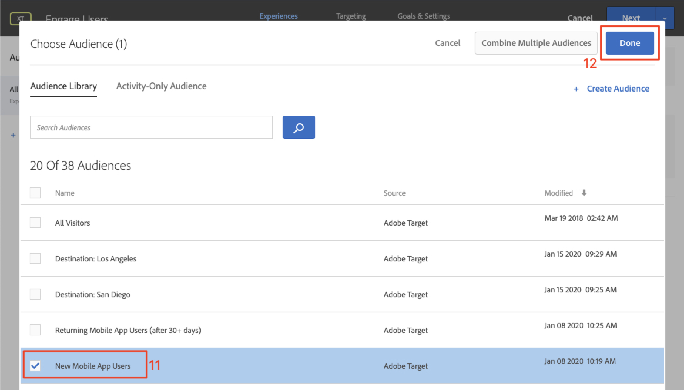
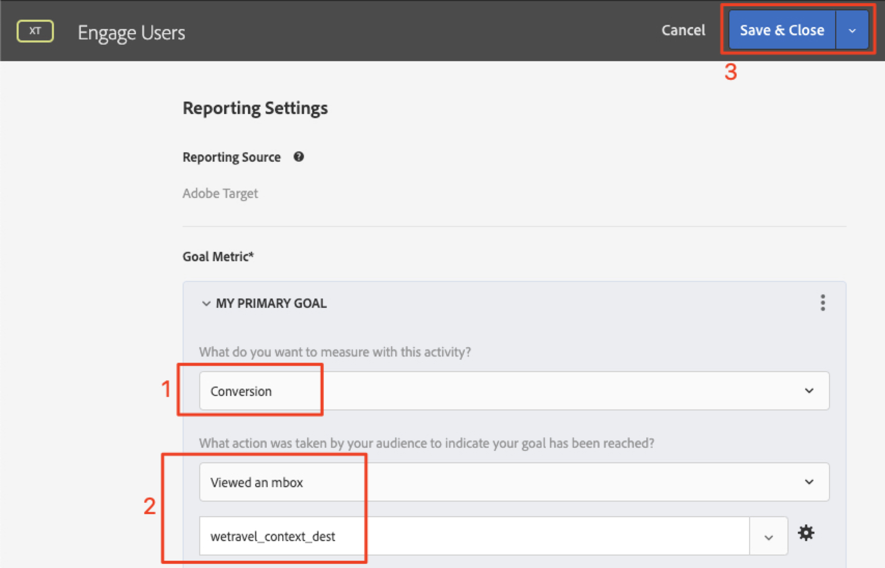

# 個人化配置

現在，您可以將所有內容整合在一起，並建立個人化體驗。 _活動_&#x200B;是將位置、對象和選件連結在一起的[!DNL Target]機制，因此當從應用程式提出請求時，[!DNL Target]會以個人化內容回應。 我們將在[!DNL Target]中建立兩個個人化活動，並驗證個人化內容是否會在正確的時間和正確的位置向正確的使用者顯示。

## 學習目標

在本課程結束時，您將能夠：

* 在Adobe Target中建置活動
* 驗證範例應用程式中的活動

## 在Adobe Target中建立活動

了解如何建立與使用者互動和內容相關的優惠方案活動。

### 第一個活動 — 「吸引使用者」

以下是我們將建置的活動摘要：

| 對象 | 位置 | 選件 |
|---|---|---|
| 新行動應用程式使用者 | wetravel_engage_home、wetravel_engage_search | 首頁：與新用戶互動，搜索：與新使用者互動 |
| 傳回的行動應用程式使用者 | wetravel_engage_home、wetravel_engage_search | 首頁：傳回使用者， default_content |

在[!DNL Target]介面中，執行以下操作：

1. 選取&#x200B;**[!UICONTROL 活動]** > **[!UICONTROL 建立活動]** > **[!UICONTROL 體驗鎖定目標]**。

   

1. 按一下「**[!UICONTROL 行動應用程式]**」。
1. 選擇&#x200B;**[!UICONTROL 表單撰寫器]**。
1. 選取您的工作區（與先前課程中使用的工作區相同）。
1. 選取屬性（與先前課程中使用的屬性相同）。
1. 按&#x200B;**[!UICONTROL 「下一步」]**。

   

1. 將活動標題變更為&#x200B;**[!UICONTROL 參與使用者]**。
1. 選擇&#x200B;**[!UICONTROL 刪節號]** > **[!UICONTROL 更改對象]**。
   
1. 將對象設為&#x200B;**[!UICONTROL 新行動應用程式使用者]**。
1. 按一下&#x200B;**[!UICONTROL 「完成」]**。
   

1. 將位置變更為&#x200B;_wetravel_engage_home_。
1. 選取「預設內容」旁的下拉式箭頭，然後選取「**[!UICONTROL 變更HTML選件]**」。

   

1. 選擇&#x200B;**[!UICONTROL 首頁：與新使用者]**&#x200B;優惠方案互動。
1. 選擇&#x200B;**[!UICONTROL Done]**。

   

1. 選擇&#x200B;**[!UICONTROL 添加位置]**。
   

1. 選取&#x200B;_wetravel_engage_search_&#x200B;位置。
1. 變更HTML選件。

   

1. 選擇&#x200B;**[!UICONTROL 搜索：與新使用者]**&#x200B;優惠方案互動。
1. 按一下&#x200B;**[!UICONTROL 「完成」]**。

   

您剛剛將受眾連線至位置和選件，為新行動應用程式使用者建立個人化體驗！ 現在，體驗應該如下所示：

現在為再度訪問的行動應用程式使用者建立體驗：

1. 選取左側的&#x200B;**[!UICONTROL 新增體驗鎖定目標]** 。
1. 選取對象&#x200B;**[!UICONTROL 傳回行動應用程式使用者]**。
1. 選擇&#x200B;**[!UICONTROL Done]**。
   

現在使用先前用來設定新體驗的相同程式。 再度訪問的行動應用程式使用者體驗的設定應如下所示：

讓我們繼續觀看設定中的下一個畫面：

1. 按一下&#x200B;**[!UICONTROL Next]**&#x200B;前進至&#x200B;**[!UICONTROL Targeting]**&#x200B;畫面。
1. 使用目標定位的預設設定。 如果您的對象體驗重疊(例如&#x200B;_紐約用戶_&#x200B;和&#x200B;_首次用戶_)可以在此螢幕上排列優先順序順序。
1. 按一下&#x200B;**[!UICONTROL Next]**&#x200B;前進至&#x200B;**[!UICONTROL 目標與設定]**。

   

現在來完成活動設定：

1. 將&#x200B;**[!UICONTROL 主要目標]**&#x200B;設定為&#x200B;**[!UICONTROL 轉換]**。
1. 將動作設為「**[!UICONTROL 已檢視mbox]** > _wetravel_context_dest_」（由於此位置位於確認畫面上，因此我們可以用它來測量轉換）。

   

1. 將畫面上的所有其他設定保留為預設值。
1. 按一下「**[!UICONTROL 儲存並關閉]**」以儲存活動。
1. 在下一個畫面上啟動&#x200B;**[!UICONTROL 活動]**。

我們的第一個活動現在已上線，且已準備好進行測試！

### 第二個活動 — 「內容選件」

以下是我們將建立的第二個活動的摘要：

| 對象 | 位置 | 選件 |
| --- | --- | --- |
| 目的地：聖迭戈 | wetravel_context_dest | 聖迭戈升職 |
| 目的地：洛杉磯 | wetravel_context_dest | 洛杉磯升職 |

對下一個活動重複上述相同的程式 — 「內容選件」。 這兩個體驗的最終設定如下所示：

#### 聖迭戈

#### 洛杉磯

在「目標與設定」步驟中，我們會將「主要目標」變更為預訂確認畫面上的位置：

1. 在&#x200B;**[!UICONTROL 報表設定]**&#x200B;下，將&#x200B;**[!UICONTROL 主要目標]**&#x200B;設為&#x200B;**[!UICONTROL 轉換]**。
1. 將動作設為「已檢視mbox ]**> _wetravel_context_dest_」（在此活動中，此量度基本上沒有意義，因為這也是提供體驗的相同位置）。**[!UICONTROL 
1. 按一下&#x200B;**[!UICONTROL 「儲存並關閉」]**。

在下一個畫面上啟動活動。

現在，我們的第二個活動已上線，且已準備好進行測試！

## 驗證首頁選件

執行模擬器並觀察首個選件顯示在主畫面底部。 如果您是已啟動5次以上應用程式的回頭使用者，畫面會顯示&#x200B;_歡迎返回_&#x200B;選件。 如果您是新使用者（少於5次應用程式啟動），應該會看到&#x200B;_新使用者_&#x200B;訊息：

如果未顯示新的使用者選件，請嘗試為模擬器擦除資料。 如此一來，您下次啟動時，應用程式的啟動次數就會重設為1。 在&#x200B;**[!UICONTROL Tools]** > **[!UICONTROL AVD Manager]**&#x200B;下完成。 如果Logcat無法正常運作，您也可能需要重新啟動Android Studio:

您也可以篩選&#x200B;_wetravel_engage_home_&#x200B;以驗證Logcat中的回應：

## 驗證搜尋選件

選擇&#x200B;**[!UICONTROL San Jose]**&#x200B;作為您的&#x200B;**[!UICONTROL Deparume]**&#x200B;和&#x200B;**[!UICONTROL San Diego]**&#x200B;作為您的&#x200B;**[!UICONTROL Destination]**，然後按一下&#x200B;**[!UICONTROL Find Bus]**&#x200B;以搜索可用的巴士。

在結果畫面上，應該會看到&#x200B;_使用篩選器_&#x200B;訊息。 如果您是已啟動5次以上應用程式的回訪使用者，此處不會顯示任何訊息，因為此位置已設定預設內容（空白）:

## 驗證感謝畫面上的內容選件

現在繼續進行預訂程式：

* 在結果螢幕上選擇匯流排。
* 在結帳畫面上選取座位。
* 在付款螢幕上選擇&#x200B;**[!UICONTROL 信用卡]**（將付款資訊留空 — 不進行實際預訂）。

由於已選擇San Diego作為目標，因此您應該會在確認螢幕上看到&#x200B;_DJ SAM_&#x200B;選件橫幅：

現在，請選取&#x200B;**[!UICONTROL Done]**，然後以洛杉磯為目的地再嘗試其他預訂。 確認畫面應顯示&#x200B;_環球影城_&#x200B;橫幅：

## 結論

恭喜！ 本節將結束Android專用Adobe Target SDK 4.x教學課程的主要部分。 您現在擁有在Android應用程式中實作個人化的技能！ 您可以參照本檔案和示範應用程式，作為未來專案的參考。

下一個：「功能標幟」是另一項可在Android中使用Adobe Target實作的功能。 若要了解功能標幟，請參閱下一堂課。

**[下一個：功能標幟>](feature-flagging.md)**
