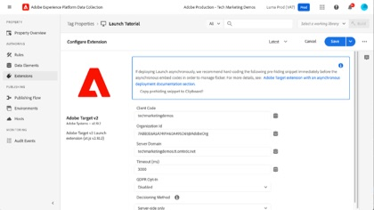

# Adobe Target教學課程

[!DNL Adobe Target]是[!DNL Adobe Experience Cloud]解決方案，提供一切所需工具，讓您量身打造及個人化您的客戶體驗。 [!DNL Target]可協助您在網站和行動網站、應用程式、社群媒體和其他數位頻道上獲得最大收入。 使用這些影片和教學課程來學習[!DNL Adobe Target]的許多元件。

>[!NOTE]
>
>除本指南外，還有提供以下 [!DNL Adobe Target] 指南：
>
>* *[Adobe Target商業從業者指南](https://experienceleague.adobe.com/docs/target/using/target-home.html?lang=zh-Hant){target=_blank}*
>
>* *[Adobe Target 開發人員指南](https://experienceleague.adobe.com/docs/target-dev/developer/overview.html){target=_blank}*

## 員工精選

<table style="margin-top: 0 !important">
<tr>
  <td>
    
    

      <a href="https://experienceleague.adobe.com/docs/platform-learn/migrate-target-to-websdk/introduction.html">
    <strong>將Target從at.js移轉至Platform Web SDK</strong>
    </a>
    

    

    <em>瞭解如何將您的at.js實作移轉至Adobe Experience Platform Web SDK。</em>
    

  </td>
  <td>
    
    

      <a href="https://experienceleague.adobe.com/docs/platform-learn/implement-in-websites/implement-solutions/target.html">
    <strong>使用Adobe Experience Platform標籤實作Target</strong>
    </a>
    

    

    <em>瞭解如何使用頁面載入請求和自訂引數來實作Adobe Target擴充功能。</em>
    

  </td>
   <td>
    
    

    <a href="https://experienceleague.adobe.com/docs/target-learn/tutorials/implementation/implement-atjs-20-in-a-single-page-application.html">
    <strong>在SPA中實作at.js 2.0</strong>
    </a>
    

    

    <em>瞭解如何在單頁應用程式(SPA)中實作Adobe Target的at.js 2.0 （和更新版本）。</em>
    

  </td>
</tr>
</table>