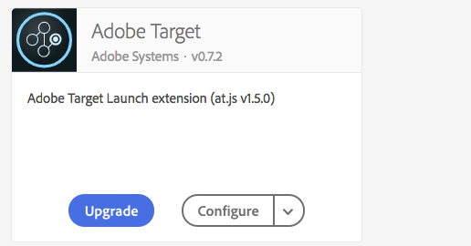

# 學習使用Adobe Target

Adobe Target 為 Adobe Experience Cloud 解決方案，提供一切所需工具，讓您量身訂造及個人化您的客戶體驗，藉此為您的網頁以及行動網站、應用程式、社交媒體和其他數位頻道創造最高的收入。使用這些視頻和教程來學習Adobe Target的許多元件。

## 新功能

* **[在Analysis Workspace設定A4T報表以進行自動目標活動](integrations/set-up-a4t-reports-in-analysis-workspace-for-auto-target-activities.md)**

   *對於業務從業者：是否使用A4T進行自動目標？ 按照以下步驟在Analysis Workspace配置A4T報告，以確保在運行自動目標活動時獲得預期結果。*
* **[設備上決策概述](implementation/on-device-decisioning-overview.md)**

   *對於建築師：開始設備上的決策，為您的消費者提供接近零的延遲體驗！*
<!-- * **[Use the Recommendations API (Tutorial)](recommendations-api-tutorial/recs-api-overview.md)**
    *For developers: Get hands-on practice using the [!DNL Recommendations] APIs to configure and manage [!DNL Recommendations] catalogs and custom criteria, and more.*-->

<!--* **[Implement Adobe Target with Adobe Mobile Services SDK v4 for Android (Tutorial)](mobile-v4/overview.md)**
    *For developers who are already using Adobe Mobile Services SDK v4: learn how to start personalizing app experiences with Adobe Target. These steps are provided as legacy user support.*<!-- Concepts learned here are also applicable to Adobe Experience Platform Mobile SDK (v5).-->

<!--* **[Use Recommendations Offers (Video)](recommendations/use-recommendations-offers.md)**
    *For all Target Users: Learn how to use product recommendations in A/B and Experience Targeting Activities.*-->

<!--
* **[Create a Recommendations Activity (Video)](recommendations/create-a-recommendations-activity.md)**
     
    *Recommend products to your customers at scale with this Premium feature.* -->

## 員工挑選

<table>
<tr>
  <td>
    
    

      <a href="https://experienceleague.adobe.com/docs/launch-learn/implementing-in-websites-with-launch/implement-solutions/target.html?lang=en">
    <strong>與Adobe Experience Platform Launch實施目標</strong>
    </a>
    

    

    <em>通過啟動加快Web實施</em>
    

  </td>
  <td>
    
    

      <a href="implementation/implement-atjs-20-in-a-single-page-application.md">
    <strong>在單頁應用程式中實現at.js 2.0(SPA)</strong>
    </a>
    

    

    <em>瞭解at.js 2.x如何支SPA持</em>
    

  </td>
  <td>
    
    

      <a href="troubleshooting/troubleshoot-with-the-experience-cloud-debugger.md">
    <strong>使用Experience Cloud Debugger排除目標故障</strong>
    </a>
    

    

    <em>放大您的實施</em>
    

  </td>
</tr>
</table>
